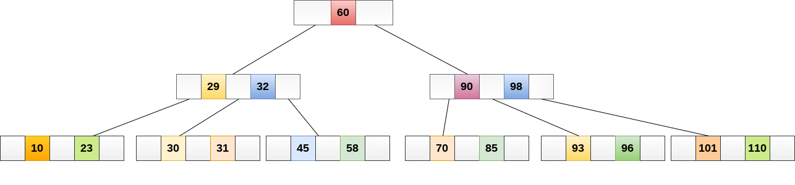
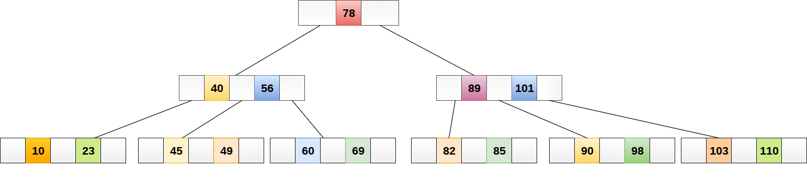
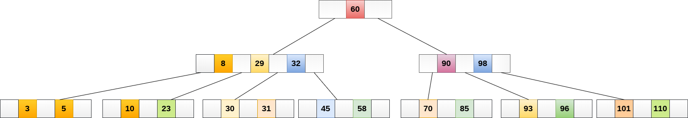
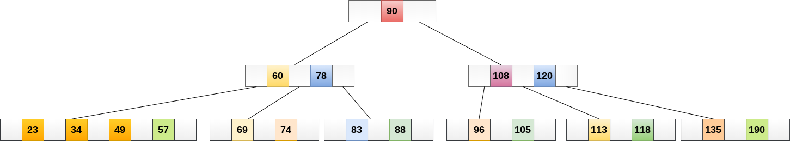

# B树

B树是一种专用的M阶树，可广泛用于磁盘访问。 M阶树顺序的B树最多可以有`m-1`个键和M个子树。 使用B树的主要原因之一是它能够在单个节点中存储大量键，并且通过保持树的高度相对较小来存储大键值。

排序M的B树包含M阶树的所有属性。 此外，它还包含以下属性。

- B树中的每个节点最多包含`m`个子节点。
- 除根节点和叶节点外，B树中的每个节点至少包含`m/2`个子节点。
- 根节点必须至少有`2`个节点。
- 所有叶节点必须处于同一级别。

所有节点都不必包含相同数量的子节点，但每个节点必须具有`m/2`个节点数。

在下图中显示了4阶B树。


在B树上执行某些操作时，B树的任何属性都可能违反节点可以拥有的最小子节点数。 为了维护B 树的属性，树可能会分裂或连接。

## 操作

#### 1. 搜索

在B树中搜索类似于二叉搜索树中的搜索。 例如，如果在以下B树中搜索数据项：`49`。 该过程将如下所示：

- 将数据项`49`与根节点`78`进行比较。因为`49 <78`因此，移动到其左子树。
- 因为，`40 <49 <56`，遍历右子树`40`。
- `49> 45`，向右移动。 比较`49`。
- 找到匹配，则返回。

在B树中搜索取决于树的高度。 搜索算法需要`O(log n)`时间来搜索B树中的任何元素。



#### 2. 插入

插入在叶节点级别完成。要将项目插入B树，需要遵循以下算法。

- 遍历B树以找到可插入节点的适当叶节点。

- 如果叶节点包含少于`m-1`个键，则按递增顺序插入元素。

- 否则，如果叶节点包含

  ```
  m-1
  ```

  个键，则按照以下步骤操作。

  - 按元素的递增顺序插入新元素。
  - 将节点拆分为中间的两个节点。
  - 将中值元素推送到其父节点。
  - 如果父节点还包含`m-1`个键，则按照相同的步骤将其拆分。

**示例：**

将节点`8`插入到下图所示的5阶B树中。


`8`将插入`5`的右侧，因此插入`8`。


该节点现在包含5个键，大于`(5 -1 = 4)`个键。 因此，将节点从中间分开，即`8`，并将其推到其父节点，如下所示。



#### 3. 删除

还在叶节点处执行删除。 要删除的节点可以是叶节点或内部节点。 需要遵循以下算法才能从B树中删除节点。

- 找到叶节点。
- 如果叶节点中有多于`m/2`个键，则从节点中删除所需的键。
- 如果叶节点不包含`m/2`个键，则通过从`8`个或左兄弟中获取元素来完成键。
  - 如果左侧兄弟包含多于`m/2`个元素，则将其最大元素推送到其父元素，并将插入元素向下移动到删除键的节点。
  - 如果右侧兄弟包含多于`m/2`个元素，则将其最小元素向上推送到父节点，并将插入元素向下移动到删除键的节点。
- 如果兄弟节点都不包含多于`m/2`个元素，则通过连接两个叶节点和父节点的插入元素来创建新的叶节点。
- 如果父节点的节点少于`m/2`，那么也应在父节点上应用上述过程。
- 如果要删除的节点是内部节点，则将节点替换为其有序后继或前一个节点。 由于后继或前任将始终位于叶节点上，因此该过程将类似于从叶节点中删除节点。

**示例1**

从下图所示的5阶B树中删除节点：`53`。


元素`49`的右子节点中存在`53`，则删除它。


现在，`57`是唯一留在节点中的元素，在5阶B树中必须存在的最小元素数是`2`。它小于左边和右边子树中的元素 因此，也不足以将其与父母的左兄弟和干预元素合并，即`49`。

最终的B树如下所示。



## B树的应用

B树用于索引数据并提供对存储在磁盘上的实际数据的快速访问，因为存储在磁盘上的大型数据库中存储的值的访问是非常耗时的过程。
在最坏的情况下，搜索包含`n`个键值的未索引和未排序的数据库需要`O(n)`运行时间。 但是，如果使用B树来索引此数据库，则在最坏的情况下将在`O(log n)`时间内搜索它。