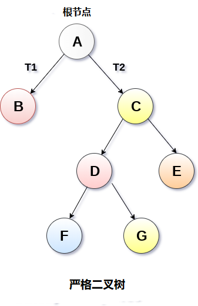
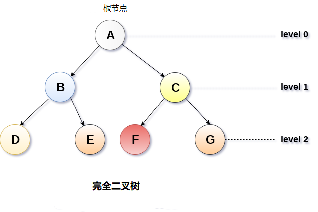

# 二叉树 			

二叉树是一种特殊类型的通用树，它的每个节点最多可以有两个子节点。 二叉树通常被划分为三个不相交的子集。

- 节点的根
- 左二叉树。
- 右二叉树

二叉树的结构，如在下图中显示。

## 1. 二叉树的类型

#### 1.1. 严格二叉树

在严格二叉树中，每个非叶节点包含非空的左和右子树。 换句话说，每个非叶节点的等级将始终为`2`。具有`n`个叶子的严格二叉树将具有`(2n-1)`个节点。

严格二叉树如下图所示。

#### 1.2. 完全二叉树

如果所有叶子都位于相同的水平`d`，则称二元树是完全二叉树。完全二叉树是二叉树，在0级和d级之间的每个级别包含正好`2 ^ 1`个节点。 具有深度`d`的完全二叉树中的节点总数是`2^d+1 -1`，其中叶节点是`2d`而非叶节点是`2^d-1`。

## 2. 二叉树遍历

二叉树遍历的方法有以下几种：

| 编号 | 遍历     | 描述                                                         |
| ---- | -------- | ------------------------------------------------------------ |
| 1    | 前序遍历 | 首先遍历根，然后分别遍历左子树和右子树。 该过程将递归地应用于树的每个子树。 |
| 2    | 中序遍历 | 首先遍历左子树，然后分别遍历根和右子树。 该过程将递归地应用于树的每个子树。 |
| 3    | 后序遍历 | 遍历左子树，然后分别遍历右子树和根。 该过程将递归地应用于树的每个子树。 |

## 3. 二叉树表示

二叉树有两种表示形式：

#### 3.1. 链接表示

在这种表示中，二叉树以链表的形式存储在存储器中，其节点的数量存储在非连续的存储器位置并通过像树一样继承父子关系而链接在一起。 每个节点包含三个部分：指向左节点的指针，数据元素和指向右节点的指针。 每个二叉树都有一个根指针，指向二叉树的根节点。 在空二进制树中，根指针将指向`null`。

如下图中给出的二叉树。

在上图中，树被视为节点的集合，其中每个节点包含三个部分：左指针，数据元素和右指针。 左指针存储左子节点的地址，而右指针存储右子节点的地址。 叶节点的左右指针包含`null`。

下图显示了如何使用链接表示为二叉树分配内存。 内存中维护了一个特殊指针，指向树的根节点。 树中的每个节点都包含其左右子节点的地址。 叶节点的左右指针包含`null`。

#### 3.2. 顺序表示

这是存储树元素的最简单的内存分配技术，但它是一种效率低下的技术，因为它需要大量空间来存储树元素。 下图显示了二叉树及其内存分配。

在这种表示方式中，数组用于存储树元素。 数组的大小将等于树中存在的节点数。 树的根节点将出现在数组的第一个索引处。 如果节点存储在第`i`个索引处，则其左右子节点将存储在`2i`和`2i + 1`位置。 如果数组的第一个索引，即`tree[1]`为`0`，则表示树为空。