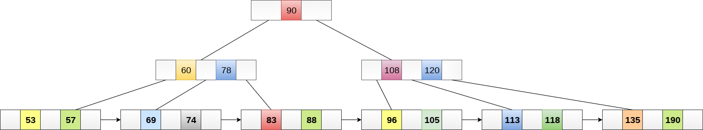
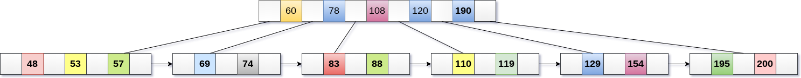
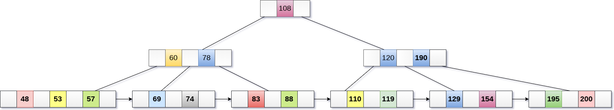
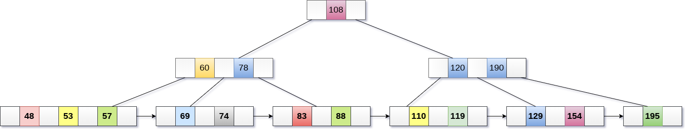
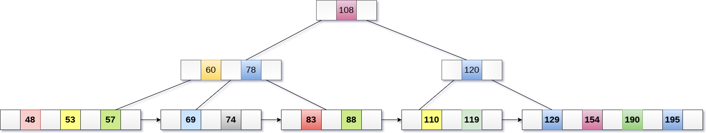

# B+树

B+树是B树的扩展，允许有效的插入，删除和搜索操作。

在B树中，键和记录都可以存储在内部节点和叶子节点中。 然而，在B+树中，记录(数据)只能存储在叶节点上，而内部节点只能存储键值。

B+树的叶节点以单链表的形式链接在一起，以使搜索查询更有效。

B+树用于存储无法存储在主存储器中的大量数据。 由于主存储器的大小总是有限的事实，B+树的内部节点(访问记录的键)存储在主存储器中，而叶节点存储在辅助存储器中。

B+树的内部节点通常称为索引节点。 B+树的排序3，如下图所示。

## B+树的优点

- 可以在相同数量的磁盘访问中获取记录。
- 树高度保持平衡，与B树相比较少。
- 可以顺序访问存储在B+树中的数据，也可以直接访问。
- 键用于索引。
- 更快的搜索查询，因为数据仅存储在叶节点上。

##  B树与B+树比较

| 编号 | B树                                                          | B+树                                                         |
| ---- | ------------------------------------------------------------ | ------------------------------------------------------------ |
| 1    | 搜索键无法重复存储。                                         | 可以存在冗余搜索键。                                         |
| 2    | 数据可以存储在叶节点以及内部节点中                           | 数据只能存储在叶节点上。                                     |
| 3    | 搜索某些数据是一个较慢的过程，因为可以在内部节点和叶节点上找到数据。 | 搜索速度相对较快，因为只能在叶节点上找到数据。               |
| 4    | 删除内部节点非常复杂且耗时。                                 | 删除永远不会是一个复杂的过程，因为元素将始终从叶节点中删除。 |
| 5    | 叶节点不能链接在一起。                                       | 叶节点链接在一起以使搜索操作更有效。                         |

##  B+树插入操作

**第1步** ：将新节点作为叶节点插入。
**第2步** ：如果叶子没有所需空间，则拆分节点并将中间节点复制到下一个索引节点。
**第3步** ：如果索引节点没有所需空间，则拆分节点并将中间元素复制到下一个索引节点。

**示例：**

将值`195`插入到下图所示的5阶B+树中。

在`190`之后，将在右子树`120`中插入`195`。将其插入所需位置。

该节点包含大于最大的元素数量，即`4`，因此将其拆分并将中间节点放置到父节点。

现在，索引节点包含`6`个子节点和`5`个违反B+树属性的键，因此需要将其拆分，如下所示。

## B+树删除操作

**第1步**：从叶子中删除键和数据。
**第2步**：如果叶节点包含少于最小数量的元素，则将节点与其兄弟节点合并，并删除它们之间的键。
**第3步**：如果索引节点包含少于最小数量的元素，则将节点与兄弟节点合并，并在它们之间向下移动键。

**示例**

从下图所示的B+树中删除键为`200`。

在`195`之后的`190`的右子树中存在`200`，删除它。

使用`195`,`190`,`154`和`129`合并两个节点。

现在，元素`120`是节点中存在的违反B+树属性的单个元素。 因此，需要使用`60`,`78`,`108`和`120`来合并它。

现在，`B+`树的高度将减`1`。

