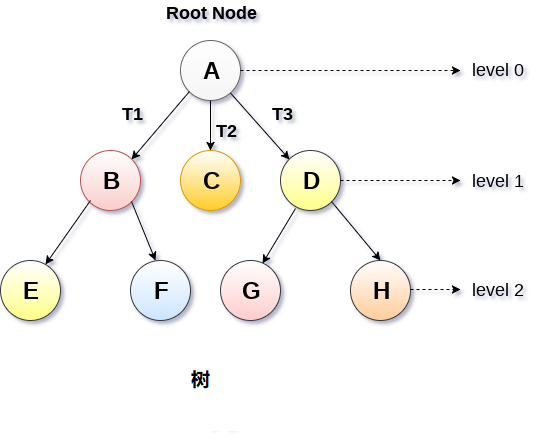
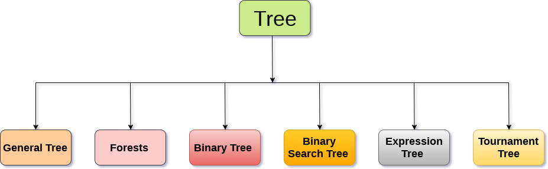
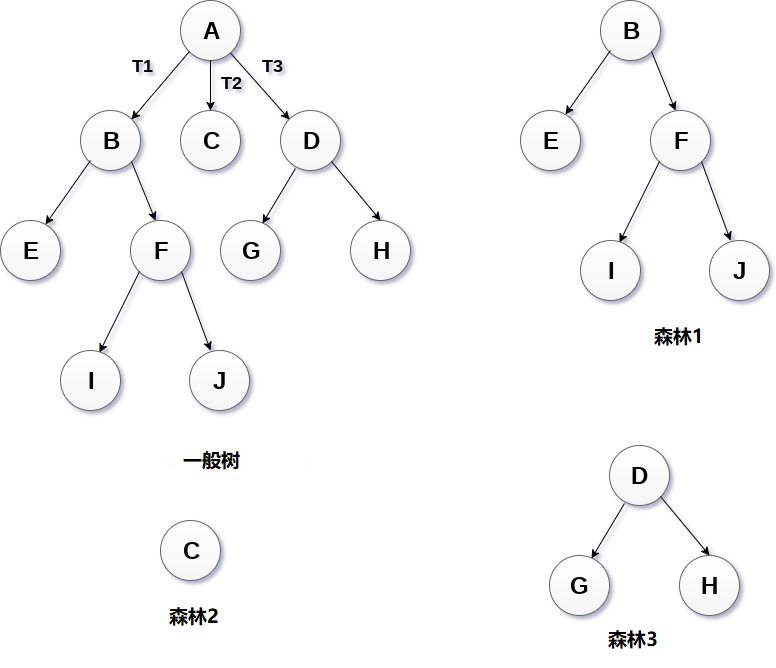
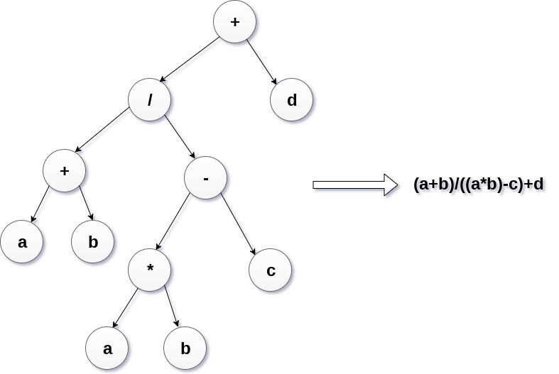
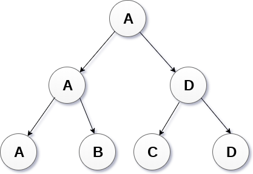

# 树

- 树是一种递归数据结构，包含一个或多个数据节点的集合，其中一个节点被指定为树的根，而其余节点被称为根的子节点。
- 除根节点之外的节点被划分为非空集，其中每个节点将被称为子树。
- 树的节点要么保持它们之间的父子关系，要么它们是姐妹节点。
- 在通用树中，一个节点可以具有任意数量的子节点，但它只能有一个父节点。
- 下图显示了一棵树，其中节点`A`是树的根节点，而其他节点可以看作是`A`的子节点。



#### 基本术语

- **根节点** ： 根节点是树层次结构中的最顶层节点。 换句话说，根节点是没有任何父节点的节点。
- **子树**： 如果根节点不为空，则树`T1`，`T2`和`T3`称为根节点的子树。
- **叶节点**： 树的节点，没有任何子节点，称为叶节点。 叶节点是树的最底部节点。 一般树中可以存在任意数量的叶节点。 叶节点也可以称为外部节点。
- **路径**： 连续边的序列称为路径。 在上图所示的树中，节点`E`的路径为`A→B→E`。
- **祖先节点**： 节点的祖先是从根到该节点的路径上的任何前节点。根节点没有祖先节点。 在上图所示的树中，节点`F`的祖先是`B`和`A`。
- **度**： 节点的度数等于子节点数，节点数。 在上图所示的树中，节点`B`的度数为`2`。叶子节点的度数总是`0`，而在完整的二叉树中，每个节点的度数等于`2`。
- **级别编号**： 为树的每个节点分配一个级别编号，使得每个节点都存在于高于其父级的一个级别。树的根节点始终是级别`0`。

**树的静态表示**

```c
#define MAXNODE 500
struct treenode {
    int root;
    int father;
    int son;
    int next;
}
```

**树的动态表示**

```c
struct treenode
{
    int root;  
    struct treenode *father;
    struct treenode *son
    struct treenode *next;
}
```

## 树的类型

树数据结构可以分为六个不同的类别。



#### 1.一般树

一般树(*General Tree*)按层次顺序存储元素，其中顶级元素始终以`0`级作为根元素。 除根节点之外的所有节点都以级别数存在。 存在于同一级别的节点称为兄弟节点，而存在于不同级别的节点表现出它们之间的父子关系。 节点可以包含任意数量的子树。 每个节点包含`3`个子树的树称为三元树。

#### 2.森林

可以将森林(*Forests*)定义为可以通过删除根节点并将根节点连接到第一级节点的边缘来获得的不相交树的集合。



#### 3.二叉树

二叉树是一种数据结构，其中每个节点最多可以有`2`个子节点。 存在于最顶层的节点称为根节点。 具有`0`个子节点的节点称为叶节点。 二叉树用于表达式评估等应用程序。 我们将在本教程后面详细讨论二叉树。

#### 4.二叉搜索树

二叉搜索树是有序二叉树。 左子树中的所有元素都小于根，而右子树中存在的元素大于或等于根节点元素。 二进制搜索树用于计算机科学领域的大多数应用，如搜索，排序等。

#### 5.表达树

表达式树用于评估简单的算术表达式。表达式树基本上是二叉树，其中内部节点由运算符表示，而叶节点由操作数表示。表达式树被广泛用于解决代数表达式，如`(a + b)*(a-b)`。 请考虑以下示例。

使用以下代数表达式构造表达式树:

```
(a + b) / (a*b - c) + d
```


#### 6.竞赛树

竞赛树用于记录两名比赛者之间每轮比赛的胜者。 比赛树也可以称为选择树或获胜者树。 外部节点表示正在播放匹配的比赛者，而内部节点表示所播放的匹配的胜者。 在最顶层，比赛的获胜者作为树的根节点出现。

例如，在4个比赛者之间进行的比赛树如下所示。 但是，左子树中的获胜者将与右子树的获胜者对战。

