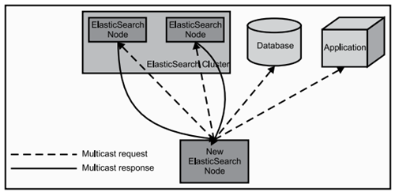

# elasticsearch 简介

Elasticsearch是一个开源的高扩展的分布式全文检索引擎，它可以近乎实时的存储、检索数据；本身扩展性很好，可以扩展到上百台服务器，处理PB级别的数据。 

Elasticsearch也使用Java开发并使用Lucene作为其核心来实现所有索引和搜索的功能，但是它的目的是通过简单的RESTful API来隐藏Lucene的复杂性，从而让全文搜索变得简单。

## 大规模数据如何检索？

当系统数据量上了10亿、100亿条的时候，我们在做系统架构的时候通常会从以下角度去考虑问题： 
1）用什么数据库好？(mysql、sybase、oracle、达梦、神通、mongodb、hbase…) 
2）如何解决单点故障；(lvs、F5、A10、Zookeep、MQ) 
3）如何保证数据安全性；(热备、冷备、异地多活) 
4）如何解决检索难题；(数据库代理中间件：mysql-proxy、Cobar、MaxScale等;) 
5）如何解决统计分析问题；(离线、近实时)

完全把数据放在内存中是不可靠的，实际上也不太现实，当我们的数据达到PB级别时，按照每个节点96G内存计算，在内存完全装满的数据情况下，我们需要的机器是：1PB=1024T=1048576G 
节点数=1048576/96=10922个 
实际上，考虑到数据备份，节点数往往在2.5万台左右。成本巨大决定了其不现实！

从前面讨论我们了解到，把数据放在内存也好，不放在内存也好，都不能完完全全解决问题。 
全部放在内存速度问题是解决了，但成本问题上来了。 
为解决以上问题，从源头着手分析，通常会从以下方式来寻找方法： 
1、存储数据时按有序存储； 
2、将数据和索引分离； 
3、压缩数据； 

这就引出了Elasticsearch。

## Lucene与ES关系？

1）Lucene只是一个库。想要使用它，你必须使用Java来作为开发语言并将其直接集成到你的应用中，更糟糕的是，Lucene非常复杂，你需要深入了解检索的相关知识来理解它是如何工作的。

2）Elasticsearch也使用Java开发并使用Lucene作为其核心来实现所有索引和搜索的功能，但是它的目的是通过简单的RESTful API来隐藏Lucene的复杂性，从而让全文搜索变得简单。

## ES主要解决问题：

1）检索相关数据； 
2）返回统计结果； 
3）速度要快。

## ES工作原理

当ElasticSearch的节点启动后，它会利用多播(multicast)(或者单播，如果用户更改了配置)寻找集群中的其它节点，并与之建立连接。这个过程如下图所示： 

## ES特点和优势

1）分布式实时文件存储，可将每一个字段存入索引，使其可以被检索到。 

2）实时分析的分布式搜索引擎。 

分布式：索引分拆成多个分片，每个分片可有零个或多个副本。集群中的每个数据节点都可承载一个或多个分片，并且协调和处理各种操作； 
负载再平衡和路由在大多数情况下自动完成。 

3）可以扩展到上百台服务器，处理PB级别的结构化或非结构化数据。也可以运行在单台PC上（已测试） 

4）支持插件机制，分词插件、同步插件、Hadoop插件、可视化插件等。

## ES国内外使用优秀案例

1） 2013年初，GitHub抛弃了Solr，采取ElasticSearch 来做PB级的搜索。 “GitHub使用ElasticSearch搜索20TB的数据，包括13亿文件和1300亿行代码”。

2）维基百科：启动以elasticsearch为基础的核心搜索架构。 

3）SoundCloud：“SoundCloud使用ElasticSearch为1.8亿用户提供即时而精准的音乐搜索服务”。 

4）百度：百度目前广泛使用ElasticSearch作为文本数据分析，采集百度所有服务器上的各类指标数据及用户自定义数据，通过对各种数据进行多维分析展示，辅助定位分析实例异常或业务层面异常。目前覆盖百度内部20多个业务线（包括casio、云分析、网盟、预测、文库、直达号、钱包、风控等），单集群最大100台机器，200个ES节点，每天导入30TB+数据。