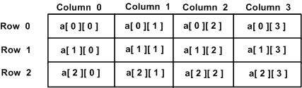

# Go语言 多维数组

Go编程语言允许多维数组。这里是多维数组声明的一般形式：

```go
var variable_name [SIZE1][SIZE2]...[SIZEN] variable_type
```

例如，以下声明创建一个三维`5 x 10 x 4`的整数数组：

```go
var threedim [5][10][4]int
```

## 二维数组

多维数组的最简单的形式是二维数组。 二维数组本质上是一维数组的列表。要声明一个大小为`x，y`的二维整数数组，可以这样写：

```go
var arrayName [ x ][ y ] variable_type
```

其中`variable_type`可以是任何有效的Go数据类型，`arrayName`将是有效的Go标识符。 二维数组可以被认为是具有`x`个行和`y`个列的表。包含三行四列的二维数组`a`可以如下所示：


因此，数组`a`中的每个元素由形式`a[i][j]`的元素名称标识，其中`a`是数组的名称，`i`和`j`是唯一标识`a`数组中的每个元素的下标。

## 初始化二维数组

多维数组可以通过为每一行指定括号值来初始化。以下是具有`3`行的数组，每行具有`4`列。

```go
a = [3][4]int{  
 {0, 1, 2, 3} ,   /*  initializers for row indexed by 0 */
 {4, 5, 6, 7} ,   /*  initializers for row indexed by 1 */
 {8, 9, 10, 11}   /*  initializers for row indexed by 2 */
}
```

## 访问二维数组元素

通过使用下标，即数组的行索引和列索引来访问`2`维数组中的元素。 例如：

```go
int val = a[2][3]
```

上面的语句将获取数组中第`3`行的第`4`个元素。可以在上图中验证它。如下面的程序，使用嵌套循环来处理一个二维数组：

**示例：**

文件名:array-md.go

```go
package main

import "fmt"

func main() {
   /* an array with 5 rows and 2 columns*/
   var a = [5][2]int{ {0,0}, {1,2}, {2,4}, {3,6},{4,8}}
   var i, j int

   /* output each array element's value */
   for  i = 0; i < 5; i++ {
      for j = 0; j < 2; j++ {
         fmt.Printf("a[%d][%d] = %d\n", i,j, a[i][j] )
      }
   }
}
```

```bash
go run /share/lesson/go/array-for.go
```

康康

如上所述，我们可以创建任意数量维度的数组，尽管创建的大多数数组可能是一维或二维。