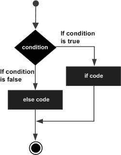

# Go语言 嵌套if语句

在Go编程中嵌套`if-else`语句总是合法的，这意味着可以在另一个`if`或`else if`语句中使用一个`if`或`else if`语句。

### 语法

Go编程语言中**嵌套if语句**的语法是：

```go
if( boolean_expression 1)
{
   /* Executes when the boolean expression 1 is true */
   if(boolean_expression 2)// 嵌套if语句部分
   {
      /* Executes when the boolean expression 2 is true */
   }
}
```

可以使用嵌套`else if ... else`类似的方式来嵌套`if`语句。

### 流程图



### 示例

文件名:logic-ifnested.go

```go
package main

import "fmt"

func main() {
   /* local variable definition */
   var a int = 100
   var b int = 200

   /* check the boolean condition */
   if( a == 100 ) {
       /* if condition is true then check the following */
       if( b == 200 )  {
          /* if condition is true then print the following */
          fmt.Printf("Value of a is 100 and b is 200\n" );
       }
   }
   fmt.Printf("Exact value of a is : %d\n", a );
   fmt.Printf("Exact value of b is : %d\n", b );
}
```

```bash
go run /share/lesson/go/logic-ifnested.go
```

康康