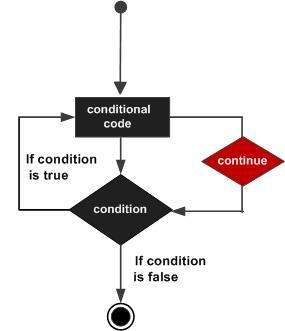

# Go语言continue语句

Go编程语言中的`continue`语句在某种程度上类似于[break语句](./loopcontrol-break.html)。 但不是强制终止，而是继续强制循环的下一个迭代发生，跳过`continue`语句之后的任何代码继续强制循环的下一个迭代。

对于`for`循环，`continue`语句导致条件测试并增加循环的部分以执行循环的下一个迭代。

Go中的`continue`语句的语法如下：

```go
continue ;
```

### 流程图



### 示例

文件名:loopcontrol-continue.go

```go
package main

import "fmt"

func main() {
   /* local variable definition */
   var a int = 10

   /* do loop execution */
   for a < 20 {
      if a == 15 {
         /* skip the iteration */
         a = a + 1;
         continue;
      }
      fmt.Printf("value of a: %d\n", a);
      a++;     
   }  
}
```

```bash
go run /share/lesson/go/loopcontrol-continue.go
```

康康