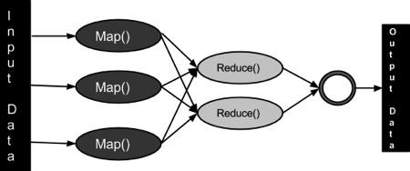
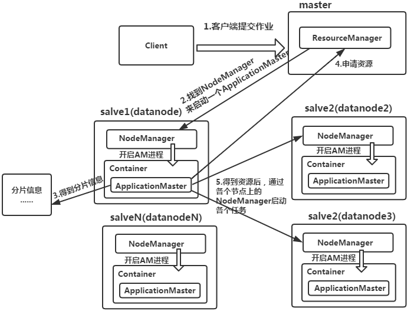

# Hadoop MapReduce

MapReduce它可以编写应用程序来处理海量数据，并行，大集群的普通硬件，以可靠的方式的框架。

### Hadoop示例

让我们来看看Hadoop的一个简单例子。 Hadoop安装提供了下列示例 MapReduce jar 文件，它提供了MapReduce的基本功能，并且可以用于计算，像PI值，字计数在文件等等`$HADOOP_HOME/share/hadoop/mapreduce/hadoop-mapreduce-examples-2.2.0.jar `

有一个输入目录将推送几个文件，要求计算那些文件的单词总数。要计算单词总数，并不需要写MapReduce，提供的.jar文件包含了实现字数。可以尝试其他的例子使用相同的.jar文件; 发出以下命令通过Hadoop hadoop-mapreduce-examples-2.2.0.jar 文件检查支持MapReduce功能的程序。

```bash
hadoop jar $HADOOP_HOME/share/hadoop/mapreduce/hadoop-mapreduce-examples-2.9.2.jar
```

## MapReduce是什么?

MapReduce是一种处理技术和程序模型基于Java的分布式计算。 MapReduce算法包含了两项重要任务，即Map 和 Reduce。Map采用了一组数据，并将其转换成另一组数据，其中，各个元件被分解成元组(键/值对)。其次，减少任务，这需要从Map 作为输入并组合那些数据元组成的一组小的元组输出。作为MapReduce暗示的名称的序列在Map作业之后执行reduce任务。

​	MapReduce主要优点是，它很容易大规模数据处理在多个计算节点。下面MapReduce模型中，数据处理的原语被称为映射器和减速器。分解数据处理应用到映射器和减速器有时是普通的。但是编写MapReduce形式的应用，扩展应用程序运行在几百，几千，甚至几万机集群中的仅仅是一个配置的更改。这个简单的可扩展性是吸引了众多程序员使用MapReduce模型。

## 算法

- 通常MapReduce范例是基于向发送计算机数据的位置！
- MapReduce计划分三个阶段执行，即映射阶段，shuffle阶段，并减少阶段。
- 映射阶段：映射或映射器的工作是处理输入数据。一般输入数据是在文件或目录的形式，并且被存储在Hadoop的文件系统（HDFS）。输入文件被传递到由线映射器功能线路。映射器处理该数据，并创建数据的若干小块。
- 减少阶段：这个阶段是：Shuffle阶段和Reduce阶段的组合。减速器的工作是处理该来自映射器中的数据。处理之后，它产生一组新的输出，这将被存储在HDFS。
- 在一个MapReduce工作，Hadoop的发送Map和Reduce任务到集群的相应服务器。
- 框架管理数据传递例如发出任务的所有节点之间的集群周围的详细信息，验证任务完成，和复制数据。
- 大部分的计算发生在与在本地磁盘上，可以减少网络通信量数据的节点。
- 给定的任务完成后，将群集收集并减少了数据，以形成一个合适的结果，并且将其发送回Hadoop服务器。



## MapReduce Jobs运行流程
[](https://www.ipieuvre.com/doc/exper/1e146ce6-91ad-11e9-beeb-00215ec892f4/img/01.png)

（1）ResourceManager：是YARN资源控制框架的中心模块，负责集群中所有资源的统一管理和分配。它接收来自NM(NodeManager)的汇报，建立AM，并将资源派送给AM(ApplicationMaster)。

（2）NodeManager：简称NM，NodeManager是ResourceManager在每台机器上的代理，负责容器管理，并监控他们的资源使用情况（cpu、内存、磁盘及网络等），以及向ResourceManager提供这些资源使用报告。

（3）ApplicationMaster：以下简称AM。YARN中每个应用都会启动一个AM，负责向RM申请资源，请求NM启动Container，并告诉Container做什么事情。

（4）Container：资源容器。YARN中所有的应用都是在Container之上运行的。AM也是在Container上运行的，不过AM的Container是RM申请的。Container是YARN中资源的抽象，它封装了某个节点上一定量的资源（CPU和内存两类资源）。Container由ApplicationMaster向ResourceManager申请的，由ResouceManager中的资源调度器异步分配给ApplicationMaster。Container的运行是由ApplicationMaster向资源所在的NodeManager发起的，Container运行时需提供内部执行的任务命令（可以是任何命令，比如java、Python、C++进程启动命令均可）以及该命令执行所需的环境变量和外部资源（比如词典文件、可执行文件、jar包等）。

另外，一个应用程序所需的Container分为两大类，如下：

①运行ApplicationMaster的Container：这是由ResourceManager（向内部的资源调度器）申请和启动的，用户提交应用程序时，可指定唯一的ApplicationMaster所需的资源。

②运行各类任务的Container：这是由ApplicationMaster向ResourceManager申请的，并为了ApplicationMaster与NodeManager通信以启动的。

以上两类Container可能在任意节点上，它们的位置通常而言是随机的，即ApplicationMaster可能与它管理的任务运行在一个节点上。

## 	输入和输出（Java透视图）

​	MapReduce框架上的<key, value>对操作，也就是框架视图的输入工作作为一组<key, value>对，并产生一组<key, value>对作为作业的输出可以在不同的类型。

​	键和值类在框架连载的方式，因此，需要实现接口。此外，键类必须实现可写，可比的接口，以方便框架排序。MapReduce工作的输入和输出类型：（输入）<k1, v1> ->映射 - ><k2, v2>-> reduce - ><k3, v3>（输出）。

|        | 输入           | 输出            |
| ------ | -------------- | --------------- |
| Map    | <k1, v1>       | list (<k2, v2>) |
| Reduce | <k2, list(v2)> | list (<k3, v3>) |

## 	术语

- **PayLoad** - 应用程序实现映射和减少功能，形成工作的核心。
- **Mapper** - 映射器的输入键/值对映射到一组中间键/值对。
- **NamedNode** - 节点管理Hadoop分布式文件系统（HDFS）。
- **DataNode** - 节点数据呈现在任何处理发生之前。
- **MasterNode** - 节点所在JobTracker运行并接受来自客户端作业请求。
- **SlaveNode** - 节点所在Map和Reduce程序运行。
- **JobTracker** - 调度作业并跟踪作业分配给任务跟踪器。
- **Task Tracker** - 跟踪任务和报告状态的JobTracker。
- **Job** -程序在整个数据集映射器和减速的执行。
- **Task** - 一个映射程序的执行或对数据的一个片段的减速器。
- **Task Attempt** - 一种尝试的特定实例在SlaveNode执行任务。

## 	参考命令

所有的Hadoop命令是由hadoop命令调用。不带任何参数运行Hadoop脚本打印所有命令的描述。

**Usage :** hadoop [--config confdir] COMMAND

下表列出了可用的选项及其说明。

| 操作                         | 描述                                           |
| ---------------------------- | ---------------------------------------------- |
| namenode -format             | 格式化DFS文件系统。                            |
| secondarynamenode            | 运行DFS二次名称节点。                          |
| namenode                     | 运行DFS名称节点。                              |
| datanode                     | 运行DFS的Datanode。                            |
| dfsadmin                     | 运行DFS管理客户端。                            |
| mradmin                      | 运行映射，减少管理客户端。                     |
| fsck                         | 运行DFS文件系统检查工具。                      |
| fs                           | 运行一个通用的文件系统的用户客户端。           |
| balancer                     | 运行集群平衡工具。                             |
| oiv                          | 适用于离线FsImage查看器的fsimage。             |
| fetchdt                      | 从NameNode获取团令牌。                         |
| jobtracker                   | 运行MapReduce工作跟踪节点。                    |
| pipes                        | 运行管道的工作。                               |
| tasktracker                  | 运行MapReduce任务跟踪节点。                    |
| historyserver                | 运行作业历史记录服务器作为一个独立的守护进程。 |
| job                          | 操纵MapReduce工作。                            |
| queue                        | 获取有关作业队列信息。                         |
| version                      | 打印版本。                                     |
| jar <jar>                    | 运行一个jar文件。                              |
| distcp <srcurl> <desturl>    | 复制文件或目录的递归。                         |
| distcp2 <srcurl> <desturl>   | DistCp第2版。                                  |
| archive -archiveName NAME -p | 创建一个Hadoop的归档。                         |
| <parent path> <src>* <dest>  |                                                |
| classpath                    | 打印需要得到Hadoop jar和所需要的库的类路径。   |
| daemonlog                    | 为每个守护进程获取/设置日志级别                |

## 	如何与MapReduce工作互动

Usage: hadoop job [GENERIC_OPTIONS]

以下是在一个Hadoop的作业可用通用选项。

| GENERIC_OPTIONS                                         | 描述                                                         |
| ------------------------------------------------------- | ------------------------------------------------------------ |
| -submit <job-file>                                      | 提交作业。                                                   |
| status <job-id>                                         | 打印映射，并减少完成的百分比以及所有的工作的计数器。         |
| counter <job-id> <group-name> <countername>             | 打印的计数器值。                                             |
| -kill <job-id>                                          | 终止任务。                                                   |
| -events <job-id> <fromevent-#> <#-of-events>            | 打印接收到JobTracker为给定范围内的事件的详细信息。           |
| -history [all] <jobOutputDir> - history < jobOutputDir> | 打印作业的详细信息，未能终止提示详细信息。有关作业的更多详细信息，如每个任务取得成功的任务，任务可以尝试通过指定[all]选项中查看。 |
| -list[all]                                              | 显示所有作业。-list 只显示尚未完成的作业。                   |
| -kill-task <task-id>                                    | 终止任务。终止任务不计入失败的尝试。                         |
| -fail-task <task-id>                                    | 失败的任务。失败的任务都算对失败的尝试。                     |
| set-priority <job-id> <priority>                        | 更改作业的优先级。允许优先级值：VERY_HIGH, HIGH, NORMAL, LOW, VERY_LOW |
