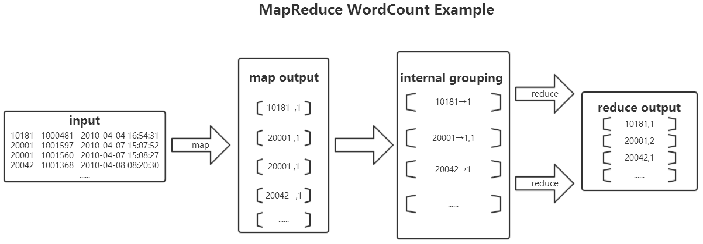

# Hadoop MapReduce任务示例2

[环境准备](./setup.html)

## 任务内容

现有某电商网站用户对商品的收藏数据，记录了用户收藏的商品id以及收藏日期

文件名:buyerfavorite

```
买家id   商品id    收藏日期  
10181   1000481   2010-04-04 16:54:31  
20001   1001597   2010-04-07 15:07:52  
20001   1001560   2010-04-07 15:08:27  
20042   1001368   2010-04-08 08:20:30  
20067   1002061   2010-04-08 16:45:33  
20056   1003289   2010-04-12 10:50:55  
20056   1003290   2010-04-12 11:57:35  
20056   1003292   2010-04-12 12:05:29  
20054   1002420   2010-04-14 15:24:12  
20055   1001679   2010-04-14 19:46:04  
20054   1010675   2010-04-14 15:23:53  
20054   1002429   2010-04-14 17:52:45  
20076   1002427   2010-04-14 19:35:39  
20054   1003326   2010-04-20 12:54:44  
20056   1002420   2010-04-15 11:24:49  
20064   1002422   2010-04-15 11:35:54  
20056   1003066   2010-04-15 11:43:01  
20056   1003055   2010-04-15 11:43:06  
20056   1010183   2010-04-15 11:45:24  
20056   1002422   2010-04-15 11:45:49  
20056   1003100   2010-04-15 11:45:54  
20056   1003094   2010-04-15 11:45:57  
20056   1003064   2010-04-15 11:46:04  
20056   1010178   2010-04-15 16:15:20  
20076   1003101   2010-04-15 16:37:27  
20076   1003103   2010-04-15 16:37:05  
20076   1003100   2010-04-15 16:37:18  
20076   1003066   2010-04-15 16:37:31  
20054   1003103   2010-04-15 16:40:14  
20054   1003100   2010-04-15 16:40:16  
```

要求编写MapReduce程序，统计每个买家收藏商品数量。

统计结果数据：

```
买家id 商品数量  
10181   1  
20001   2  
20042   1  
20054   6  
20055   1  
20056   12  
20064   1  
20067   1  
20076   5  
```

## 准备相关文件

[环境准备](./setup.html)

在linux上，创建目录`~/mr2`及复制相关文件

```
mkdir -p ~/mr2 && cd ~/mr2
cp /share/lesson/hadoop/buyerfavorites .
cp /share/lesson/hadoop/hadoop-core-1.2.1.jar .
cp /share/lesson/hadoop/WordCount.java .
```

**编写Java代码，并描述其设计思路。**

下图描述了该mapreduce的执行过程

[

大致思路是将hdfs上的文本作为输入，MapReduce通过InputFormat会将文本进行切片处理，并将每行的首字母相对于文本文件的首地址的偏移量作为输入键值对的key，文本内容作为输入键值对的value，经过在map函数处理，输出中间结果<word,1>的形式，并在reduce函数中完成对每个单词的词频统计。整个程序代码主要包括两部分：Mapper部分和Reducer部分。

文件名:WordCount.java

```java
import java.io.BufferedReader;
import java.io.FileReader;
import java.io.IOException;
import java.util.HashMap;
import java.util.Map;

import org.apache.hadoop.conf.Configuration;
import org.apache.hadoop.conf.Configured;
import org.apache.hadoop.filecache.DistributedCache;
import org.apache.hadoop.fs.Path;
import org.apache.hadoop.io.LongWritable;
import org.apache.hadoop.io.Text;
import org.apache.hadoop.mapreduce.Job;
import org.apache.hadoop.mapreduce.Mapper;
import org.apache.hadoop.mapreduce.Reducer;
import org.apache.hadoop.mapreduce.lib.input.FileInputFormat;
import org.apache.hadoop.mapreduce.lib.input.TextInputFormat;
import org.apache.hadoop.mapreduce.lib.output.FileOutputFormat;
import org.apache.hadoop.mapreduce.lib.output.TextOutputFormat;
import org.apache.hadoop.util.GenericOptionsParser;
import org.apache.hadoop.util.Tool;
import org.apache.hadoop.util.ToolRunner;

public class WordCount {  
    public static void main(String[] args) throws IOException, ClassNotFoundException, InterruptedException {  
        Job job = Job.getInstance();  
        job.setJobName("WordCount");  
        job.setJarByClass(WordCount.class);  
        job.setMapperClass(doMapper.class);  
        job.setReducerClass(doReducer.class);  
        job.setOutputKeyClass(Text.class);  
        job.setOutputValueClass(IntWritable.class);  
        Path in = new Path("hdfs://localhost:9000/input2/buyerfavorites");  
        Path out = new Path("hdfs://localhost:9000/outout2");  
        FileInputFormat.addInputPath(job, in);  
        FileOutputFormat.setOutputPath(job, out);  
        System.exit(job.waitForCompletion(true) ? 0 : 1);  
    }  
    public static class doMapper extends Mapper<Object, Text, Text, IntWritable>{  
        public static final IntWritable one = new IntWritable(1);  
        public static Text word = new Text();  
        @Override  
        protected void map(Object key, Text value, Context context)  
                    throws IOException, InterruptedException {  
            StringTokenizer tokenizer = new StringTokenizer(value.toString(), "\t");  
                word.set(tokenizer.nextToken());  
                context.write(word, one);  
        }  
    }  
    public static class doReducer extends Reducer<Text, IntWritable, Text, IntWritable>{  
        private IntWritable result = new IntWritable();  
        @Override  
        protected void reduce(Text key, Iterable<IntWritable> values, Context context)  
        throws IOException, InterruptedException {  
        int sum = 0;  
        for (IntWritable value : values) {  
        sum += value.get();  
        }  
        result.set(sum);  
        context.write(key, result);  
        }  
    }  
} 
```

### 编译java文件并打jar包

```bash
javac -classpath hadoop-core-1.2.1.jar -d ~/mr2/ WordCount.java
jar cvf ./WordCount.jar ./WordCount*.class
```

将linux本地/data/mapreduce/buyer_favorite，上传到HDFS上的/mymapreduce/in目录下。

```bash
hadoop fs -mkdir -p /input2/
hadoop fs -put ~/mr2/buyerfavorites /input2
```

### 提交任务并耐心等待任务完成

```bash
hadoop jar WordCount.jar WordCount
```

待执行完毕后，打开终端或使用hadoop eclipse插件，查看hdfs上，程序输出的实验结果。

```bash
hadoop fs -ls /mymapreduce/out 
hadoop fs -cat /mymapreduce/out/part-r-00000
```