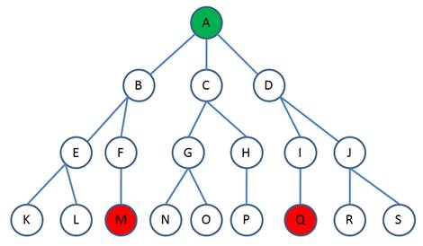
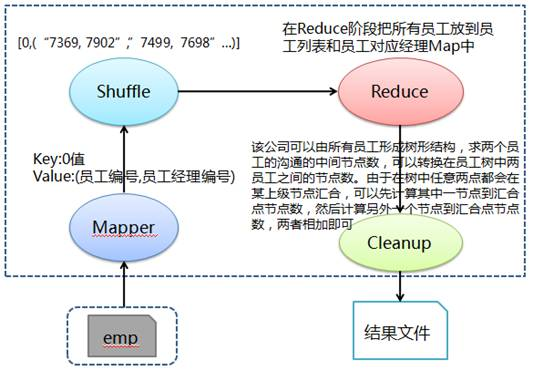

# Hadoop MapReduce示例10:求任何两名员工信息传递所需要经过的中间节点数

## 问题分析

该公司所有员工可以形成入下图的树形结构，求两个员工的沟通的中间节点数，可转换在员工树中求两个节点连通所经过的节点数，即从其中一节点到汇合节点经过节点数加上另一节点到汇合节点经过节点数。例如求 M 到 Q 所需节点数，可以先找出 M 到 A 经过的节点数，然后找出 Q 到 A 经过的节点数，两者相加得到 M 到 Q 所需节点数。



在作业中首先在 Mapper 阶段所有员工数据，其中经理数据 key 为 0 值、value 为"员工编号，员工经理编号"，然后在 Reduce 阶段把所有员工放到员工列表和员工对应经理链表 Map 中，最后在 Reduce 的 Cleanup 中按照上面说所算法对任意两个员工计算出沟通的路径长度并输出。

**处理流程图**




## 准备相关文件

测试数据 emp（员工），其中各字段用逗号分隔：

文件名:emp

```
7369,SMITH,CLERK,7902,17-12月-80,800,,20
7499,ALLEN,SALESMAN,7698,20-2月-81,1600,300,30
7521,WARD,SALESMAN,7698,22-2月-81,1250,500,30
7566,JONES,MANAGER,7839,02-4月-81,2975,,20
7654,MARTIN,SALESMAN,7698,28-9月-81,1250,1400,30
7698,BLAKE,MANAGER,7839,01-5月-81,2850,,30
7782,CLARK,MANAGER,7839,09-6月-81,2450,,10
7839,KING,PRESIDENT,,17-11月-81,5000,,10
7844,TURNER,SALESMAN,7698,08-9月-81,1500,0,30
7900,JAMES,CLERK,7698,03-12月-81,950,,30
7902,FORD,ANALYST,7566,03-12月-81,3000,,20
7934,MILLER,CLERK,7782,23-1月-82,1300,,10
```

文件名:Q10MiddlePersonsCountForComm.java

```java
import java.io.IOException;
import java.util.ArrayList;
import java.util.HashMap;
import java.util.List;
import java.util.Map;

import org.apache.hadoop.conf.Configuration;
import org.apache.hadoop.conf.Configured;
import org.apache.hadoop.fs.Path;
import org.apache.hadoop.io.IntWritable;
import org.apache.hadoop.io.LongWritable;
import org.apache.hadoop.io.NullWritable;
import org.apache.hadoop.io.Text;
import org.apache.hadoop.mapreduce.Job;
import org.apache.hadoop.mapreduce.Mapper;
import org.apache.hadoop.mapreduce.Reducer;
import org.apache.hadoop.mapreduce.lib.input.FileInputFormat;
import org.apache.hadoop.mapreduce.lib.output.FileOutputFormat;
import org.apache.hadoop.mapreduce.lib.output.TextOutputFormat;
import org.apache.hadoop.util.GenericOptionsParser;
import org.apache.hadoop.util.Tool;
import org.apache.hadoop.util.ToolRunner;

public class Q10MiddlePersonsCountForComm extends Configured implements Tool {

    public static class MapClass extends Mapper<LongWritable, Text, IntWritable, Text> {

        public void map(LongWritable key, Text value, Context context) throws IOException,         InterruptedException {

            // 对员工文件字段进行拆分
            String[] kv = value.toString().split(",");

            // 输出key为0和value为员工编号+","+员工经理编号
            context.write(new IntWritable(0), new Text(kv[0] + "," + ("".equals(kv[3]) ? " " : kv[3])));
        }
    }

    public static class Reduce extends Reducer<IntWritable, Text, NullWritable, Text> {

        // 定义员工列表和员工对应经理Map
        List<String> employeeList = new ArrayList<String>();
        Map<String, String> employeeToManagerMap = new HashMap<String, String>();

        public void reduce(IntWritable key, Iterable<Text> values, Context context) throws         IOException, InterruptedException {

            // 在reduce阶段把所有员工放到员工列表和员工对应经理Map中
            for (Text value : values) {
                employeeList.add(value.toString().split(",")[0].trim());
                employeeToManagerMap.put(value.toString().split(",")[0].trim(),                             value.toString().split(",")[1].trim());
            }
        }

        @Override
        protected void cleanup(Context context) throws IOException, InterruptedException {
            int totalEmployee = employeeList.size();
            int i, j;
            int distance;
            System.out.println(employeeList);
            System.out.println(employeeToManagerMap);

            // 对任意两个员工计算出沟通的路径长度并输出
            for (i = 0; i < (totalEmployee - 1); i++) {
                for (j = (i + 1); j < totalEmployee; j++) {
                    distance = calculateDistance(i, j);
                    String value = employeeList.get(i) + " and " + employeeList.get(j) + " =                     " + distance;
                    context.write(NullWritable.get(), new Text(value));
                }
            }
        }

        /**
         * 该公司可以由所有员工形成树形结构，求两个员工的沟通的中间节点数，可以转换在员工树中两员工之间的距离
         * 由于在树中任意两点都会在某上级节点汇合，根据该情况设计了如下算法
         */
        private int calculateDistance(int i, int j) {
            String employeeA = employeeList.get(i);
            String employeeB = employeeList.get(j);
            int distance = 0;

            // 如果A是B的经理，反之亦然
            if (employeeToManagerMap.get(employeeA).equals(employeeB) ||                                     employeeToManagerMap.get(employeeB).equals(employeeA)) {
                distance = 0;
            }
            // A和B在同一经理下
            else if  (employeeToManagerMap.get(employeeA).equals(
                    employeeToManagerMap.get(employeeB))) {
                distance = 0;
            } else {
                // 定义A和B对应经理链表
                List<String> employeeA_ManagerList = new ArrayList<String>();
                List<String> employeeB_ManagerList = new ArrayList<String>();

                // 获取从A开始经理链表
                employeeA_ManagerList.add(employeeA);
                String current = employeeA;
                while (false == employeeToManagerMap.get(current).isEmpty()) {
                    current = employeeToManagerMap.get(current);
                    employeeA_ManagerList.add(current);
                }

                // 获取从B开始经理链表
                employeeB_ManagerList.add(employeeB);
                current = employeeB;
                while (false == employeeToManagerMap.get(current).isEmpty()) {
                    current = employeeToManagerMap.get(current);
                    employeeB_ManagerList.add(current);
                }

                int ii = 0, jj = 0;
                String currentA_manager, currentB_manager;
                boolean found = false;

                // 遍历A与B开始经理链表，找出汇合点计算
                for (ii = 0; ii < employeeA_ManagerList.size(); ii++) {
                    currentA_manager = employeeA_ManagerList.get(ii);
                    for (jj = 0; jj < employeeB_ManagerList.size(); jj++) {
                        currentB_manager = employeeB_ManagerList.get(jj);
                        if (currentA_manager.equals(currentB_manager)) {
                            found = true;
                            break;
                        }
                    }

                    if (found) {
                        break;
                    }
                }

                // 最后获取两只之前的路径
                distance = ii + jj - 1;
            }

            return distance;
        }
    }

    @Override
    public int run(String[] args) throws Exception {

        // 实例化作业对象，设置作业名称
        Job job = new Job(getConf(), "Q10MiddlePersonsCountForComm");
        job.setJobName("Q10MiddlePersonsCountForComm");

        // 设置Mapper和Reduce类
        job.setJarByClass(Q10MiddlePersonsCountForComm.class);
        job.setMapperClass(MapClass.class);
        job.setReducerClass(Reduce.class);

        // 设置Mapper输出格式类
        job.setMapOutputKeyClass(IntWritable.class);
        job.setMapOutputValueClass(Text.class);

        // 设置Reduce输出键和值类型
        job.setOutputFormatClass(TextOutputFormat.class);
        job.setOutputKeyClass(NullWritable.class);
        job.setOutputValueClass(Text.class);

        // 第1个参数为员工数据路径和第2个参数为输出路径
        String[] otherArgs = new GenericOptionsParser(job.getConfiguration(),                     args).getRemainingArgs();
        FileInputFormat.addInputPath(job, new Path(otherArgs[0]));
        FileOutputFormat.setOutputPath(job, new Path(otherArgs[1]));

        job.waitForCompletion(true);
        return job.isSuccessful() ? 0 : 1;
    }

    /**
     * 主方法，执行入口
     * @param args 输入参数
     */
    public static void main(String[] args) throws Exception {
        int res = ToolRunner.run(new Configuration(), new Q10MiddlePersonsCountForComm(), args);
        System.exit(res);
    }
}
```

### 创建任务目录并复制相关文件

```bash
mkdir ~/mr10 && cd ~/mr10
cp /share/lesson/hadoop/Q10MiddlePersonsCountForComm.java .
cp /share/lesson/hadoop/emp .
cp /share/lesson/hadoop/hadoop-core-1.2.1.jar .
cp /share/lesson/hadoop/commons-cli-1.2.jar .
```

### 编译java文件并打jar包

```bash
cd ~/mr10
javac -classpath  hadoop-core-1.2.1.jar:commons-cli-1.2.jar -d ~/mr10/ Q10MiddlePersonsCountForComm.java
jar cvf ./Q10MiddlePersonsCountForComm.jar ./Q10MiddlePersonsCountForComm*.class
```

### 准备上传数据至HDFS系统

```bash
jps #检查hdfs系统是否正常
```

```bash
hadoop fs -mkdir -p /input10/
hadoop fs -put ~/mr10/emp /input10/
```

### 提交任务并耐心等待任务完成

```bash
cd ~/mr10
hadoop jar Q10MiddlePersonsCountForComm.jar Q10MiddlePersonsCountForComm hdfs://localhost:9000/input10/emp hdfs://localhost:9000/output10
```

### 查看HDFS上任务输出目录

```bash
hadoop fs -ls /output10 #查看输出结果目录
hadoop fs -cat /output10/part-r-00000
```

打开 `part-r-00000` 文件，可以看到运行结果：

```
7369 and 7499 = 4
7369 and 7521 = 4
7369 and 7566 = 1
7369 and 7654 = 4
7369 and 7698 = 3
......
```
