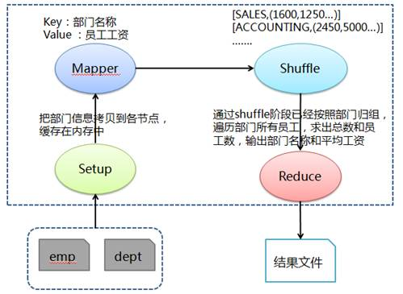

# Hadoop MapReduce示例2:求各个部门的人数和平均工资

[环境准备](./setup.html)

## 问题分析

求各个部门的人数和平均工资，需要得到各部门工资总数和部门人数，通过两者相除获取各部门平均工资。首先和问题 1 类似在 Mapper 的 Setup 阶段缓存部门数据，然后在 Mapper 阶段抽取出部门编号和员工工资，利用缓存部门数据把部门编号对应为部门名称，接着在 Shuffle 阶段把传过来的数据处理为部门名称对应该部门所有员工工资的列表，最后在 Reduce 中按照部门归组，遍历部门所有员工，求出总数和员工数，输出部门名称和平均工资。

## 处理流程图



## 准备相关文件

测试数据包括两个文件 dept（部门）和 emp（员工），其中各字段用逗号分隔：

文件名:dept

```
10,ACCOUNTING,NEW YORK
20,RESEARCH,DALLAS
30,SALES,CHICAGO
40,OPERATIONS,BOSTON
```

文件名:emp

```
7369,SMITH,CLERK,7902,17-12月-80,800,,20
7499,ALLEN,SALESMAN,7698,20-2月-81,1600,300,30
7521,WARD,SALESMAN,7698,22-2月-81,1250,500,30
7566,JONES,MANAGER,7839,02-4月-81,2975,,20
7654,MARTIN,SALESMAN,7698,28-9月-81,1250,1400,30
7698,BLAKE,MANAGER,7839,01-5月-81,2850,,30
7782,CLARK,MANAGER,7839,09-6月-81,2450,,10
7839,KING,PRESIDENT,,17-11月-81,5000,,10
7844,TURNER,SALESMAN,7698,08-9月-81,1500,0,30
7900,JAMES,CLERK,7698,03-12月-81,950,,30
7902,FORD,ANALYST,7566,03-12月-81,3000,,20
7934,MILLER,CLERK,7782,23-1月-82,1300,,10
```

文件名:Q2DeptNumberAveSalary.java

```java
import java.io.BufferedReader;
import java.io.FileReader;
import java.io.IOException;
import java.util.HashMap;
import java.util.Map;

import org.apache.hadoop.conf.Configuration;
import org.apache.hadoop.conf.Configured;
import org.apache.hadoop.filecache.DistributedCache;
import org.apache.hadoop.fs.Path;
import org.apache.hadoop.io.LongWritable;
import org.apache.hadoop.io.Text;
import org.apache.hadoop.mapreduce.Job;
import org.apache.hadoop.mapreduce.Mapper;
import org.apache.hadoop.mapreduce.Reducer;
import org.apache.hadoop.mapreduce.lib.input.FileInputFormat;
import org.apache.hadoop.mapreduce.lib.input.TextInputFormat;
import org.apache.hadoop.mapreduce.lib.output.FileOutputFormat;
import org.apache.hadoop.mapreduce.lib.output.TextOutputFormat;
import org.apache.hadoop.util.GenericOptionsParser;
import org.apache.hadoop.util.Tool;
import org.apache.hadoop.util.ToolRunner;

public class Q2DeptNumberAveSalary extends Configured implements Tool {

    public static class MapClass extends Mapper<LongWritable, Text, Text, Text> {

        // 用于缓存 dept文件中的数据
        private Map<String, String> deptMap = new HashMap<String, String>();
        private String[] kv;

        // 此方法会在Map方法执行之前执行且执行一次
        @Override
        protected void setup(Context context) throws IOException, InterruptedException {
            BufferedReader in = null;
            try {
                // 从当前作业中获取要缓存的文件
                Path[] paths = DistributedCache.getLocalCacheFiles(context.getConfiguration());
                String deptIdName = null;
                for (Path path : paths) {

                    // 对部门文件字段进行拆分并缓存到deptMap中
                    if (path.toString().contains("dept")) {
                        in = new BufferedReader(new FileReader(path.toString()));
                        while (null != (deptIdName = in.readLine())) {

                            // 对部门文件字段进行拆分并缓存到deptMap中
                            // 其中Map中key为部门编号，value为所在部门名称
                            deptMap.put(deptIdName.split(",")[0], deptIdName.split(",")[1]);
                        }
                    }
                }
            } catch (IOException e) {
                e.printStackTrace();
            } finally {
                try {
                    if (in != null) {
                        in.close();
                    }
                } catch (IOException e) {
                    e.printStackTrace();
                }
            }
        }

    public void map(LongWritable key, Text value, Context context) throws IOException, InterruptedException {

            // 对员工文件字段进行拆分
            kv = value.toString().split(",");

            // map join: 在map阶段过滤掉不需要的数据，输出key为部门名称和value为员工工资
            if (deptMap.containsKey(kv[7])) {
                if (null != kv[5] && !"".equals(kv[5].toString())) {
                    context.write(new Text(deptMap.get(kv[7].trim())), new Text(kv[5].trim()));
                }
            }
        }
    }

    public static class Reduce extends Reducer<Text, Text, Text, Text> {

    public void reduce(Text key, Iterable<Text> values, Context context) throws IOException, InterruptedException {

            long sumSalary = 0;
            int deptNumber = 0;

            // 对同一部门的员工工资进行求和
            for (Text val : values) {
                sumSalary += Long.parseLong(val.toString());
                deptNumber++;
            }

            // 输出key为部门名称和value为该部门员工工资平均值
    context.write(key, new Text("Dept Number:" + deptNumber + ", Ave Salary:" + sumSalary / deptNumber));
        }
    }

    @Override
    public int run(String[] args) throws Exception {

        // 实例化作业对象，设置作业名称、Mapper和Reduce类
        Job job = new Job(getConf(), "Q2DeptNumberAveSalary");
        job.setJobName("Q2DeptNumberAveSalary");
        job.setJarByClass(Q2DeptNumberAveSalary.class);
        job.setMapperClass(MapClass.class);
        job.setReducerClass(Reduce.class);

        // 设置输入格式类
        job.setInputFormatClass(TextInputFormat.class);

        // 设置输出格式类
        job.setOutputFormatClass(TextOutputFormat.class);
        job.setOutputKeyClass(Text.class);
        job.setOutputValueClass(Text.class);

        // 第1个参数为缓存的部门数据路径、第2个参数为员工数据路径和第3个参数为输出路径
    String[] otherArgs = new GenericOptionsParser(job.getConfiguration(), args).getRemainingArgs();
        DistributedCache.addCacheFile(new Path(otherArgs[0]).toUri(), job.getConfiguration());
        FileInputFormat.addInputPath(job, new Path(otherArgs[1]));
        FileOutputFormat.setOutputPath(job, new Path(otherArgs[2]));

        job.waitForCompletion(true);
        return job.isSuccessful() ? 0 : 1;
    }

    /**
     * 主方法，执行入口
     * @param args 输入参数
     */
    public static void main(String[] args) throws Exception {
        int res = ToolRunner.run(new Configuration(), new Q2DeptNumberAveSalary(), args);
        System.exit(res);
    }
}
```

### 创建任务目录并复制相关文件

```bash
mkdir ~/mr2 && cd ~/mr2
cp /share/lesson/hadoop/Q2DeptNumberAveSalary.java .
cp /share/lesson/hadoop/dept .
cp /share/lesson/hadoop/emp .
cp /share/lesson/hadoop/hadoop-core-1.2.1.jar .
cp /share/lesson/hadoop/commons-cli-1.2.jar .
```

### 编译java文件并打jar包

```bash
cd ~/mr2
javac -classpath  hadoop-core-1.2.1.jar:commons-cli-1.2.jar -d ~/mr2/ Q2DeptNumberAveSalary.java
jar cvf ./Q2DeptNumberAveSalary.jar ./Q3DeptEarliestEmp*.class
```

### 准备上传数据至HDFS系统

```bash
jps #检查hdfs系统是否正常
```

```bash
hadoop fs -mkdir -p /input2/
hadoop fs -put ~/mr2/dept /input2/
hadoop fs -put ~/mr2/emp /input2/
```

### 提交任务并耐心等待任务完成

```bash
cd ~/mr2
hadoop jar Q2DeptNumberAveSalary.jar Q2DeptNumberAveSalary hdfs://localhost:9000/input2/dept hdfs://localhost:9000/input2/emp hdfs://localhost:9000/output2
```

### 查看HDFS上任务输出目录

```bash
hadoop fs -ls /output2 #查看输出结果目录
hadoop fs -cat /output2/part-r-00000
```

打开 `part-r-00000` 文件，可以看到运行结果：

```bash
ACCOUNTING    Dept Number:3,Ave Salary:2916
RESEARCH    Dept Number:3,Ave Salary:2258
SALES    Dept Number:6,Ave Salary:1566
```
