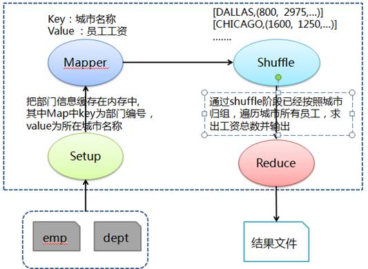

# Hadoop MapReduce示例4:求各个城市的员工的总工资
## 问题分析

求各个城市员工的总工资，需要得到各个城市所有员工的工资，通过对各个城市所有员工工资求和得到总工资。首先和测试例子 1 类似在 Mapper 的 Setup 阶段缓存部门对应所在城市数据，然后在 Mapper 阶段抽取出 key 为城市名称（利用缓存数据把部门编号对应为所在城市名称），value 为员工工资，接着在 Shuffle 阶段把传过来的数据处理为城市名称对应该城市所有员工工资，最后在 Reduce 中按照城市归组，遍历城市所有员工，求出工资总数并输出。

## 处理流程图



## 准备相关文件

测试数据包括两个文件 dept（部门）和 emp（员工），其中各字段用逗号分隔：

文件名:dept

```
10,ACCOUNTING,NEW YORK
20,RESEARCH,DALLAS
30,SALES,CHICAGO
40,OPERATIONS,BOSTON
```

文件名:emp

```
7369,SMITH,CLERK,7902,17-12月-80,800,,20
7499,ALLEN,SALESMAN,7698,20-2月-81,1600,300,30
7521,WARD,SALESMAN,7698,22-2月-81,1250,500,30
7566,JONES,MANAGER,7839,02-4月-81,2975,,20
7654,MARTIN,SALESMAN,7698,28-9月-81,1250,1400,30
7698,BLAKE,MANAGER,7839,01-5月-81,2850,,30
7782,CLARK,MANAGER,7839,09-6月-81,2450,,10
7839,KING,PRESIDENT,,17-11月-81,5000,,10
7844,TURNER,SALESMAN,7698,08-9月-81,1500,0,30
7900,JAMES,CLERK,7698,03-12月-81,950,,30
7902,FORD,ANALYST,7566,03-12月-81,3000,,20
7934,MILLER,CLERK,7782,23-1月-82,1300,,10
```

文件名:Q4SumCitySalary.java

```java
import java.io.BufferedReader;
import java.io.FileReader;
import java.io.IOException;
import java.util.HashMap;
import java.util.Map;

import org.apache.hadoop.conf.Configuration;
import org.apache.hadoop.conf.Configured;
import org.apache.hadoop.filecache.DistributedCache;
import org.apache.hadoop.fs.Path;
import org.apache.hadoop.io.LongWritable;
import org.apache.hadoop.io.Text;
import org.apache.hadoop.mapreduce.Job;
import org.apache.hadoop.mapreduce.Mapper;
import org.apache.hadoop.mapreduce.Reducer;
import org.apache.hadoop.mapreduce.lib.input.FileInputFormat;
import org.apache.hadoop.mapreduce.lib.input.TextInputFormat;
import org.apache.hadoop.mapreduce.lib.output.FileOutputFormat;
import org.apache.hadoop.mapreduce.lib.output.TextOutputFormat;
import org.apache.hadoop.util.GenericOptionsParser;
import org.apache.hadoop.util.Tool;
import org.apache.hadoop.util.ToolRunner;

public class Q4SumCitySalary extends Configured implements Tool {

    public static class MapClass extends Mapper<LongWritable, Text, Text, Text> {

        // 用于缓存 dept文件中的数据
        private Map<String, String> deptMap = new HashMap<String, String>();
        private String[] kv;

        // 此方法会在Map方法执行之前执行且执行一次
        @Override
        protected void setup(Context context) throws IOException, InterruptedException {
            BufferedReader in = null;
            try {
                // 从当前作业中获取要缓存的文件
                Path[] paths = DistributedCache.getLocalCacheFiles(context.getConfiguration());
                String deptIdName = null;
                for (Path path : paths) {
                    if (path.toString().contains("dept")) {
                        in = new BufferedReader(new FileReader(path.toString()));
                        while (null != (deptIdName = in.readLine())) {

                            // 对部门文件字段进行拆分并缓存到deptMap中
                            // 其中Map中key为部门编号，value为所在城市名称
                            deptMap.put(deptIdName.split(",")[0], deptIdName.split(",")[2]);
                        }
                    }
                }
            } catch (IOException e) {
                e.printStackTrace();
            } finally {
                try {
                    if (in != null) {
                        in.close();
                    }
                } catch (IOException e) {
                    e.printStackTrace();
                }
            }
        }

        public void map(LongWritable key, Text value, Context context) throws IOException,         InterruptedException {

            // 对员工文件字段进行拆分
            kv = value.toString().split(",");

            // map join: 在map阶段过滤掉不需要的数据，输出key为城市名称和value为员工工资
            if (deptMap.containsKey(kv[7])) {
                if (null != kv[5] && !"".equals(kv[5].toString())) {
                    context.write(new Text(deptMap.get(kv[7].trim())), new Text(kv[5].trim()));
                }
            }
        }
    }

    public static class Reduce extends Reducer<Text, Text, Text, LongWritable> {

        public void reduce(Text key, Iterable<Text> values, Context context) throws IOException,         InterruptedException {

            // 对同一城市的员工工资进行求和
            long sumSalary = 0;
            for (Text val : values) {
                sumSalary += Long.parseLong(val.toString());
            }

            // 输出key为城市名称和value为该城市工资总和
            context.write(key, new LongWritable(sumSalary));
        }
    }

    @Override
    public int run(String[] args) throws Exception {

        // 实例化作业对象，设置作业名称
        Job job = new Job(getConf(), "Q4SumCitySalary");
        job.setJobName("Q4SumCitySalary");

        // 设置Mapper和Reduce类
        job.setJarByClass(Q4SumCitySalary.class);
        job.setMapperClass(MapClass.class);
        job.setReducerClass(Reduce.class);

        // 设置输入格式类
        job.setInputFormatClass(TextInputFormat.class);

        // 设置输出格式类
        job.setOutputFormatClass(TextOutputFormat.class);
        job.setOutputKeyClass(Text.class);
        job.setOutputValueClass(Text.class);

        // 第1个参数为缓存的部门数据路径、第2个参数为员工数据路径和第3个参数为输出路径
    String[] otherArgs = new GenericOptionsParser(job.getConfiguration(), args).getRemainingArgs();
    DistributedCache.addCacheFile(new Path(otherArgs[0]).toUri(), job.getConfiguration());
        FileInputFormat.addInputPath(job, new Path(otherArgs[1]));
        FileOutputFormat.setOutputPath(job, new Path(otherArgs[2]));

        job.waitForCompletion(true);
        return job.isSuccessful() ? 0 : 1;
    }

    /**
     * 主方法，执行入口
     * @param args 输入参数
     */
    public static void main(String[] args) throws Exception {
        int res = ToolRunner.run(new Configuration(), new Q4SumCitySalary(), args);
        System.exit(res);
    }
}
```

### 创建任务目录并复制相关文件

```bash
mkdir ~/mr4 && cd ~/mr4
cp /share/lesson/hadoop/Q4SumCitySalary.java .
cp /share/lesson/hadoop/dept .
cp /share/lesson/hadoop/emp .
cp /share/lesson/hadoop/hadoop-core-1.2.1.jar .
cp /share/lesson/hadoop/commons-cli-1.2.jar .
```

### 编译java文件并打jar包

```bash
cd ~/mr4
javac -classpath  hadoop-core-1.2.1.jar:commons-cli-1.2.jar -d ~/mr4/ Q4SumCitySalary.java
jar cvf ./Q4SumCitySalary.jar ./Q4SumCitySalary*.class
```

### 准备上传数据至HDFS系统

```bash
jps #检查hdfs系统是否正常
```

```bash
hadoop fs -mkdir -p /input4/
hadoop fs -put ~/mr4/dept /input4/
hadoop fs -put ~/mr4/emp /input4/
```

### 提交任务并耐心等待任务完成

```bash
cd ~/mr4
hadoop jar Q4SumCitySalary.jar Q4SumCitySalary hdfs://localhost:9000/input4/dept hdfs://localhost:9000/input4/emp hdfs://localhost:9000/output4
```

### 查看HDFS上任务输出目录

```bash
hadoop fs -ls /output4 #查看输出结果目录
hadoop fs -cat /output4/part-r-00000
```
打开 `part-r-00000` 文件，可以看到运行结果：
```
CHICAGO    9400
DALLAS    6775
NEW YORK    8750
```

