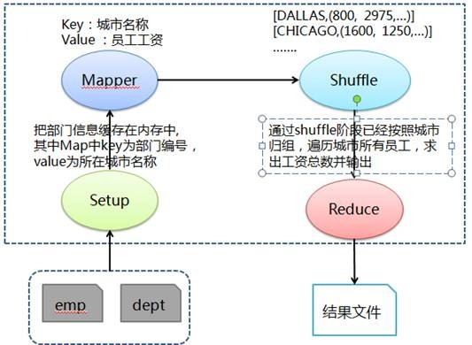

# Hadoop MapReduce示例5:求各个城市的员工的总工资

## 问题分析

求工资比上司高的员工姓名及工资，需要得到上司工资及上司所有下属员工，通过比较他们工资高低得到比上司工资高的员工。在 Mapper 阶段输出经理数据和员工对应经理表数据，其中经理数据 key 为员工编号、value 为"M，该员工工资"，员工对应经理表数据 key 为经理编号、value 为"E，该员工姓名，该员工工资"。然后在 Shuffle 阶段把传过来的经理数据和员工对应经理表数据进行归组，如编号为 7698 员工，value 中标志 M 为自己工资，value 中标志 E 为其下属姓名及工资。最后在 Reduce 中遍历比较员工与经理工资高低，输出工资高于经理的员工。

## 处理流程图



## 准备相关文件

测试数据 emp（员工），其中各字段用逗号分隔：

文件名:emp

```
7369,SMITH,CLERK,7902,17-12月-80,800,,20
7499,ALLEN,SALESMAN,7698,20-2月-81,1600,300,30
7521,WARD,SALESMAN,7698,22-2月-81,1250,500,30
7566,JONES,MANAGER,7839,02-4月-81,2975,,20
7654,MARTIN,SALESMAN,7698,28-9月-81,1250,1400,30
7698,BLAKE,MANAGER,7839,01-5月-81,2850,,30
7782,CLARK,MANAGER,7839,09-6月-81,2450,,10
7839,KING,PRESIDENT,,17-11月-81,5000,,10
7844,TURNER,SALESMAN,7698,08-9月-81,1500,0,30
7900,JAMES,CLERK,7698,03-12月-81,950,,30
7902,FORD,ANALYST,7566,03-12月-81,3000,,20
7934,MILLER,CLERK,7782,23-1月-82,1300,,10
```

文件名:Q5EarnMoreThanManager.java

```java
import java.io.IOException;
import java.util.HashMap;

import org.apache.hadoop.conf.Configuration;
import org.apache.hadoop.conf.Configured;
import org.apache.hadoop.fs.Path;
import org.apache.hadoop.io.LongWritable;
import org.apache.hadoop.io.Text;
import org.apache.hadoop.mapreduce.Job;
import org.apache.hadoop.mapreduce.Mapper;
import org.apache.hadoop.mapreduce.Reducer;
import org.apache.hadoop.mapreduce.lib.input.FileInputFormat;
import org.apache.hadoop.mapreduce.lib.input.TextInputFormat;
import org.apache.hadoop.mapreduce.lib.output.FileOutputFormat;
import org.apache.hadoop.mapreduce.lib.output.TextOutputFormat;
import org.apache.hadoop.util.GenericOptionsParser;
import org.apache.hadoop.util.Tool;
import org.apache.hadoop.util.ToolRunner;

public class Q5EarnMoreThanManager extends Configured implements Tool {

    public static class MapClass extends Mapper<LongWritable, Text, Text, Text> {

        public void map(LongWritable key, Text value, Context context) throws IOException,         InterruptedException {

            // 对员工文件字段进行拆分
            String[] kv = value.toString().split(",");

            // 输出经理表数据，其中key为员工编号和value为M+该员工工资
            context.write(new Text(kv[0].toString()), new Text("M," + kv[5]));

            // 输出员工对应经理表数据，其中key为经理编号和value为(E，该员工姓名，该员工工资)
            if (null != kv[3] && !"".equals(kv[3].toString())) {
                context.write(new Text(kv[3].toString()), new Text("E," + kv[1] + "," + kv[5]));
            }
        }
    }

    public static class Reduce extends Reducer<Text, Text, Text, Text> {

        public void reduce(Text key, Iterable<Text> values, Context context) throws IOException,         InterruptedException {

            // 定义员工姓名、工资和存放部门员工Map
            String empName;
            long empSalary = 0;
            HashMap<String, Long> empMap = new HashMap<String, Long>();

            // 定义经理工资变量
            long mgrSalary = 0;

            for (Text val : values) {
                if (val.toString().startsWith("E")) {
                    // 当是员工标示时，获取该员工对应的姓名和工资并放入Map中
                    empName = val.toString().split(",")[1];
                    empSalary = Long.parseLong(val.toString().split(",")[2]);
                    empMap.put(empName, empSalary);
                } else {
                    // 当时经理标志时，获取该经理工资
                    mgrSalary = Long.parseLong(val.toString().split(",")[1]);
                }
            }

            // 遍历该经理下属，比较员工与经理工资高低，输出工资高于经理的员工
            for (java.util.Map.Entry<String, Long> entry : empMap.entrySet()) {
                if (entry.getValue() > mgrSalary) {
                    context.write(new Text(entry.getKey()), new Text("" + entry.getValue()));
                }
            }
        }
    }

    @Override
    public int run(String[] args) throws Exception {

        // 实例化作业对象，设置作业名称
        Job job = new Job(getConf(), "Q5EarnMoreThanManager");
        job.setJobName("Q5EarnMoreThanManager");

        // 设置Mapper和Reduce类
        job.setJarByClass(Q5EarnMoreThanManager.class);
        job.setMapperClass(MapClass.class);
        job.setReducerClass(Reduce.class);

        // 设置输入格式类
        job.setInputFormatClass(TextInputFormat.class);

        // 设置输出格式类
        job.setOutputFormatClass(TextOutputFormat.class);
        job.setOutputKeyClass(Text.class);
        job.setOutputValueClass(Text.class);

        // 第1个参数为员工数据路径和第2个参数为输出路径
String[] otherArgs = new GenericOptionsParser(job.getConfiguration(), args).getRemainingArgs();
        FileInputFormat.addInputPath(job, new Path(otherArgs[0]));
        FileOutputFormat.setOutputPath(job, new Path(otherArgs[1]));

        job.waitForCompletion(true);
        return job.isSuccessful() ? 0 : 1;
    }

    /**
     * 主方法，执行入口
     * @param args 输入参数
     */
    public static void main(String[] args) throws Exception {
        int res = ToolRunner.run(new Configuration(), new Q5EarnMoreThanManager(), args);
        System.exit(res);
    }
}
```

### 创建任务目录并复制相关文件

```bash
mkdir ~/mr5 && cd ~/mr5
cp /share/lesson/hadoop/Q5EarnMoreThanManager.java .
cp /share/lesson/hadoop/emp .
cp /share/lesson/hadoop/hadoop-core-1.2.1.jar .
cp /share/lesson/hadoop/commons-cli-1.2.jar .
```

### 编译java文件并打jar包

```bash
cd ~/mr5
javac -classpath  hadoop-core-1.2.1.jar:commons-cli-1.2.jar -d ~/mr5/ Q5EarnMoreThanManager.java
jar cvf ./Q5EarnMoreThanManager.jar ./Q5EarnMoreThanManager*.class
```

### 准备上传数据至HDFS系统

```bash
jps #检查hdfs系统是否正常
```

```bash
hadoop fs -mkdir -p /input5/
hadoop fs -put ~/mr5/emp /input5/
```

### 提交任务并耐心等待任务完成

```bash
cd ~/mr5
hadoop jar Q5EarnMoreThanManager.jar Q5EarnMoreThanManager  hdfs://localhost:9000/input5/emp hdfs://localhost:9000/output5
```

### 查看HDFS上任务输出目录

```bash
hadoop fs -ls /output5 #查看输出结果目录
hadoop fs -cat /output5/part-r-00000
```

打开 `part-r-00000` 文件，可以看到运行结果：

```
FORD    3000
```

