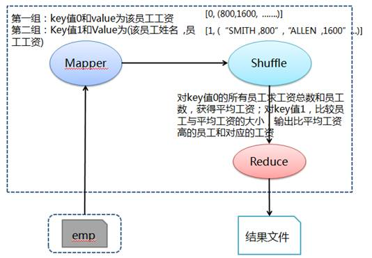

# Hadoop MapReduce示例6:列出工资比公司平均工资要高的员工姓名及其工资

## 问题分析

求工资比公司平均工资要高的员工姓名及工资，需要得到公司的平均工资和所有员工工资，通过比较得出工资比平均工资高的员工姓名及工资。这个问题可以分两个作业进行解决，先求出公司的平均工资，然后与所有员工进行比较得到结果。也可以在一个作业进行解决，这里就得使用作业 setNumReduceTasks 方法，设置 Reduce 任务数为 1，保证每次运行一个 reduce 任务，从而能先求出平均工资，然后进行比较得出结果。

在 Mapper 阶段输出两份所有员工数据，其中一份 key 为 0、value 为该员工工资，另外一份 key 为 0、value 为"该员工姓名，员工工资"。然后在 Shuffle 阶段把传过来数据按照 key 进行归组，在该任务中有 key 值为 0 和 1 两组数据。最后在 Reduce 中对 key 值 0 的所有员工求工资总数和员工数，获得平均工资。对 key 值 1，比较员工与平均工资的大小，输出比平均工资高的员工和对应的工资。

## 处理流程图



## 准备相关文件

测试数据 emp（员工），其中各字段用逗号分隔：

文件名:emp

```
7369,SMITH,CLERK,7902,17-12月-80,800,,20
7499,ALLEN,SALESMAN,7698,20-2月-81,1600,300,30
7521,WARD,SALESMAN,7698,22-2月-81,1250,500,30
7566,JONES,MANAGER,7839,02-4月-81,2975,,20
7654,MARTIN,SALESMAN,7698,28-9月-81,1250,1400,30
7698,BLAKE,MANAGER,7839,01-5月-81,2850,,30
7782,CLARK,MANAGER,7839,09-6月-81,2450,,10
7839,KING,PRESIDENT,,17-11月-81,5000,,10
7844,TURNER,SALESMAN,7698,08-9月-81,1500,0,30
7900,JAMES,CLERK,7698,03-12月-81,950,,30
7902,FORD,ANALYST,7566,03-12月-81,3000,,20
7934,MILLER,CLERK,7782,23-1月-82,1300,,10
```

文件名:Q6HigherThanAveSalary.java

```java
import java.io.IOException;
import org.apache.hadoop.conf.Configuration;
import org.apache.hadoop.conf.Configured;
import org.apache.hadoop.fs.Path;
import org.apache.hadoop.io.IntWritable;
import org.apache.hadoop.io.LongWritable;
import org.apache.hadoop.io.Text;
import org.apache.hadoop.mapreduce.Job;
import org.apache.hadoop.mapreduce.Mapper;
import org.apache.hadoop.mapreduce.Reducer;
import org.apache.hadoop.mapreduce.lib.input.FileInputFormat;
import org.apache.hadoop.mapreduce.lib.output.FileOutputFormat;
import org.apache.hadoop.mapreduce.lib.output.TextOutputFormat;
import org.apache.hadoop.util.GenericOptionsParser;
import org.apache.hadoop.util.Tool;
import org.apache.hadoop.util.ToolRunner;

public class Q6HigherThanAveSalary extends Configured implements Tool {

    public static class MapClass extends Mapper<LongWritable, Text, IntWritable, Text> {

        public void map(LongWritable key, Text value, Context context) throws IOException,         InterruptedException {

            // 对员工文件字段进行拆分
            String[] kv = value.toString().split(",");

            // 获取所有员工数据，其中key为0和value为该员工工资
            context.write(new IntWritable(0), new Text(kv[5]));

            // 获取所有员工数据，其中key为0和value为(该员工姓名 ,员工工资)
            context.write(new IntWritable(1), new Text(kv[1] + "," + kv[5]));
        }
    }

    public static class Reduce extends Reducer<IntWritable, Text, Text, Text> {

        // 定义员工工资、员工数和平均工资
        private long allSalary = 0;
        private int allEmpCount = 0;
        private long aveSalary = 0;

        // 定义员工工资变量
        private long empSalary = 0;

        public void reduce(IntWritable key, Iterable<Text> values, Context context) throws         IOException, InterruptedException {

            for (Text val : values) {
                if (0 == key.get()) {
                    // 获取所有员工工资和员工数
                    allSalary += Long.parseLong(val.toString());
                    allEmpCount++;
                    System.out.println("allEmpCount = " + allEmpCount);
                } else if (1 == key.get()) {
                    if (aveSalary == 0) {
                        aveSalary = allSalary / allEmpCount;
                        context.write(new Text("Average Salary = "), new Text("" + aveSalary));
                        context.write(new Text("Following employees have salarys higher than                         Average:"), new Text(""));
                    }

                    // 获取员工的平均工资
                    System.out.println("Employee salary = " + val.toString());
                    aveSalary = allSalary / allEmpCount;

                    // 比较员工与平均工资的大小，输出比平均工资高的员工和对应的工资
                    empSalary = Long.parseLong(val.toString().split(",")[1]);
                    if (empSalary > aveSalary) {
                        context.write(new Text(val.toString().split(",")[0]), new Text("" +                         empSalary));
                    }
                }
            }
        }
    }

    @Override
    public int run(String[] args) throws Exception {

        // 实例化作业对象，设置作业名称
        Job job = new Job(getConf(), "Q6HigherThanAveSalary");
        job.setJobName("Q6HigherThanAveSalary");

        // 设置Mapper和Reduce类
        job.setJarByClass(Q6HigherThanAveSalary.class);
        job.setMapperClass(MapClass.class);
        job.setReducerClass(Reduce.class);

        // 必须设置Reduce任务数为1 # -D mapred.reduce.tasks = 1
        // 这是该作业设置的核心，这样才能够保证各reduce是串行的
        job.setNumReduceTasks(1);

        // 设置输出格式类
        job.setMapOutputKeyClass(IntWritable.class);
        job.setMapOutputValueClass(Text.class);

        // 设置输出键和值类型
        job.setOutputFormatClass(TextOutputFormat.class);
        job.setOutputKeyClass(Text.class);
        job.setOutputValueClass(LongWritable.class);

        // 第1个参数为员工数据路径和第2个参数为输出路径
String[] otherArgs = new GenericOptionsParser(job.getConfiguration(), args).getRemainingArgs();
        FileInputFormat.addInputPath(job, new Path(otherArgs[0]));
        FileOutputFormat.setOutputPath(job, new Path(otherArgs[1]));

        job.waitForCompletion(true);
        return job.isSuccessful() ? 0 : 1;
    }

    /**
     * 主方法，执行入口
     * @param args 输入参数
     */
    public static void main(String[] args) throws Exception {
        int res = ToolRunner.run(new Configuration(), new Q6HigherThanAveSalary(), args);
        System.exit(res);
    }
}
```

### 创建任务目录并复制相关文件

```bash
mkdir ~/mr6 && cd ~/mr6
cp /share/lesson/hadoop/Q6HigherThanAveSalary.java .
cp /share/lesson/hadoop/emp .
cp /share/lesson/hadoop/hadoop-core-1.2.1.jar .
cp /share/lesson/hadoop/commons-cli-1.2.jar .
```

### 编译java文件并打jar包

```bash
cd ~/mr6
javac -classpath  hadoop-core-1.2.1.jar:commons-cli-1.2.jar -d ~/mr6/ Q6HigherThanAveSalary.java
jar cvf ./Q6HigherThanAveSalary.jar ./Q6HigherThanAveSalary*.class
```

### 准备上传数据至HDFS系统

```bash
jps #检查hdfs系统是否正常
```

```bash
hadoop fs -mkdir -p /input6/
hadoop fs -put ~/mr6/emp /input6/
```

### 提交任务并耐心等待任务完成

```bash
cd ~/mr6
hadoop jar Q6HigherThanAveSalary.jar Q6HigherThanAveSalary  hdfs://localhost:9000/input6/emp hdfs://localhost:9000/output6
```

### 查看HDFS上任务输出目录

```bash
hadoop fs -ls /output6 #查看输出结果目录
hadoop fs -cat /output6/part-r-00000
```

打开 `part-r-00000` 文件，可以看到运行结果：

```
Average Salary =     2077
Following employees have salarys higher than Average:
FORD    3000
CLARK    2450
KING    5000
JONES    2975
BLAKE    2850
```