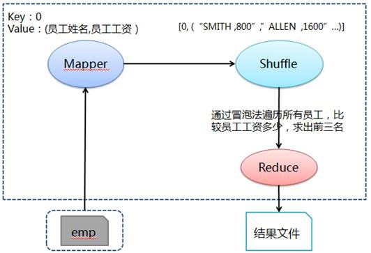

# Hadoop MapReduce示例8:列出名字以 J 开头的员工姓名及其所属部门名称

## 问题分析

求工资最高的头三名员工姓名及工资，可以通过冒泡法得到。在 Mapper 阶段输出经理数据和员工对应经理表数据，其中经理数据 key 为 0 值、value 为"员工姓名，员工工资"。最后在 Reduce 中通过冒泡法遍历所有员工，比较员工工资多少，求出前三名。
## 处理流程图



## 准备相关文件

测试数据 emp（员工），其中各字段用逗号分隔：

文件名:emp

```
7369,SMITH,CLERK,7902,17-12月-80,800,,20
7499,ALLEN,SALESMAN,7698,20-2月-81,1600,300,30
7521,WARD,SALESMAN,7698,22-2月-81,1250,500,30
7566,JONES,MANAGER,7839,02-4月-81,2975,,20
7654,MARTIN,SALESMAN,7698,28-9月-81,1250,1400,30
7698,BLAKE,MANAGER,7839,01-5月-81,2850,,30
7782,CLARK,MANAGER,7839,09-6月-81,2450,,10
7839,KING,PRESIDENT,,17-11月-81,5000,,10
7844,TURNER,SALESMAN,7698,08-9月-81,1500,0,30
7900,JAMES,CLERK,7698,03-12月-81,950,,30
7902,FORD,ANALYST,7566,03-12月-81,3000,,20
7934,MILLER,CLERK,7782,23-1月-82,1300,,10
```

文件名:Q8SalaryTop3Salary.java

```java
import java.io.IOException;

import org.apache.hadoop.conf.Configuration;
import org.apache.hadoop.conf.Configured;
import org.apache.hadoop.fs.Path;
import org.apache.hadoop.io.IntWritable;
import org.apache.hadoop.io.LongWritable;
import org.apache.hadoop.io.Text;
import org.apache.hadoop.mapreduce.Job;
import org.apache.hadoop.mapreduce.Mapper;
import org.apache.hadoop.mapreduce.Reducer;
import org.apache.hadoop.mapreduce.lib.input.FileInputFormat;
import org.apache.hadoop.mapreduce.lib.input.TextInputFormat;
import org.apache.hadoop.mapreduce.lib.output.FileOutputFormat;
import org.apache.hadoop.mapreduce.lib.output.TextOutputFormat;
import org.apache.hadoop.util.GenericOptionsParser;
import org.apache.hadoop.util.Tool;
import org.apache.hadoop.util.ToolRunner;

public class Q8SalaryTop3Salary extends Configured implements Tool {

    public static class MapClass extends Mapper<LongWritable, Text, IntWritable, Text> {

        public void map(LongWritable key, Text value, Context context) throws IOException,         InterruptedException {

            // 对员工文件字段进行拆分
            String[] kv = value.toString().split(",");

            // 输出key为0和value为员工姓名+","+员工工资
            context.write(new IntWritable(0), new Text(kv[1].trim() + "," + kv[5].trim()));
        }
    }

    public static class Reduce extends Reducer<IntWritable, Text, Text, Text> {

        public void reduce(IntWritable key, Iterable<Text> values, Context context) throws         IOException, InterruptedException {

            // 定义工资前三员工姓名
            String empName;
            String firstEmpName = "";
            String secondEmpName = "";
            String thirdEmpName = "";

            // 定义工资前三工资
            long empSalary = 0;
            long firstEmpSalary = 0;
            long secondEmpSalary = 0;
            long thirdEmpSalary = 0;

            // 通过冒泡法遍历所有员工，比较员工工资多少，求出前三名
            for (Text val : values) {
                empName = val.toString().split(",")[0];
                empSalary = Long.parseLong(val.toString().split(",")[1]);

                if(empSalary > firstEmpSalary) {
                    thirdEmpName = secondEmpName;
                    thirdEmpSalary = secondEmpSalary;
                    secondEmpName = firstEmpName;
                    secondEmpSalary = firstEmpSalary;
                    firstEmpName = empName;
                    firstEmpSalary = empSalary;
                } else if (empSalary > secondEmpSalary) {
                    thirdEmpName = secondEmpName;
                    thirdEmpSalary = secondEmpSalary;
                    secondEmpName = empName;
                    secondEmpSalary = empSalary;
                } else if (empSalary > thirdEmpSalary) {
                    thirdEmpName = empName;
                    thirdEmpSalary = empSalary;
                }
            }

            // 输出工资前三名信息
            context.write(new Text( "First employee name:" + firstEmpName), new Text("Salary:"             + firstEmpSalary));
            context.write(new Text( "Second employee name:" + secondEmpName), new                     Text("Salary:" + secondEmpSalary));
            context.write(new Text( "Third employee name:" + thirdEmpName), new Text("Salary:"             + thirdEmpSalary));
        }
    }

    @Override
    public int run(String[] args) throws Exception {

        // 实例化作业对象，设置作业名称
        Job job = new Job(getConf(), "Q8SalaryTop3Salary");
        job.setJobName("Q8SalaryTop3Salary");

        // 设置Mapper和Reduce类
        job.setJarByClass(Q8SalaryTop3Salary.class);
        job.setMapperClass(MapClass.class);
        job.setReducerClass(Reduce.class);
        job.setMapOutputKeyClass(IntWritable.class);
        job.setMapOutputValueClass(Text.class);

        // 设置输入格式类
        job.setInputFormatClass(TextInputFormat.class);

        // 设置输出格式类
        job.setOutputKeyClass(Text.class);
        job.setOutputFormatClass(TextOutputFormat.class);
        job.setOutputValueClass(Text.class);

        // 第1个参数为员工数据路径和第2个参数为输出路径
        String[] otherArgs = new GenericOptionsParser(job.getConfiguration(),                     args).getRemainingArgs();
        FileInputFormat.addInputPath(job, new Path(otherArgs[0]));
        FileOutputFormat.setOutputPath(job, new Path(otherArgs[1]));

        job.waitForCompletion(true);
        return job.isSuccessful() ? 0 : 1;
    }

    /**
     * 主方法，执行入口
     * @param args 输入参数
     */
    public static void main(String[] args) throws Exception {
        int res = ToolRunner.run(new Configuration(), new Q8SalaryTop3Salary(), args);
        System.exit(res);
    }
}
```

### 创建任务目录并复制相关文件

```bash
mkdir ~/mr8 && cd ~/mr8
cp /share/lesson/hadoop/Q8SalaryTop3Salary.java .
cp /share/lesson/hadoop/emp .
cp /share/lesson/hadoop/hadoop-core-1.2.1.jar .
cp /share/lesson/hadoop/commons-cli-1.2.jar .
```

### 编译java文件并打jar包

```bash
cd ~/mr8
javac -classpath  hadoop-core-1.2.1.jar:commons-cli-1.2.jar -d ~/mr8/ Q8SalaryTop3Salary.java
jar cvf ./Q8SalaryTop3Salary.jar ./Q8SalaryTop3Salary*.class
```

### 准备上传数据至HDFS系统

```bash
jps #检查hdfs系统是否正常
```

```bash
hadoop fs -mkdir -p /input8/
hadoop fs -put ~/mr8/emp /input8/
```

### 提交任务并耐心等待任务完成

```bash
cd ~/mr8
hadoop jar Q8SalaryTop3Salary.jar Q8SalaryTop3Salary hdfs://localhost:9000/input8/emp hdfs://localhost:9000/output8
```

### 查看HDFS上任务输出目录

```bash
hadoop fs -ls /output8 #查看输出结果目录
hadoop fs -cat /output8/part-r-00000
```

打开 `part-r-00000` 文件，可以看到运行结果：

```
First employee name:KING    Salary:5000
Second employee name:FORD    Salary:3000
Third employee name:JONES    Salary:2975
```

