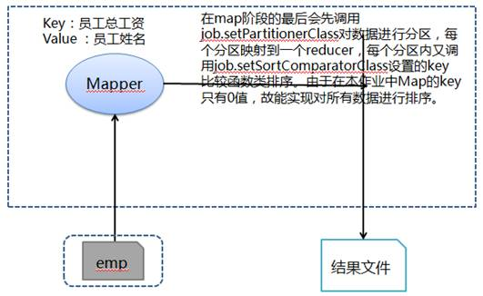

# Hadoop MapReduce示例9:将全体员工按照总收入（工资 + 提成）从高到低排列

## 问题分析

求全体员工总收入降序排列，获得所有员工总收入并降序排列即可。在 Mapper 阶段输出所有员工总工资数据，其中 key 为员工总工资、value 为员工姓名，在 Mapper 阶段的最后会先调用 `job.setPartitionerClass` 对数据进行分区，每个分区映射到一个 reducer，每个分区内又调用 `job.setSortComparatorClass` 设置的 key 比较函数类排序。由于在本作业中 Map 的 key 只有 0 值，故能实现对所有数据进行排序。

**处理流程图**



## 准备相关文件

测试数据 emp（员工），其中各字段用逗号分隔：

文件名:emp

```
7369,SMITH,CLERK,7902,17-12月-80,800,,20
7499,ALLEN,SALESMAN,7698,20-2月-81,1600,300,30
7521,WARD,SALESMAN,7698,22-2月-81,1250,500,30
7566,JONES,MANAGER,7839,02-4月-81,2975,,20
7654,MARTIN,SALESMAN,7698,28-9月-81,1250,1400,30
7698,BLAKE,MANAGER,7839,01-5月-81,2850,,30
7782,CLARK,MANAGER,7839,09-6月-81,2450,,10
7839,KING,PRESIDENT,,17-11月-81,5000,,10
7844,TURNER,SALESMAN,7698,08-9月-81,1500,0,30
7900,JAMES,CLERK,7698,03-12月-81,950,,30
7902,FORD,ANALYST,7566,03-12月-81,3000,,20
7934,MILLER,CLERK,7782,23-1月-82,1300,,10
```

文件名:Q9EmpSalarySort.java

```java
import java.io.IOException;

import org.apache.hadoop.conf.Configuration;
import org.apache.hadoop.conf.Configured;
import org.apache.hadoop.fs.Path;
import org.apache.hadoop.io.IntWritable;
import org.apache.hadoop.io.LongWritable;
import org.apache.hadoop.io.Text;
import org.apache.hadoop.io.WritableComparable;
import org.apache.hadoop.mapreduce.Job;
import org.apache.hadoop.mapreduce.Mapper;
import org.apache.hadoop.mapreduce.lib.input.FileInputFormat;
import org.apache.hadoop.mapreduce.lib.output.FileOutputFormat;
import org.apache.hadoop.util.GenericOptionsParser;
import org.apache.hadoop.util.Tool;
import org.apache.hadoop.util.ToolRunner;

public class Q9EmpSalarySort extends Configured implements Tool {

    public static class MapClass extends Mapper<LongWritable, Text, IntWritable, Text> {

        public void map(LongWritable key, Text value, Context context) throws IOException,         InterruptedException {

            // 对员工文件字段进行拆分
            String[] kv = value.toString().split(",");

            // 输出key为员工所有工资和value为员工姓名
            int empAllSalary = "".equals(kv[6]) ? Integer.parseInt(kv[5]) :                             Integer.parseInt(kv[5]) + Integer.parseInt(kv[6]);
            context.write(new IntWritable(empAllSalary), new Text(kv[1]));
        }
    }

    /**
     * 递减排序算法
     */
    public static class DecreaseComparator extends IntWritable.Comparator {
        public int compare(WritableComparable a, WritableComparable b) {
            return -super.compare(a, b);
        }

        public int compare(byte[] b1, int s1, int l1, byte[] b2, int s2, int l2) {
            return -super.compare(b1, s1, l1, b2, s2, l2);
        }
    }

    @Override
    public int run(String[] args) throws Exception {

        // 实例化作业对象，设置作业名称
        Job job = new Job(getConf(), "Q9EmpSalarySort");
        job.setJobName("Q9EmpSalarySort");

        // 设置Mapper和Reduce类
        job.setJarByClass(Q9EmpSalarySort.class);
        job.setMapperClass(MapClass.class);

        // 设置输出格式类
        job.setMapOutputKeyClass(IntWritable.class);
        job.setMapOutputValueClass(Text.class);
        job.setSortComparatorClass(DecreaseComparator.class);

        // 第1个参数为员工数据路径和第2个参数为输出路径
        String[] otherArgs = new GenericOptionsParser(job.getConfiguration(),                     args).getRemainingArgs();
        FileInputFormat.addInputPath(job, new Path(otherArgs[0]));
        FileOutputFormat.setOutputPath(job, new Path(otherArgs[1]));

        job.waitForCompletion(true);
        return job.isSuccessful() ? 0 : 1;
    }

    /**
     * 主方法，执行入口
     * @param args 输入参数
     */
    public static void main(String[] args) throws Exception {
        int res = ToolRunner.run(new Configuration(), new Q9EmpSalarySort(), args);
        System.exit(res);
    }
}
```

### 创建任务目录并复制相关文件

```bash
mkdir ~/mr9 && cd ~/mr9
cp /share/lesson/hadoop/Q9EmpSalarySort.java .
cp /share/lesson/hadoop/emp .
cp /share/lesson/hadoop/hadoop-core-1.2.1.jar .
cp /share/lesson/hadoop/commons-cli-1.2.jar .
```

### 编译java文件并打jar包

```bash
cd ~/mr9
javac -classpath  hadoop-core-1.2.1.jar:commons-cli-1.2.jar -d ~/mr9/ Q9EmpSalarySort.java
jar cvf ./Q9EmpSalarySort.jar ./Q9EmpSalarySort*.class
```

### 准备上传数据至HDFS系统

```bash
jps #检查hdfs系统是否正常
```

```bash
hadoop fs -mkdir -p /input9/
hadoop fs -put ~/mr9/emp /input9/
```

### 提交任务并耐心等待任务完成

```bash
cd ~/mr9
hadoop jar Q8SalaryTop3Salary.jar Q9EmpSalarySort hdfs://localhost:9000/input9/emp hdfs://localhost:9000/output9
```

### 查看HDFS上任务输出目录

```bash
hadoop fs -ls /output9 #查看输出结果目录
hadoop fs -cat /output9/part-r-00000
```

打开 `part-r-00000` 文件，可以看到运行结果：

```
5000    KING
3000    FORD
2975    JONES
......
```

