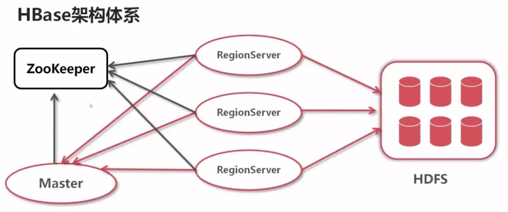

# HBase 简介

HBase是一种Hadoop数据库，经常被描述为一种稀疏的，分布式的，持久化的，多维有序映射，它基于行键、列键和时间戳建立索引，是一个可以随机访问的存储和检索数据的平台。HBase不限制存储的数据的种类，允许动态的、灵活的数据模型，不用SQL语言，也不强调数据之间的关系。HBase被设计成在一个服务器集群上运行，可以相应地横向扩展。

HBASE是一个高可靠性、高性能、面向列、可伸缩的分布式存储系统，利用HBASE技术可在廉价PC Server上搭建起大规模结构化存储集群。

HBASE的目标是存储并处理大型的数据，更具体来说是仅需使用普通的硬件配置，就能够处理由成千上万的行和列所组成的大型数据。

HBASE是Google Bigtable的开源实现，但是也有很多不同之处。比如：

Google Bigtable利用GFS作为其文件存储系统，HBASE利用Hadoop HDFS作为其文件存储系统；

Google运行MAPREDUCE来处理Bigtable中的海量数据，HBASE同样利用Hadoop MapReduce来处理HBASE中的海量数据；

Google Bigtable利用Chubby作为协同服务，HBASE利用Zookeeper作为对应。

## 与传统数据库的对比
**传统数据库遇到的问题：**

1）数据量很大的时候无法存储

2）没有很好的备份机制

3）数据达到一定数量开始缓慢，很大的话基本无法支撑

**HBASE优势：**

1）线性扩展，随着数据量增多可以通过节点扩展进行支撑

2）数据存储在hdfs上，备份机制健全

3）通过zookeeper协调查找数据，访问速度块。

## HBase 架构

如图所示，HBase 的最底层结构是基于 hdfs 的，它将自己的日志文件 `hlog`，以及数据表 `Region` 存储在 hdfs 的 datanode 当中。

而管理 HBase 的主要是 zookeeper 和 master。其中，HBase 主要依靠 zookeeper 管理，master 仅仅负责当启动 HBase 时，分配区域到指定区域服务器。当 HBase 启动以后 master 几乎不起作用，我们可以关掉 Hmaster 进程，HBase 仍然可以运行。

同学肯定对刚刚提到的 regionServer（区域服务器），和区域（region）感到陌生。下面我们来具体解释一下概念。regionServer 即是一台 HBase 服务器，一个进程。我们配置的伪分布式 HBase 就只有一台 regionServer，而真正的分布式集群每一台部署了 HBase 的节点都是一个 regionServer。

我们使用的 HBase 是一个列式数据库，一张表可以达到十亿行，这就需要将表拆分成多个部分储备起来。即是分别存入 region 中，由 regionserver 管理。

## Hbase几个特点介绍

### 海量存储

Hbase适合存储PB级别的海量数据，在PB级别的数据以及采用廉价PC存储的情况下，能在几十到百毫秒内返回数据。这与Hbase的极易扩展性息息相关。正式因为Hbase良好的扩展性，才为海量数据的存储提供了便利。

### 列式存储

这里的列式存储其实说的是列族存储，Hbase是根据列族来存储数据的。列族下面可以有非常多的列，列族在创建表的时候就必须指定。（通常建表会只建一个列簇，）

### 极易扩展

Hbase的扩展性主要体现在两个方面，一个是基于上层处理能力（RegionServer）的扩展，一个是基于存储的扩展（HDFS）。

通过横向添加RegionSever的机器，进行水平扩展，提升Hbase上层的处理能力，提升Hbsae服务更多Region的能力。

备注：RegionServer的作用是管理region、承接业务的访问，这个后面会详细的介绍

通过横向添加Datanode的机器，进行存储层扩容，提升Hbase的数据存储能力和提升后端存储的读写能力。

### 高并发

由于目前大部分使用Hbase的架构，都是采用的廉价PC，因此单个IO的延迟其实并不小，一般在几十到上百ms之间。这里说的高并发，主要是在并发的情况下，Hbase的单个IO延迟下降并不多。能获得高并发、低延迟的服务。

### 稀疏

稀疏主要是针对Hbase列的灵活性，在列族中，你可以指定任意多的列，在列数据为空的情况下，是不会占用存储空间的。

## Hbase不足之处：

对多表关联查询支持不够好，

事物支持不好

不支持sql（加大开发难度）

## 应用场景

Hbase是一个通过廉价PC机器集群来存储海量数据的分布式数据库解决方案。它比较适合的场景概括如下：

是巨量大（百T、PB级别）

查询简单（基于rowkey或者rowkey范围查询）

不涉及到复杂的关联

有几个典型的场景特别适合使用Hbase来存储：

银行：历史账单，记录

海量订单流水数据（长久保存）

交易记录

数据库历史数据
