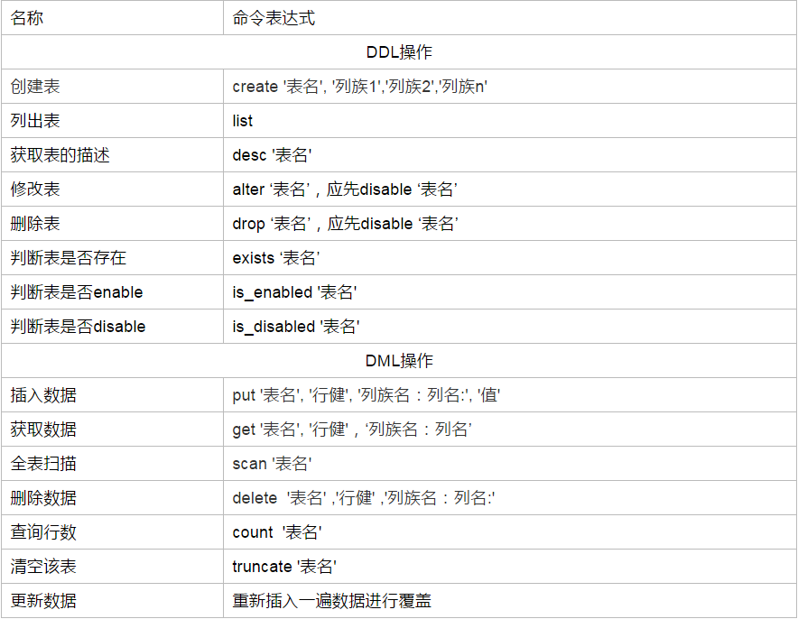

# HBase Shell

本章介绍了如何使用自带HBase交互shell启动HBase。

HBase包含可以与HBase进行通信的Shell。 HBase使用Hadoop文件系统来存储数据。它拥有一个主服务器和区域服务器。数据存储将在区域(表)的形式。这些区域被分割并存储在区域服务器。

主服务器管理这些区域服务器，所有这些任务发生在HDFS。下面给出的是一些由HBase Shell支持的命令。


**DML（data manipulation language）：**

它们是SELECT、UPDATE、INSERT、DELETE，就象它的名字一样，这4条命令是用来对数据库里的数据进行操作的语言

**DDL（data definition language）：**

DDL比DML要多，主要的命令有CREATE、ALTER、DROP等，DDL主要是用在定义或改变表（TABLE）的结构，数据类型，表之间的链接和约束等初始化工作上，他们大多在建立表时使用



## 	数据定义语言

这些是关于HBase在表中操作的命令。

- **create:** 创建一个表。
- **list:** 列出HBase的所有表。
- **disable:** 禁用表。
- **is_disabled:** 验证表是否被禁用。
- **enable:** 启用一个表。
- **is_enabled:** 验证表是否已启用。
- **describe:** 提供了一个表的描述。
- **alter:** 改变一个表。
- **exists:** 验证表是否存在。
- **drop:** 从HBase中删除表。
- **drop_all:** 丢弃在命令中给出匹配“regex”的表。
- **Java Admin API:** 在此之前所有的上述命令，Java提供了一个通过API编程来管理实现DDL功能。在这个org.apache.hadoop.hbase.client包中有HBaseAdmin和HTableDescriptor 这两个重要的类提供DDL功能。

## 	数据操纵语言

- **put:** 把指定列在指定的行中单元格的值在一个特定的表。
- **get:** 取行或单元格的内容。
- **delete:** 删除表中的单元格值。
- **deleteall:** 删除给定行的所有单元格。
- **scan:** 扫描并返回表数据。
- **count:** 计数并返回表中的行的数目。
- **truncate:** 禁用，删除和重新创建一个指定的表。
- **Java client API:** 在此之前所有上述命令，Java提供了一个客户端API来实现DML功能，CRUD（创建检索更新删除）操作更多的是通过编程，在org.apache.hadoop.hbase.client包下。 在此包HTable 的 Put和Get是重要的类。

## 	启动 HBase Shell

[HBase安装](./setup.html)

可以使用“hbase shell”命令来启动HBase的交互shel

```bash
hbase shell
```

如果已成功在系统中安装HBase，那么它会给出 HBase shell 提示符，类似如下所示。

```txt
hbase(main):001:0>
```

list是用来获取所有HBase 表的列表。首先，验证安装HBase在系统中使用如下所示。

```bash
list
```

**status**

命令返回包括在系统上运行的服务器的细节和系统的状态。

```hbase
status
```

**version**

该命令返回HBase系统使用的版本。

```hbase
version
```

**table_help**

此命令将引导如何使用表引用的命令。

```hbase
table_help
```

**whoami**

该命令返回HBase用户详细信息。如果执行这个命令，返回当前HBase用户

```hbase
whoami
```


要退出交互shell命令，在任何时候键入 exit 或使用<Ctrl + C>。进一步处理检查shell功能之前，使用 list 命令用于列出所有可用命令。

```
exit
```

