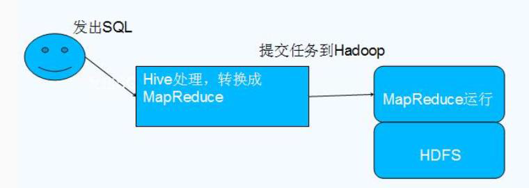

# Hive 简介

数据仓库之父比尔·恩门（Bill Inmon）在 1991 年出版的“Building the Data Warehouse”（《建 立数据仓库》）一书中所提出的定义被广泛接受——数据仓库（Data Warehouse）是一个面 向主题的（Subject Oriented）、集成的（Integrated）、相对稳定的（Non-Volatile）、反映历史 变化（Time Variant）的数据集合，用于支持管理决策(Decision Making Support)。

**Hive 依赖于 HDFS 存储数据，**Hive 将 HQL 转换成 MapReduce 执行，所以说 Hive 是基于 Hadoop 的一个数据仓库工具，实质就是一款基于 HDFS 的 MapReduce 计算框架，对存储在 HDFS 中的数据进行分析和管理

## Hive 架构

## 为什么使用 Hive

**直接使用 MapReduce 所面临的问题：**

　　1、人员学习成本太高

　　2、项目周期要求太短

　　3、MapReduce实现复杂查询逻辑开发难度太大

**为什么要使用 Hive：**

　　1、更友好的接口：操作接口采用类 SQL 的语法，提供快速开发的能力

　　2、更低的学习成本：避免了写 MapReduce，减少开发人员的学习成本

　　3、更好的扩展性：可自由扩展集群规模而无需重启服务，还支持用户自定义函数

## Hive 特点

**优点**：

　　1、**可扩展性,横向扩展**，Hive 可以自由的扩展集群的规模，一般情况下不需要重启服务 横向扩展：通过分担压力的方式扩展集群的规模 纵向扩展：一台服务器cpu i7-6700k 4核心8线程，8核心16线程，内存64G => 128G

　　2、**延展性**，Hive 支持自定义函数，用户可以根据自己的需求来实现自己的函数

　　3、**良好的容错性**，可以保障即使有节点出现问题，SQL 语句仍可完成执行

**缺点**：

　　1、**Hive 不支持记录级别的增删改操作**，但是用户可以通过查询生成新表或者将查询结 果导入到文件中（当前选择的 hive-2.3.2 的版本支持记录级别的插入操作）

　　2、**Hive 的查询延时很严重**，因为 MapReduce Job 的启动过程消耗很长时间，所以不能 用在交互查询系统中。

　　3、**Hive 不支持事务**（因为不没有增删改，所以主要用来做 OLAP（联机分析处理），而 不是 OLTP（联机事务处理），这就是数据处理的两大级别）。

## 总结：

Hive 具有 SQL 数据库的外表，但应用场景完全不同。

**Hive适合用来做海量离线数据统计分析，也就是数据仓库**。