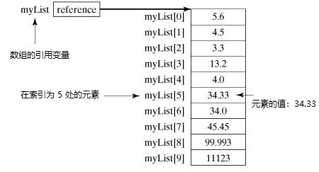

# Java 数组(array)

Java提供了一种叫作数组的数据结构，它是一种用来存储相同类型元素的固定大小顺序集合。 数组用于存储数据集合，但也可以将数组视为相同类型的变量集合。

声明一个数组变量(如：`numbers`)并使用`numbers[0]`，`numbers[1]`和`...`，`numbers[99]`来表示单个变量，例如`number0`，`number1`，`...`和`number99`，而不是单独地声明各个变量。

本教程介绍如何声明数组变量，创建数组和索引访问数组。

<iframe src="//player.bilibili.com/player.html?aid=63239891&bvid=BV1C4411D7jZ&cid=109828579&page=1" scrolling="no" border="0" frameborder="no" framespacing="0" allowfullscreen="true"> </iframe>
## 声明数组变量

要在程序中使用数组，需要先声明一个变量以引用该数组，并且要指定该变量的数组类型。 以下是声明数组变量的语法 - 

**语法**

```java
dataType[] arrayRefVar;   // 推荐方式。
// 或者
dataType arrayRefVar[];  // 有效，但不是推荐方式。
```

> 注 - 格式：`dataType [] arrayRefVar`是推荐方式。 格式：`dataType arrayRefVar []`来自C/C++语言，可在Java中采用以适应C/C++程序员。

**示例**

以下代码片段是此语法的示例 - 

```java
double[] myList;   // 推荐方式。
// 或者
double myList[];   // 有效，但不是推荐方式。
```

## 创建数组

可以使用`new`运算符来创建数组，如以下语法 - 

```java
// 声明
dataType[] arrayRefVar;   // 推荐方式。
// 创建
arrayRefVar = new dataType[arraySize];
```

上面语句做了两件事 - 

- 它使用`new dataType[arraySize]`来创建了一个数组。
- 它将新创建的数组的引用分配给变量`arrayRefVar`。

声明一个数组变量，创建一个数组，并将该数组的引用分配给变量，可以在一个语句中完成，如下所示 - 

```java
dataType[] arrayRefVar = new dataType[arraySize];
```

或者，可以按如下方式创建数组 - 

```java
dataType[] arrayRefVar = {value0, value1, ..., valuek};
```

通过索引访问数组元素。 数组索引值从`0`开始; 也就是说，它们从`0`开始到`arrayRefVar.length - 1`。

**示例**

下面语句中声明了一个数组变量`myList`，它创建了一个包含`10`个`double`类型元素的数组，并将数组变量的引用分配给`myList`  - 

```java
double[] myList = new double[10];
```

下图表示数组`myList`。 这里，`myList`数组中包含十个`double`值，索引从`0`到`9`。


## 处理数组

处理数组元素时，经常使用`for`循环或`foreach`循环，因为数组中的所有元素都是相同的类型，并且数组的大小是已知的。

**示例**：这是一个完整的示例，演示了如何创建，初始化和处理数组

文件名:ArrayTest.java

```java
import java.util.*;

public class ArrayTest {

    public static void main(String[] args) {
        double[] myList = { 10.01, 12.19, 23.44, 43.95, 77.88, 65.00 };

        // 打印所有元素
        for (int i = 0; i < myList.length; i++) {
            System.out.print(myList[i] + ", ");
        }
        System.out.println(" ");

        // 求和
        double total = 0;
        for (int i = 0; i < myList.length; i++) {
            total += myList[i];
        }
        System.out.println("总和：" + total);

        // 查找最大值
        double max = myList[0];
        for (int i = 1; i < myList.length; i++) {
            if (myList[i] > max)
                max = myList[i];
        }
        System.out.println("元素最大值：" + max);
    }
}
```

快在右侧实验区使用下方命令执行上面代码，康康会得到什么结果？

```bash
cd ~/java && javac ArrayTest.java
java ArrayTest
```

#### foreach循环

JDK 1.5引入了`foreach`循环或增强`for`循环，它能够在不使用索引变量的情况下顺序遍历整个数组。

**示例**：

以下代码演示如何遍历数组`myList`中的所有元素 - 

文件名:ArrayForEach.java

```java
import java.util.*;

public class ArrayForEach {

    public static void main(String[] args) {
        double[] myList = { 10.01, 12.19, 23.44, 43.95, 77.88, 65.00 };

        // Print all the array elements
        for (double element : myList) {
            System.out.print(element+", ");
        }
    }
}
```

快在右侧实验区使用下方命令执行上面代码，康康会得到什么结果？

```bash
cd ~/java && javac ArrayForEach.java
java ArrayForEach
```

####  将数组传递给方法

就像将原始类型值传递给方法一样，也可以将数组传递给方法。 例如，以下`printArray()`方法用来打印`int`数组中的元素 - 

**示例**：将数组传递给方法

文件名:PrintArray.java

```java
import java.util.*;

public class PrintArray {

    public static void main(String[] args) {
        double[] myList = { 10.01, 12.19, 23.44, 43.95, 77.88, 65.00 };

        // Print all the array elements
        printArray(myList);
    }

    public static void printArray(double[] array) {
        for (int i = 0; i < array.length; i++) {
            System.out.print(array[i] + " ");
        }
    }
}
```

快在右侧实验区使用下方命令执行上面代码，康康会得到什么结果？

```bash
cd ~/java && javac ArrayPrint.java
java ArrayPrint
```

#### 从方法返回数组

方法可以返回数组。

**示例**：返回一个与给定参数数组相反的数组 

文件名:ReturnArray.java

```java
import java.util.*;

public class Test {

    public static void main(String[] args) {
        double[] myList = { 10.01, 12.19, 23.44, 43.95, 77.88, 65.00 };

        // Print all the array elements
        printArray(myList);
        printArray(reverse(myList));
    }

    public static void printArray(double[] array) {
        for (int i = 0; i < array.length; i++) {
            System.out.print(array[i] + " ");
        }
        System.out.println(" ");
    }

    public static double[] reverse(double[] list) {
        double[] result = new double[list.length];

        for (int i = 0, j = result.length - 1; i < list.length; i++, j--) {
            result[j] = list[i];
        }
        return result;
    }
}
```

快在右侧实验区使用下方命令执行上面代码，康康会得到什么结果？

```bash
cd ~/java && javac ReturnArray.java
java ReturnArray
```