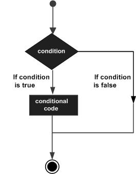

# Java 逻辑判断

条件判断是有一个或多个由程序评估或测试的条件，在条件确定为真时要执行的一个或多个语句；以及可选地，如果条件为假时则执行其他语句。

以下是大多数编程语言中常见决策结构的一般形式 - 



Java编程语言提供以下类型的条件判断语句。 可通过单击以下链接来了解和学习。

| 编号 | 语句                          | 描述                                                         |
| ---- | ----------------------------- | ------------------------------------------------------------ |
| 1    | [if语句](./if.html)           | `if`语句由布尔表达式后跟一个或多个语句组成。                 |
| 2    | [if…else语句](./if-else.html) | `if`语句后面可以跟一个可选的`else`语句，`else`语句在布尔表达式为`false`时执行。 |
| 3    | [嵌套if语句](./f-nested.html) | 可以在一个`if`或`else if`语句中使用另一个`if`或`else if`语句。 |
| 4    | [switch语句](./switch.html)   | `switch`语句允许测试变量与值列表的相等性。                   |

## ? : 运算符

在前面的内容中覆盖了`?;`条件运算符，可以使用`if...else`语句来替代`?;`条件运算符。 它具有以下一般形式 - 

```java
Exp1 ? Exp2 : Exp3;
Java
```

`Exp1`，`Exp2`和`Exp3`是表达式。 注意冒号(`:`)的放置和使用。要确定整个表达式的值，首先计算`Exp1`。

- 如果`Exp1`的值为`true`，则`Exp2`的值将成为整个表达式的值。
- 如果`Exp1`的值为`false`，则计算`Exp3`的值将成为整个表达式的值。

**示例代码**

文件名:ConditionalOperator.java

```java
public class ConditionalOperator {

    public static void main(String[] args) {
        // TODO Auto-generated method stub
        int a = 5;
        int b = 20;
        int c = 0;

        c = a > b ? a - b : b - a;

        System.out.println("C的值是：" + c);
    }
}
```

```shell
cd ~/java && javac ConditionalOperator.java
java ConditionalOperator
```

康康