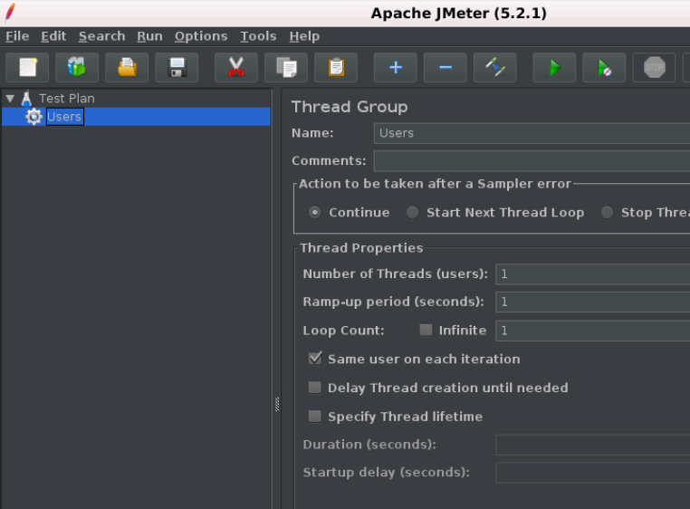
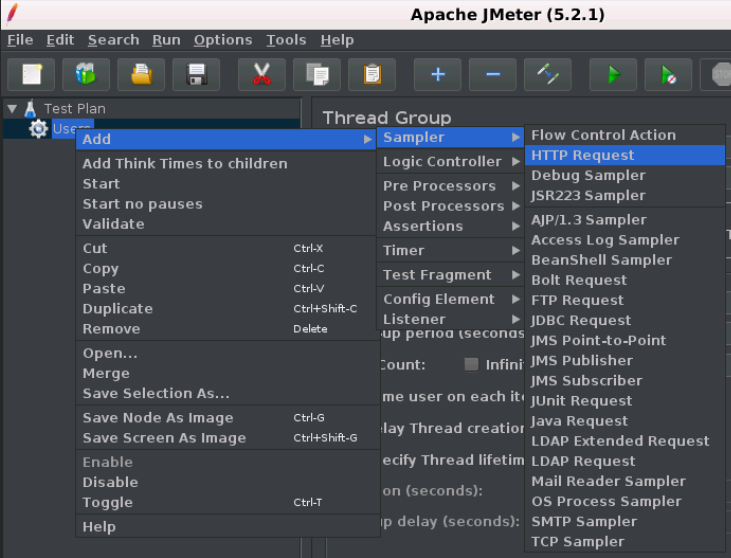
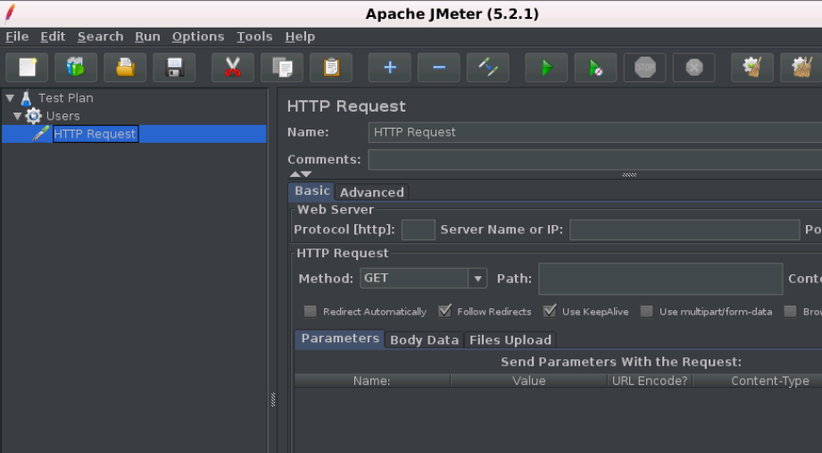
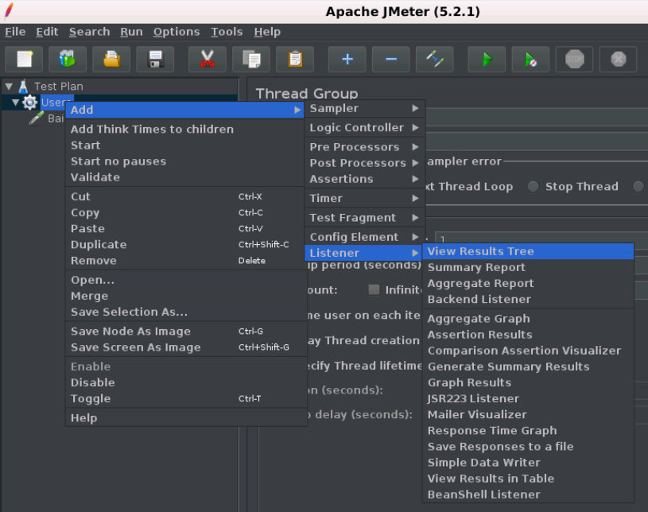
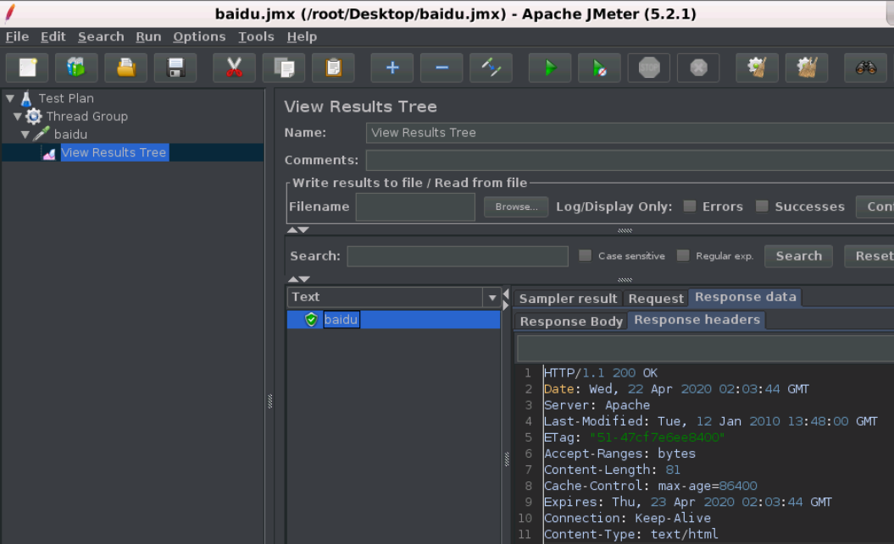

# JMeter Web测试网页性能

在本节中，将学习如何创建测试网页的基本测试计划。

## 创建JMeter测试计划

- 进入到JMeter安装bin文件夹，双击`jmeter.bat`文件以启动JMeter界面。
- 选择`Test Plan`节点并右键，悬停在**“Add”**选项上，然后将显示元素列表。
- 选择**Threads (Users)** -> **Thread Group**。
- 将此线程组重命名为**Users**。
- 对于此测试，Users元素表示访问网站主页的用户数。

## 添加采样器

我们必须在**Users** 元素(线程组)中添加一个采样器。

- 选择`Users`元素(线程组)，然后右键单击所选项。
- 鼠标悬停在“Add”选项上，然后将显示元素列表。
- 选择**Sampler** -> **HTTP request**选项。
- 它将添加一个空的HTTP请求采样器。

现在，配置**HTTP Request Sampler**的字段。它包括:

- 名称 - baidu
- 服务器名称或IP - 在这个示例中，Web服务器名称是:`baidu.com`
- 协议 - 此字段保持不变。 路径 - 将其写为`/`(斜杠)。 它表示想要服务器的根页面。
- 点击底部的`save`

## 添加监听器

- 选择**Users**元素。
- 鼠标悬停在**“Add”**选项上，然后将显示元素列表。
- 选择**Listener** -> **View Results Tree**选项。

单击:**Run** -> **Start** 以执行测试计划。

> 注意:有时需要多次运行测试计划。可以选择运行测试计划而不保存它。

## 验证输出

因为，我们将Users元素(线程组)的设置保留为单线程(一个用户)并循环1次(仅运行1次)。 因此，在**View Result Tree Listener**中将结果作为单个用户请求获取。

此测试计划仅适用于一个请求。 但是JMeter能够发送相同的请求，就好像许多用户正在发送它一样。 要测试具有多个用户的Web服务器，需要更改Users元素(线程组)设置。

**“View Result Tree”** 面板的第一个选项卡是**“Sampler result”**。 它显示了JMeter数据以及Web服务器返回的数据。

**“Sampler result”**选项卡显示Web服务器发送的所有响应标头。

**“Sampler result”**面板的第二个选项卡是“请求”，它显示作为请求的一部分发送到Web服务器的所有数据。

**“Sampler result”**面板的最后一个选项卡是**响应数据**。 它以文本格式显示从服务器接收的数据。