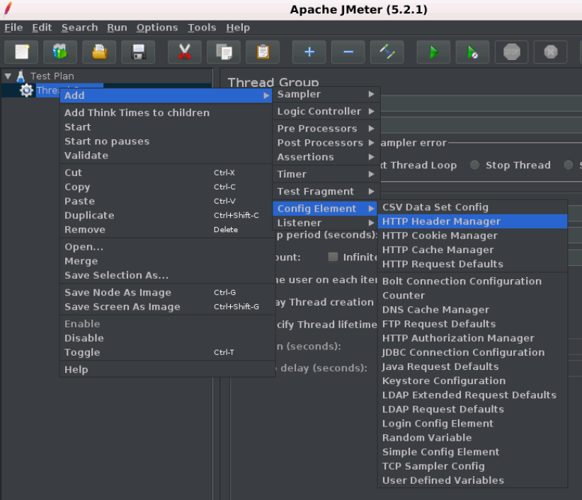

# JMeter 配置元素(configuration element)

配置元素的工作与采样器的工作类似。但是，它不发送请求，但它允许修改采样器发出的请求。

这是一个简单的元素，您可以在其中收集所有采样器的关联配置值，如webserver的主机名或数据库URL等。

配置元素只能从放置元素的分支内部访问。

下面给出了JMeter提供的一些最常用配置元素的列表：

- Java请求默认值
- LDAP请求默认值
- LDAP扩展请求默认值
- 密钥库配置
- JDBC连接配置
- 登录配置元素
- CSV数据集配置
- FTP请求默认值
- TCP采样器配置
- 用户定义的变量
- HTTP授权管理器
- HTTP缓存管理器
- HTTP Cookie管理器
- HTTP代理服务器
- HTTP请求默认值
- HTTP标头管理器
- 简单的配置元素
- 随机变量

下图显示了如何将配置元素添加到测试计划中

