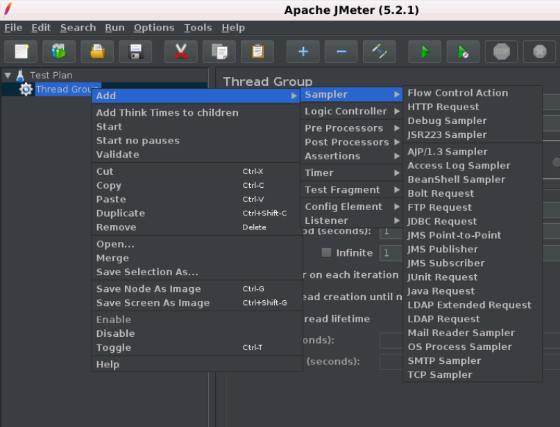
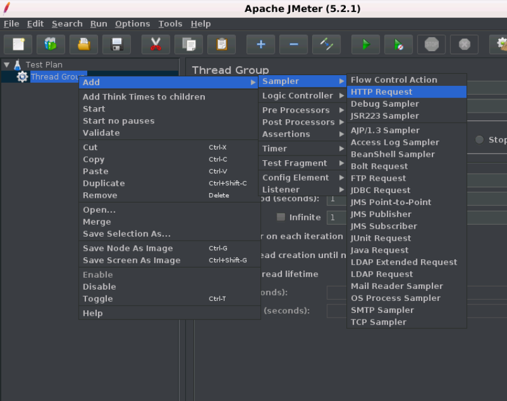
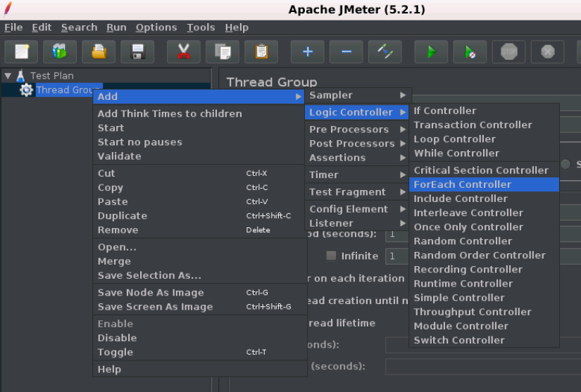
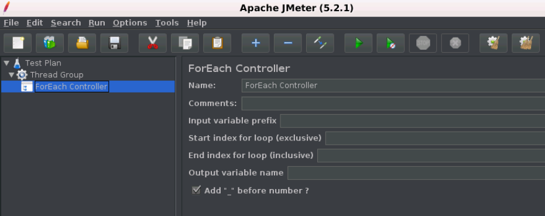

# JMeter 控制器(controller)

控制器可分为两大类:

- 采样器(sampler)
- 逻辑控制器(logic controller)

##  采样器

采样器是允许JMeter将特定类型的请求发送到服务器的组件。它模拟用户对目标服务器的页面的请求。

采样器是必须将组件添加到测试计划中的，因为它只能让JMeter知道需要将哪种类型的请求发送到服务器。 请求可以是HTTP，HTTP(s)，FTP，TCP，SMTP，SOAP等。

下面给出了JMeter采样器服务的请求列表:

- FTP请求
- HTTP请求(也可用于SOAP或REST Web服务)
- JDBC请求
- Java对象请求
- JMS请求
- JUnit测试请求
- LDAP请求
- 邮件请求
- 操作系统进程请求
- TCP请求

JMeter采样器只能通过下图所示的方法添加到线程组中:

下图显示了HTTP请求采样器控制面板:

## 逻辑控制器

逻辑控制器可帮助您控制线程中采样器处理顺序的流程。 它还可以更改来自其子元素的请求的顺序。

以下是JMeter中所有逻辑控制器的列表：

- 运行时控制器
- IF控制器
- 事务控制器
- 录音控制器
- 简单控制器
- while控制器
- Switch控制器
- ForEach控制器
- 模块控制器
- 包括控制器
- 循环控制器
- 仅一次控制器
- 交错控制器
- 随机控制器
- 随机顺序控制器
- 吞吐量控制器

下图显示了如何将ForEach逻辑控制器添加到测试计划中：

下图显示了ForEach控制器控制面板：

