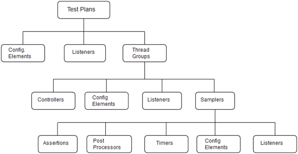

# JMeter 测试计划元素

JMeter包含各种相互关联但为不同目的而设计的元素。在开始使用JMeter之前，最好先了解一下JMeter的一些主要元素，并详细说明。

> 注意:测试计划包含至少一个线程组。

以下是JMeter的一些主要组件:

- [测试计划(Test Plan)](./test-plan.html)
- [线程组(Thread Group)](./thread-group.html)
- [控制器(Controllers)](./controller.html)
- [监听器(Listeners)](./listener.html)
- [计时器(Timers)](./timer.html)
- [配置元素(Configuration Elements)](./configuration-element.html)
- [预处理器元素(Pre-Processor Elements)](./preprocessor-element.html)
- [后处理器元素(Post-Processor Elements)](./postprocessor-element.html)

请参阅以下图，以了解每个组件及其与JMeter特定模块的关系。

