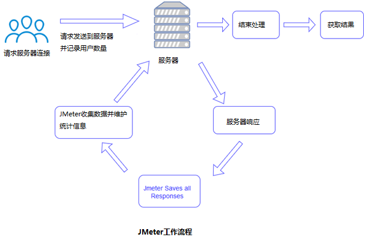

# JMeter 简介

JMeter是Apache组织开发的基于Java的压力测试工具。用于对软件做压力测试，它最初被设计用于Web应用测试，但后来扩展到其他测试领域。 它可以用于测试静态和动态资源，例如静态文件、Java 小服务程序、CGI 脚本、Java 对象、数据库、FTP 服务器， 等等。

JMeter 可以用于对服务器、网络或对象模拟巨大的负载，来自不同压力类别下测试它们的强度和分析整体性能。

另外，JMeter能够对应用程序做功能/回归测试，通过创建带有断言的脚本来验证你的程序返回了你期望的结果。为了最大限度的灵活性，JMeter允许使用正则表达式创建断言。

## 我们为什么使用Jmeter
  - 开源免费，基于Java编写，可集成到其他系统可拓展各个功能插件
  - 支持接口测试，压力测试等多种功能，支持录制回放，入门简单
  - 相较于自己编写框架活其他开源工具，有较为完善的UI界面，便于接口调试
  - 多平台支持，可在Linux，Windows，Mac上运行selenium 是一套完整的web应用程序测试系统，包含了测试的录制（selenium IDE）,编写及运行（Selenium Remote Control）和测试的并行处理（Selenium Grid）。Selenium的核心Selenium Core基于JsUnit，完全由JavaScript编写，因此可以用于任何支持JavaScript的浏览器上。

## 历史

Apache Software Foundation 的 Stefano Mazzocchi 是JMeter的初级开发人员。他编写它主要用于测试Apache JServ的性能（一个后来被Apache Tomcat项目替代的项目）。我们重新设计了JMeter，增强了它的GUI和添加了功能测试支持。

## 主要组件介绍

**（1）测试计划(Test Plan)**

  是使用JMeter进行测试的起点，它是其它JMeter测试元件的容器。

**（2）线程组(Thread Group)**

  代表一定数量的并发用户，它可以用来模拟并发用户发送请求。

**（3）取样器(sampler)**

  定义实际的请求内容，被线程组包含，我们主要用HTTP请求。

**（4）监听器(Listener)**

负责收集测试结果，同时也被告知了结果显示的方式。我们常用的包括：聚合报告、察看结果树、用表格查看结果，都支持将结果数据写入文件。其他的添加上去看看就行。

**（5）逻辑控制器(Logic Controller)**

可以自定义JMeter发送请求的行为逻辑，它与Sampler结合使用可以模拟复杂的请求序列。

其分为循环控制器和事务控制器。

**（6）断言(Assertions)**

可以用来判断请求响应的结果是否如用户所期望的。它可以用来隔离问题域，即在确保功能正确的前提下执行压力测试。这个限制对于有效的测试是非常有用的。

**（7）配置元件(Config Element)**

维护Sampler需要的配置信息，并根据实际的需要会修改请求的内容。我们主要在参数化中用到CSV Data Set Config。

**（8）前置处理器(Pre Processors)和后置处理器(Post Processors)**

负责在生成请求之前和之后完成工作。前置处理器常常用来修改请求的设置，后置处理器则常常用来处理响应的数据。我们主要在动态关联中用到后置处理器的正则表达式提取器。

**（9）定时器(Timer)**

负责定义请求之间的延迟间隔。

## 工作流程

JMeter通过模拟一组用户将请求发送到目标服务器。 随后，收集数据以通过各种格式计算目标服务器的统计和显示性能度量。

**如下图所示：**

