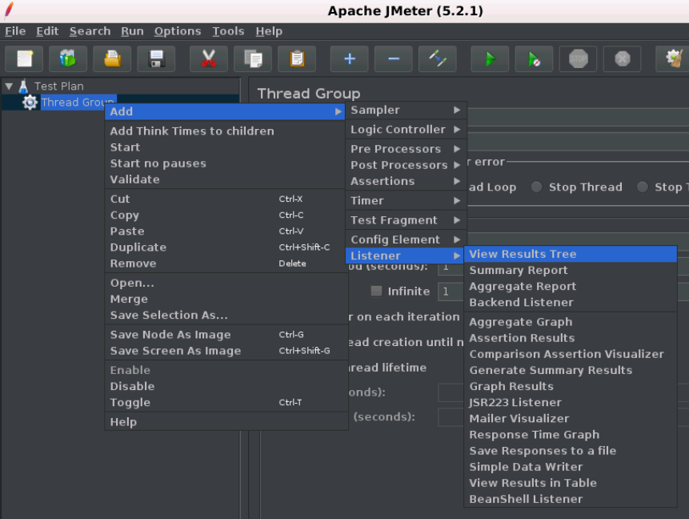

# JMeter 监听器(listener)

性能测试就是以各种形式分析服务器响应，然后将其呈现给客户端。

当JMeter的采样器组件被执行时，监听器提供JMeter收集的关于那些测试用例的数据的图形表示。它便于用户在某些日志文件中以表格，图形，树或简单文本的形式查看采样器结果。

监听器可以在测试的任何地方进行调整，直接包括在测试计划下。JMeter提供了大约15个监听器，但主要使用的是表，树和图形。

以下是JMeter中所有监听器的列表：

- 图表结果
- 样条曲线可视化器
- 断言结果
- 简单的数据编写者
- 监控结果
- 分布图(alpha)
- 聚合图
- 梅勒展示台
- BeanShell监听器
- 总结报告
- 示例结果保存配置
- 图表完整结果
- 查看结果树
- 汇总报告
- 查看表格中的结果

下图显示了如何在测试计划中添加监听器：

