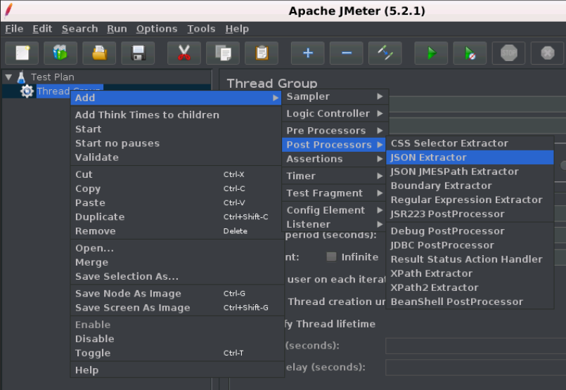

# JMeter 后处理器元素(postprocessor element)

在发出采样器请求之后执行后处理器元素。 如果后处理器连接到Sampler元素，那么它将在该sampler元素运行之后执行。

后处理器最常用于处理响应数据，例如，为了将来目的而提取特定值。

下面给出了JMeter提供的所有后处理器元素的列表：

- CSS/JQuery抽取器
- BeanShell后处理器
- JSR223后处理器
- JDBC后处理器
- 调试后处理器
- 正则表达式提取器
- XPath抽取器
- 结果状态操作处理程序
- BSF后处理器

