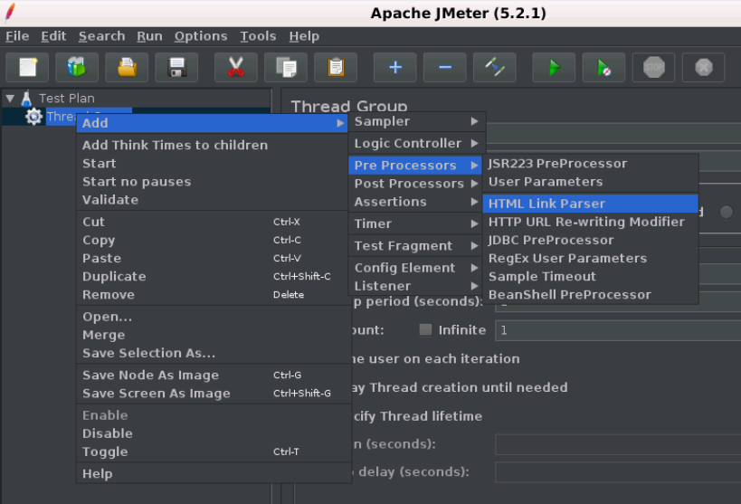

# JMeter 预处理器元素(preprocessor element)

预处理器元素在采样器发出请求之前执行，如果预处理器附加到采样器元素，那么它将在该采样器元素运行之前执行。
预处理器元素用于在运行之前修改样本请求的设置，或更新未从响应文本中提取的变量。
以下是JMeter提供的所有预处理器元素的列表:

- JDBC预处理器
- JSR223预处理器
- RegEx用户参数
- BeanShell预处理器
- BSF预处理器
- HTML链接解析器
- HTTP URL重写修饰符
- HTTP用户参数修饰符
- 用户参数

下图显示了如何将预处理器元素添加到测试计划中
