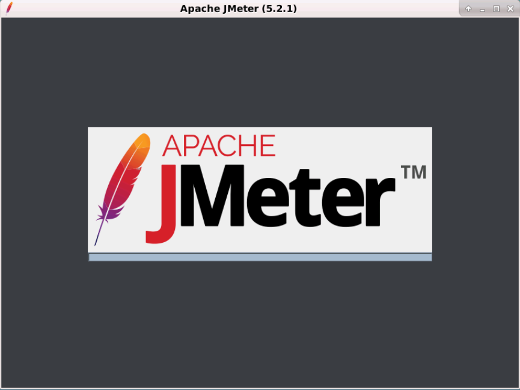

# JMeter 环境安装及配置

## 本课程在线环境的安装

### 安装JDK

```bash
cp /share/tar/jdk-8u241-linux-x64.tar.gz  /usr/local/
#tar -xzvf 对文件进行解压缩，-C 指定解压后，将文件放到/usr/local目录下。
tar -xzvf /usr/local/jdk-8u241-linux-x64.tar.gz -C /usr/local/
mv /usr/local/jdk1.8.0_241 /usr/local/java

echo 'export JAVA_HOME=/usr/local/java' >> ~/.bashrc
echo 'export PATH=$JAVA_HOME/bin:$PATH' >> ~/.bashrc
source ~/.bashrc  #生效环境变量
#验证java安装，测试环境变量是否配置正确。如果出现正确的版本信息提示，则安装成功
java -version
```

## 安装JMeter

```bash
cp /share/tar/apache-jmeter-5.2.1.tgz  /usr/local/
tar -xzvf /usr/local/apache-jmeter-5.2.1.tgz -C /usr/local/
mv /usr/local/apache-jmeter-5.2.1 /usr/local/jmeter
echo 'export PATH=/usr/local/jmeter/bin:$PATH' >> ~/.bashrc
source ~/.bashrc  #生效环境变量
```

## 启动JMeter

切换右侧实验界面至vnc模式，在桌面右键新建一个终端，输入以下命令即可启动JMeter

```bash
jmeter.sh
```

