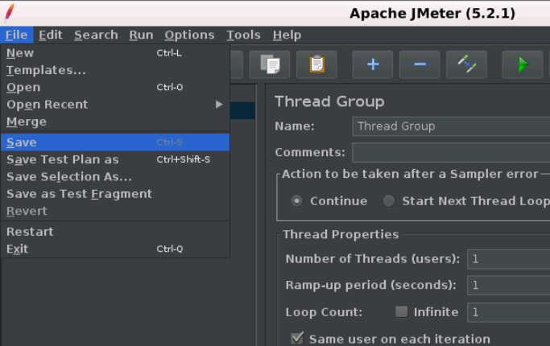
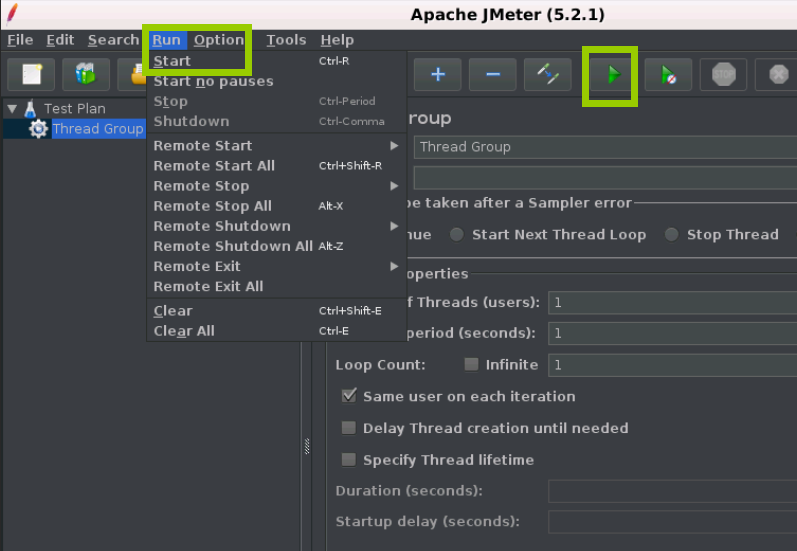

# JMeter 构建测试计划

可以将测试计划可视化为用于运行测试的JMeter脚本。测试计划由测试元素组成，例如线程组，逻辑控制器，样本生成控制器，监听器，定时器，断言和配置元素。
每个测试计划中至少应有一个线程组。 我们可以根据要求添加或删除元素。
让我们按照以下简单步骤开始构建测试计划:

## 第1步:启动JMeter窗口

- 进到JMeter bin文件夹，双击*jmeter.bat* 文件以启动JMeter界面。
- 下图显示了默认的JMeter界面，但未添加任何其他元素:

- 默认的JMeter界面包含一个测试计划节点，其中保留了真实的测试计划。
- “测试计划(Test plan)”节点包含测试计划的名称和用户定义的变量。
- 当您在测试计划的多个部分中有重复值时，可使用用户定义变量，它提供了灵活性。

## 第2步:添加/删除测试计划元素

- 为JMeter创建测试计划后，下一步是向JMeter测试计划添加和删除元素。
- 选择测试计划节点，然后右键单击所选项目。
- 鼠标悬停在**“Add”**选项上，然后将显示元素列表。
- 鼠标悬停在所需的列表元素上，然后单击选择所需的选项。
- 下图显示了如何在测试计划中添加线程组元素:
  
- 要删除元素，请选择所需的元素。
- 右键单击元素，然后选择**“Remove”**选项。
- 下图显示了如何删除测试计划中的线程组元素:
  

## 第3步:加载并保存测试计划元素。

- 要将元素加载到JMeter测试计划树，请选择并右键单击要添加已加载元素的任何树元素。
- 选择**“Merge”**选项。
- 选择保存元素的`.jmx`文件。
- 元素将合并到JMeter测试计划树中。
  
- 要保存树元素，请右键单击元素。
- 选择**“Save Selection As”**选项。
- 将文件保存在所需位置。
  

## 第4步:配置树元素。

可以使用JMeter右侧框架上的控件配置测试计划中的元素。 这些控件允许您配置所选元素的行为。 例如，可以通过以下方式配置线程组:

- 元素的名称。
- 线程数(正在测试的用户数)。
- 加速时间(希望允许线程组从`0`到`3`个用户的时间)。
- 循环计数(应该循环测试的次数)。
  

## 第5步:保存JMeter测试计划。

到目前为止，我们已经完成了创建测试计划，添加元素和配置树。
现在，您可以通过从文件菜单中选择**“Save”** 或**“Save Test Plan As”**来保存整个测试计划。

## 第6步:运行JMeter测试计划。

- 可以通过单击菜单项中的**“Start(Control + r)”**来运行测试计划，也可以单击绿色播放按钮。
  下图显示了如何运行测试计划。

- 当测试计划开始运行时，JMeter界面在菜单栏正下方的部分的右端显示一个绿色圆圈。
  绿色圆圈左侧的数字表示：
  - 活动线程数/总线程数

## 第7步：停止JMeter测试计划。

可以使用**Stop(Control +’.’)**停止测试计划 - 如果可能，它会立即停止线程。
您还可以使用**Shutdown(Control +’，’)** - 它请求线程在任何正在进行的任务结束时停止。

## 第8步：检查JMeter测试计划执行日志。

JMeter将测试运行详细信息，警告和错误存储到`jmeter.log`文件中。