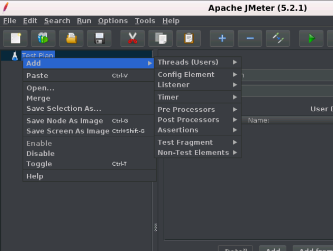

# JMeter 测试计划(test plan)

可以将测试计划可视化为用于运行测试的JMeter脚本。 测试计划由测试元素组成，例如线程组，逻辑控制器，样本生成控制器，监听器，定时器，断言和配置元素。

测试计划包含执行脚本的所有步骤。 测试计划中包含的所有内容都按照从上到下的顺序执行，或者按照测试计划中定义的顺序执行。 下图给出了测试计划的目录级别。

## 测试计划注意事项

- 在运行整个测试计划之前，应保存测试计划。
- JMeter文件或测试计划以`.JMX`扩展文件的形式保存。JMX是一种基于开放测试的格式，它使测试计划能够在文本编辑器中启动。
- 您还可以将测试计划的一部分保存为不同的选择。 例如，如果要使用侦听器保存HTTP请求采样器，可以将其保存为测试片段，以便它也可以在其他测试场景中使用。

