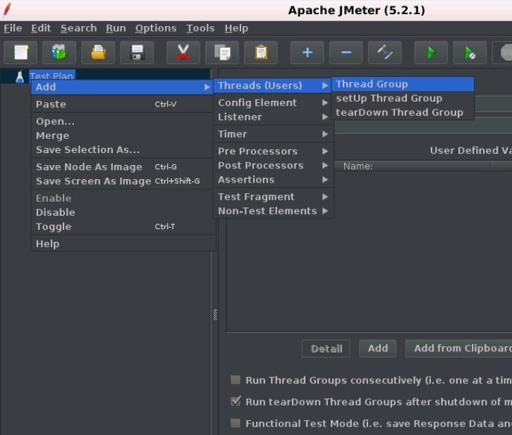

# JMeter 线程组(thread group)

线程组顾名思义，线程组表示JMeter在测试期间将使用的线程组。 线程组元素是任何测试计划的起点。 线程组提供的控件允许:

- 设置线程数。
- 设置加速期。
- 设置执行测试的次数。

前面已在“添加/删除测试元素”部分中说明了在测试计划中添加线程组的步骤。
下图显示了线程组的控制面板部分。

线程组控制面板包括:

- 线程组名称。
- 线程数(您正在测试的用户数)。
- 加速时间(您希望允许线程组从0到3个用户的时间)。
- 循环计数(应该循环测试的次数)。
- 调度程序复选框(“线程组”面板底部的复选框用于启用/禁用额外字段，您可以在其中输入测试持续时间，启动延迟，运行的开始和结束时间)。