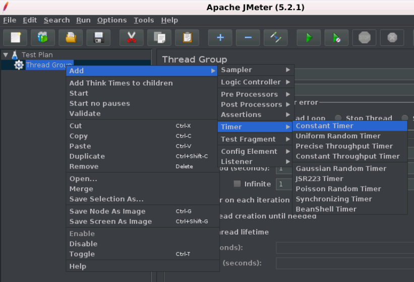
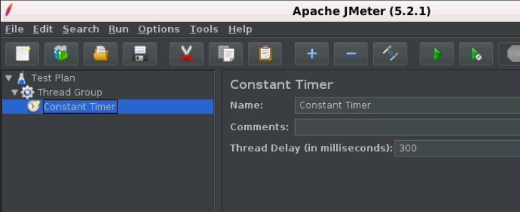

# JMeter 计时器(timer)

当您在网站或应用程序上执行任何操作时，它们自然会有暂停和延迟。 这些可以使用计时器(Timers)进行模拟。

JMeter发送请求时不会在每个采样器/请求之间应用延迟。 如果在服务器上执行负载/压力测试没有指定延迟，它将会超载。 这可能不完全是我们想要的。可以添加一个计时器元素，该元素允许您定义在每个请求到达时间等待的终止。

**下面给出了JMeter提供的所有计时器元素的列表：**

- 同步定时器
- JSR223 时间
- BeanShell 时间
- 高斯随机定时器
- 统一随机定时器
- 恒定吞吐量计时器
- BSF时间
- 泊松随机时间

**下图显示了一个恒定时器控制面板：**

