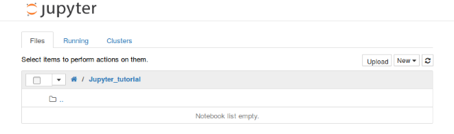
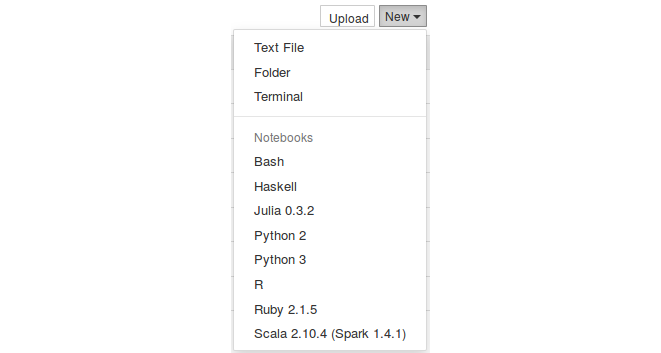
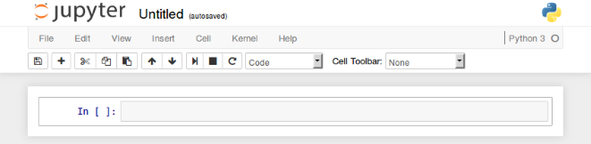
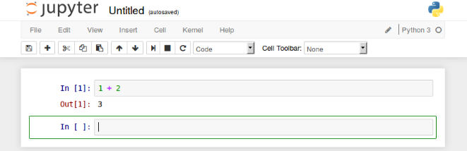

# Jupyter 快速上手

## 环境配置
[环境安装](./setup.html)

## Jupyter 界面说明及文件操作



若要创建一个新的notebook，只需鼠标左击New，在下拉选项中选择一个你想启动的notebook类型即可。



因为我只安装了Python内核，所以启动Python notebook来进行演示，打开新的标签，得到了一个空的notebook界面。



你可以看到notebook由以下部分组成：

- notebook名字
- 主工具栏，包括保存notebook、导出、重载、重启内核等
- 快捷键
- notebook主要部分，notebook编辑区

花时间熟悉菜单，了解其中的选项。如果你想了解一些特殊模块、notebook或者一些库，可以点击菜单栏右侧的Help按钮。

在主区域（编辑区），你可以看到一个个单元（cell）。每个notebook都由许多cell组成，每个cell有不同的功能。


## 使用代码单元格(Code Cell)


首先，第一个cell如下图所示，以“In[ ]”开头表示这是一个代码单元。在代码单元里，你可以输入任何代码并执行。例如，键盘输入1+2，然后按“Shift+Enter”，代码将被运行，并显示结果。同时，切换到新的cell中。



绿色的轮廓线所在的cell，就是当前工作单元。接下来，我们在第二个cell中，输入下列代码：

```python
for i in range(5):
    print(i)
```

按“Shift+Enter”运行该单元，得到：


跟之前一样，代码被执行，结果也正确显示处理。但是你可能注意到这次没有Out[2]，这是因为我们打印了结果，却没有返回值。

notebook一个非常有趣的特性是可以返回之前的cell，修改并重新运行，以此来跟新整个文档。例如，现在我们回到第一个cell中，将输入1+2改成2+3，重新按“Shift+Enter”运行该单元，结果被立即更新成5。当你想使用不同参数调试方程又不想运行整个脚本的时候，这条特性非常有用。然而，你也可以通过菜单栏Cell->Run all来重新运行整个notebook。

## 使用Markdown的单元格

现在我们已经知道了如何输入代码，**那为什么不尝试获得一个更加优美，解释性更强的notebook呢？**

这可以通过使用其他类型的cells来获得，例如**Markdown单元格**


首先，我们在notebook的顶部添加一个标题。做法是，选择第一个cell，点击Insert->Insert cell above，则在这个cell上面会添加一个新的单元。但是这个新cell默认是code类型，我们可以通过cell type菜单选择Heading或Markdown替换之前的code类型，这样就可以添加标题了。


你可以选择Heading，然后弹出信息会告诉你如何创建不同级别的标题，这样你就有了与code不同类型的cell。


这个cell以#开头，表示一级标题。如果你想列子标题的话，参考下面的方法：

```python
# : First level title


## : Second level title


### : Third level title
```

标题写在#后面，然后重新运行cell，你会发现该单元添加了标题，非常生动可读，示例如下：


添加标题之后，我们要对每个代码类型的cell做相应的解释。为此，我们在相应的位置添加cell，将其类型改为Markdown，然后重新运行cell，这样就能让解释文本丰富起来了。


最后，你可以将新建的notebook重命名，点击File->Rename，然后输入新的名称即可。这样更改后的名字就会出现在窗口的左上角，位于Jupyter图标的右侧。

### Markdown单元高级用法

#### 插入图片

让我们再深入地探讨下markdown单元类型，即便它的类型是markdown，它同时也支持HTML代码。你可以在你的cell中创建更高级的样式，比如添加图片等等。举个例子来说，如果你想在notebook中添加Jupyter的图标，尺寸为100x100，并且放置在cell左侧，可以这样编写：

```
12
```

运行该单元，效果如下：


#### 插入Latex公式

除此之外，markdown还支持LaTex语法。你可以在markdown cell中按照LaTex语法规则写下方程式，然后直接运行，就可以看到结果。例如运行下面方程式：

```
$$\int_0^{+\infty} x^2 dx$$1
```

运行后就得到了LaTex方程式：


## 高级单元格操作

当你在编辑notebook时，你希望使用更多高级的cell操作。幸运的是，notebook允许你使用非常丰富的cell操作。

你可以删除一个cell，先选中cell，点击Edit->Delete cell。你也可以移动一个cell的位置，点击Edit->
Move cell [up | down]。

你也可以剪切、粘贴cell，点击Edit->Cut Cell then Edit -> Paste Cell …，选择需要的粘贴形式。如果有许多cells，而你只想执行一次，或者你想一次性执行大量代码，你就可以合并多个cells，点击Edit->Merge cell [above|below]。编辑notebook时，记住这些操作，会节约你很多时间。

## Jupyter 绘图功能

如果你用Python画过图，应该知道matplotlib。Matplotlib是用来画图的Python库。与Jupyter notebook结合使用时，效果更好。下面，让我们来看看如何在Jupyter notebook中使用matplotlib。

为了在Jupyter notebook中使用matplotlib，你需要告诉Jupyter获取所有matplotlib生成的图形，并把它们全部嵌入到notebook中。为此，只需输入以下命令：

```python
%matplotlib inline
```

这条语句执行可能耗费几秒钟，但是只需要你打开notebook时执行一次就好。让我们作个图，看看是怎么集成的：

```python
%matplotlib inline
import matplotlib.pyplot as plt
import numpy as np

x = np.arange(20)
y = x**2

plt.plot(x, y)
```

这段简单代码将绘出y=x2y=x2对应的二次曲线。运行这个cell，结果如下所示：


我们可以看到，图直接嵌入到notebook中，就在代码下面。修改代码，重新运行，图形将自动同步更新。对于每个想要把代码和图形放在同一个文件中的数据科学家来说，这是一个很好的特性，这样可以清楚知道每段代码究竟干了什么。同时，在文档中添加一些文字型描述也有很大的作用。

## Jupyter 文件导出功能

notebook另一个强大的功能就是导出功能。你可以把你的notebook（例如是个图解代码课程）导出为如下多种形式：

- HTML
- Markdown
- ReST
- PDF(Through LaTex)
- Raw Python

如果导出成PDF格式，你甚至可以不使用LaTex就创建了一个漂亮的文档。或者，你可以将你的notebook保存为HTML格式，发布到个人网站上。你还可以导出成ReST格式，作为软件库的文档。

## 总结 

通过这快速入门教程，我们知道了Jupyter notebook是一个非常强大的工具，允许使用者为数据分析、教育、文件等任何你可以想到的内容创建漂亮的交互式文档。不要犹豫，探索它更多的功能和可能性。如果你有任何问题或者想感谢开发者们，请给他们反馈。