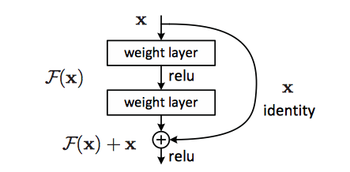

# Keras入门课4：使用ResNet识别cifar10数据集

前面几节课都是用一些简单的网络来做图像识别，这节课我们要使用经典的ResNet网络对cifar10进行分类。

ResNet是何凯明大神提出的残差网络，具体论文见此 

ResNet v1  
Deep Residual Learning for Image Recognition  
https://arxiv.org/pdf/1512.03385.pdf  
ResNet v2  
Identity Mappings in Deep Residual Networks  
https://arxiv.org/pdf/1603.05027.pdf  

这一节课，我们只动手实现v1的一个精简版本（因为数据集cifar10的数据比较小）


```python
import keras
from keras.layers import Dense, Conv2D, BatchNormalization, Activation
from keras.layers import AveragePooling2D, Input, Flatten
from keras.optimizers import Adam
from keras.regularizers import l2
from keras import backend as K
from keras.models import Model
from keras.datasets import cifar10
from keras.callbacks import ModelCheckpoint, LearningRateScheduler
from keras.callbacks import ReduceLROnPlateau
import numpy as np
import os
```


```python
(x_train, y_train), (x_test, y_test) = cifar10.load_data()
```


```python
x_train = x_train/255
x_test = x_test/255
y_train = keras.utils.to_categorical(y_train,10)
y_test = keras.utils.to_categorical(y_test,10)
```

↓构建模型基本模块，ResNet Block

这里没有用Sequential模型，而是用了另外一种构建模型的方法，即函数式模型（Functional)
Sequential模型有一个缺陷，即网络只能一层一层的堆叠起来，无法处理分支网络的情况。比如ResNet或GoogleNet中的Inception模块。使用Functional模型，构建起模型来十分自由，可以组合成各种各样的网络，可以说Sequential模型是Functional模型的一个子集。

使用函数式模型很简单，直接在网络层模块后写一个括号，参数就是当前层的输入值，返回值就是当前层的输出值，比如：net = Conv2D(...)(inputs)



↓首先构建一个基本的block模块，就是上图的weight layer，这个模块包含了一个卷积层，一个BN层，一个激活层。可以看到上图下面那个layer没有激活层，所以函数内做了一个判断

BN层的作用是对输出参数做归一化，可以有效使网络更易训练。一般来说，加了BN层的网络，可以不必再用Dropout层。
同时这一次我们在卷积层中加入了L2正则化，目的是提升模型的泛化能力。


```python
#ResNet Block
def resnet_block(inputs,num_filters=16,
                  kernel_size=3,strides=1,
                  activation='relu'):
    x = Conv2D(num_filters,kernel_size=kernel_size,strides=strides,padding='same',
           kernel_initializer='he_normal',kernel_regularizer=l2(1e-4))(inputs)
    x = BatchNormalization()(x)
    if(activation):
        x = Activation('relu')(x)
    return x
```

↓这里构建整个网络。由于我们要处理的图像较小，所以ResNet用的也是一个20层的小号版。
总体上分为五大部分。上面那张图我们称之为一个building block

输入层  
↓  
6层 filter大小为16的building block  
↓  
6层 filter大小为32的building block  
↓  
6层 filter大小为64的building block  
↓  
一层全连接
一层输出层  
第2~7层属于一个很规整的层叠加，每一个循环里都是在搭建一个building block  
第8~13层里面的首层的strides=2，这样输出就是16*16*32大小的张量，而输入是32*32*16大小的张量，所以对输入又做了一个卷积操作，使得其shape和正常卷积层的输出一直，这样才可以执行add操作。
第14~19层套路一样

返回为通过Model初始化过的一个模型


```python
# 建一个20层的ResNet网络 
def resnet_v1(input_shape):
    inputs = Input(shape=input_shape)# Input层，用来当做占位使用
    
    #第一层
    x = resnet_block(inputs)
    print('layer1,xshape:',x.shape)
    # 第2~7层
    for i in range(6):
        a = resnet_block(inputs = x)
        b = resnet_block(inputs=a,activation=None)
        x = keras.layers.add([x,b])
        x = Activation('relu')(x)
    # out：32*32*16
    # 第8~13层
    for i in range(6):
        if i == 0:
            a = resnet_block(inputs = x,strides=2,num_filters=32)
        else:
            a = resnet_block(inputs = x,num_filters=32)
        b = resnet_block(inputs=a,activation=None,num_filters=32)
        if i==0:
            x = Conv2D(32,kernel_size=3,strides=2,padding='same',
                       kernel_initializer='he_normal',kernel_regularizer=l2(1e-4))(x)
        x = keras.layers.add([x,b])
        x = Activation('relu')(x)
    # out:16*16*32
    # 第14~19层
    for i in range(6):
        if i ==0 :
            a = resnet_block(inputs = x,strides=2,num_filters=64)
        else:
            a = resnet_block(inputs = x,num_filters=64)

        b = resnet_block(inputs=a,activation=None,num_filters=64)
        if i == 0:
            x = Conv2D(64,kernel_size=3,strides=2,padding='same',
                       kernel_initializer='he_normal',kernel_regularizer=l2(1e-4))(x)
        x = keras.layers.add([x,b])# 相加操作，要求x、b shape完全一致
        x = Activation('relu')(x)
    # out:8*8*64
    # 第20层   
    x = AveragePooling2D(pool_size=2)(x)
    # out:4*4*64
    y = Flatten()(x)
    # out:1024
    outputs = Dense(10,activation='softmax',
                    kernel_initializer='he_normal')(y)
    
    #初始化模型
    #之前的操作只是将多个神经网络层进行了相连，通过下面这一句的初始化操作，才算真正完成了一个模型的结构初始化
    model = Model(inputs=inputs,outputs=outputs)
    return model
```


```python
model = resnet_v1((32,32,3))
print(model)
```


```python
model.compile(loss='categorical_crossentropy',
optimizer=Adam(),
metrics=['accuracy'])

model.summary()
```

↓callbacks 
model的.fit方法有一个参数是callbacks，这个参数可以传入一些其他待执行的函数，在训练过程中，每一个epoch会调用一次列表中的callbacks  

本次课程用到的几个回调函数  
ModelCheckpoint：用来每个epoch存储一遍模型  
LearningRateScheduler:用来动态调整学习率。其输入为一个函数，该函数的输入为当前epoch数，返回为对应的学习率  
ReduceLROnPlateau:用来在训练停滞不前的时候动态降低学习率。


```python
checkpoint = ModelCheckpoint(filepath='./cifar10_resnet_ckpt.h5',monitor='val_acc',
                             verbose=1,save_best_only=True)
def lr_sch(epoch):
    #200 total
    if epoch <50:
        return 1e-3
    if 50<=epoch<100:
        return 1e-4
    if epoch>=100:
        return 1e-5
lr_scheduler = LearningRateScheduler(lr_sch)
lr_reducer = ReduceLROnPlateau(monitor='val_acc',factor=0.2,patience=5,
                               mode='max',min_lr=1e-3)
callbacks = [checkpoint,lr_scheduler,lr_reducer]
```


```python
model.fit(x_train,y_train,batch_size=64,epochs=200,validation_data=(x_test,y_test),verbose=1,callbacks=callbacks)
```


```python
scores = model.evaluate(x_test,y_test,verbose=1)
print('Test loss:',scores[0])
print('Test accuracy:',scores[1])
```

通过了200个批次的训练，训练集的准确率已经达到了100%，测试集达到了82.44%。这还是没有使用数据增强的效果，如果使用数据增强，准确率可以达到90+%

## 总结
1. 学习了一种新的构建模型的方法，函数式模型（Functional），更自由灵活
1. 学习了如何将通过Functional方式定义的层初始化为一个模型（Model）
1. 使用keras.layers.add方法，可以将两个一模一样的张量进行相加
1. 搭建了一个精简版的ResNet网络
1. 学习了如何在训练中调用回调函数
1. 学习了在训练过程中动态的调节学习率（使用LearningRateScheduler）
1. 学习了保存checkpoint（使用ModelCheckpoint）
1. 使用ReduceLROnPlateau在训练进入平台期的时候动态调节学习率


参考：
> https://github.com/keras-team/keras/blob/master/examples/cifar10_resnet.py
