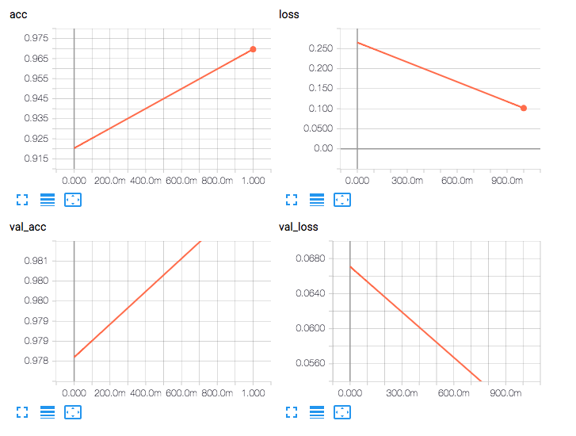
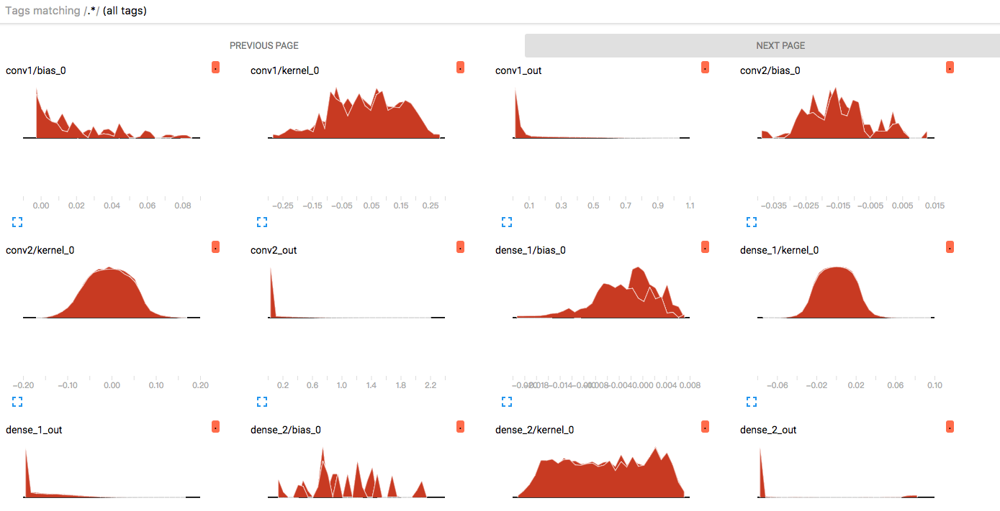

# Keras入门课5：网络可视化及训练监控

本节专注于Keras中神经网络的可视化，包括网络结构可视化以及如何使用TensorBoard来监控训练过程。  
这里我们借用第2课的代码内容来进行示例和讲解。

网络前面的定义、数据初始化都一样，主要是fit函数

#### 启用TensorBoard
在model的fit函数中加入TensorBoard的回调函数即可，训练数据就会自动保存在log_dir指定的目录内，然后在命令行启动命令 tensorboard --logdir=./log 即可。TensorBoard会记录loss及model.metrics里面的值，本例中即acc,loss,val_acc,val_loss四个值，每个epoch更新一次。  
除了这些SCALARS，还会记录网络的GRAPH，直接可视化网络结构，但是相比用原生TensorFlow生成的图而言，相差还是比较大的，比较难看，所以不推荐在Keras中使用TensorBoard查看网络结构。

我只训练了2个epoch，所以只记录下了两个值。曲线图如下


↓直方图，用来统计参数的分布



In[1]:


```python
import keras
from keras.datasets import mnist
from keras.models import Sequential
from keras.layers import Dense, Dropout, Flatten
from keras.layers import Conv2D, MaxPooling2D
from keras import backend as K
# 引入Tensorboard
from keras.callbacks import TensorBoard
from keras.utils import plot_model

(x_train,y_train),(x_test,y_test) = mnist.load_data() # out: np.ndarray

x_train = x_train.reshape(-1,28,28,1)
x_test = x_test.reshape(-1,28,28,1)
input_shape = (28,28,1)

x_train = x_train/255
x_test = x_test/255
y_train = keras.utils.to_categorical(y_train,10)
y_test = keras.utils.to_categorical(y_test,10)
```


```python
model = Sequential()
model.add(Conv2D(filters = 32,kernel_size=(3,3),
                 activation='relu',input_shape = input_shape,name='conv1'))
model.add(Conv2D(64,(3,3),activation='relu',name='conv2'))
model.add(MaxPooling2D(pool_size=(2,2),name='pool2'))
model.add(Dropout(0.25,name='dropout1'))
model.add(Flatten(name='flat1'))
model.add(Dense(128,activation='relu'))
model.add(Dropout(0.5,name='dropout2'))
model.add(Dense(10,activation='softmax',name='output'))
```


```python
plot_model(model,to_file='model.png')
```

↑keras的utils里面专门有一个plot_model函数是用来可视化网络结构的，为了保证格式美观，我们在定义模型的时候给每个层都加了一个名字。   
对于大多数的Keras的layers，都有name这一参数。
使用plot_model就可以生成类似下图的一张图片，相比TensorBoard的Graph要清晰明了很多。所以在Keras中打印图结构还是推荐使用Keras自带的方法。


```python
model.compile(loss = keras.losses.categorical_crossentropy,
             optimizer = keras.optimizers.Adadelta(),
             metrics=['accuracy'])
```

TensorBoard接口函数，有很多参数可选，具体细节可以参看官方文档。相比TensorFlow中的summary保存而言，keras中的TensorBoard使用更为简单，但是灵活性较差，只适合一些最基础的使用。


```python
tb = TensorBoard(log_dir='./logs',  # log 目录
                 histogram_freq=1,  # 按照何等频率（epoch）来计算直方图，0为不计算
                 batch_size=32,     # 用多大量的数据计算直方图
                 write_graph=True,  # 是否存储网络结构图
                 write_grads=False, # 是否可视化梯度直方图
                 write_images=False,# 是否可视化参数
                 embeddings_freq=0, 
                 embeddings_layer_names=None, 
                 embeddings_metadata=None)
callbacks = [tb]
```


```python
model.fit(x_train,y_train,batch_size=64,epochs=2
          ,verbose=1,validation_data=(x_test,y_test),
          callbacks=callbacks)
```

## 总结

1. 学习了如何用TensorBoard监控训练过程
1. 学习了如何使用keras自带的save_model函数来保存网络图


在使用plot_model绘制图片的时候还遇到了一些错误，如果你也报错，可以参看我的另一篇文章尝试解决：[ Mac下使用Keras plot_model函数时出错的解决办法](http://blog.csdn.net/tsyccnh/article/details/78866976)

本文代码地址：https://github.com/tsycnh/Keras-Tutorials/blob/master/class_5.ipynb

参考：
> https://keras.io/visualization/

