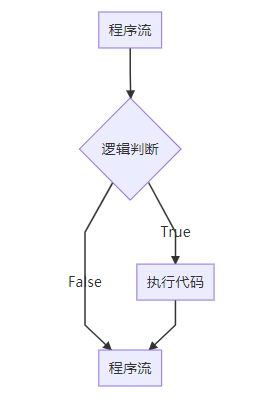

# Lua 逻辑判断

决策结构要求程序员指定一个或多个要由程序评估或测试的条件，以及要执行的一个或多个语句(如果条件被确定为真)，以及可选的其他语句(如果条件被确定为假时)。

以下是大多数编程语言中常见决策结构的一般形式 - 

Lua编程语言假定布尔`true`和`non-nil`值的任意组合为`true`，如果它是布尔`false`或`nil`，则假定为`false`值。 需要注意的是，在Lua中，零将被视为`true`。

Lua编程语言提供以下类型的决策制定语句 -

| 编号 | 决策语句                             | 描述                                                         |
| ---- | ------------------------------------ | ------------------------------------------------------------ |
| 1    | [if语句](./logic-if.html)            | `if`语句由布尔表达式后跟一个或多个语句组成。                 |
| 2    | [if…else语句](./logic-if-else.html)  | `if`语句后面可以跟一个可选的`else`语句，该语句在布尔表达式为`false`时执行。 |
| 3    | [嵌套if语句](./logic-if-nested.html) | 在一个`if`或`else if`语句中使用另一个`if`或`else if`语句。   |