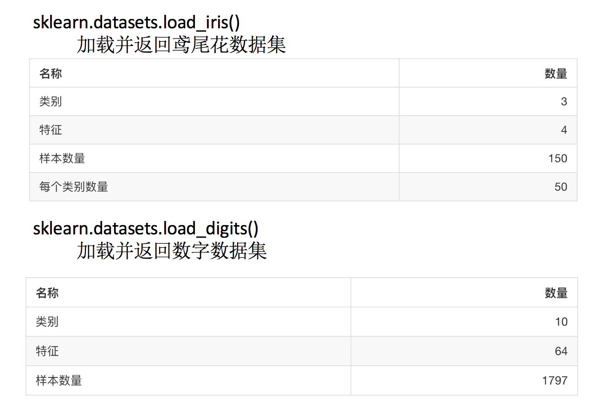
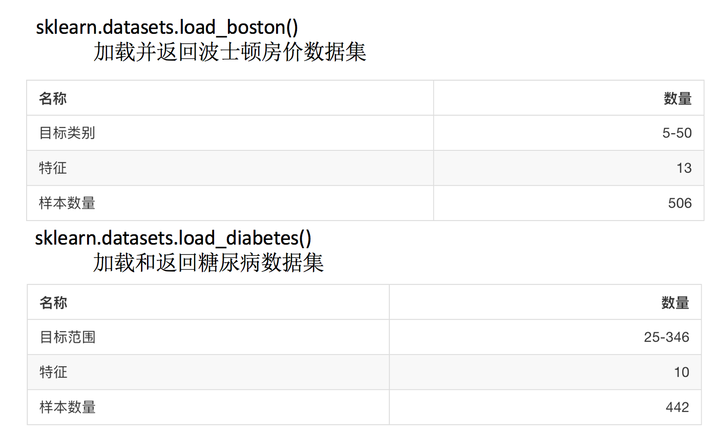

# 数据集介绍与划分

##  数据集的划分

机器学习一般的数据集会划分为两个部分：

- 训练数据：用于训练，构建模型
- 测试数据：在模型检验时使用，用于评估模型是否有效

划分比例：

- 训练集：70% 80% 75%
- 测试集：30% 20% 30%

**API**

- `sklearn.model_selection.train_test_split(arrays, *options)`
- x 数据集的特征值
  - y 数据集的标签值
- test_size 测试集的大小，一般为float
  - random_state 随机数种子,不同的种子会造成不同的随机采样结果。相同的种子采样结果相同。
- return ，测试集特征训练集特征值值，训练标签，测试标签(默认随机取)

结合后面的数据集作介绍

## sklearn数据集介绍

**API**

- `sklearn.datasets`
  - 加载获取流行数据集
  - `datasets.load_*()`
    - 获取小规模数据集，数据包含在datasets里
  - `datasets.fetch_*(data_home=None)`
    - 获取大规模数据集，需要从网络上下载，函数的第一个参数是data_home，表示数据集下载的目录,默认是 ~/scikit_learn_data/

### 分类和回归数据集

- 分类数据集



- sklearn.datasets.fetch_20newsgroups(data_home=None,subset=‘train’)
  - subset: 'train'或者'test','all'，可选，选择要加载的数据集.训练集的“训练”，测试集的“测试”，两者的“全部”
- 回归数据集



### 返回类型

- `load`和`fetch`

  返回的数据类型`datasets.base.Bunch(字典格式)`

  - data：特征数据数组，是 [n_samples * n_features] 的二维 numpy.ndarray 数组
- target：标签数组，是 n_samples 的一维 numpy.ndarray 数组
  - DESCR：数据描述
  - feature_names：特征名,新闻数据，手写数字、回归数据集没有
  - target_names：标签名


## sklearn转换器和估计器
### 1.1 转换器

想一下之前做的特征工程的步骤？

- 1、实例化 (实例化的是一个转换器类(Transformer))
- 2、调用`fit_transform`(对于文档建立分类词频矩阵，不能同时调用)

我们把特征工程的接口称之为转换器，其中转换器调用有这么几种形式

- `fit_transform`
- `fit`
- `transform`

#### 练习：不同方法的转换

```python
from sklearn.preprocessing import StandardScaler
a = [[1,2,3], [4,5,6]]

std1 = StandardScaler()
std2 = StandardScaler()


print(std1.fit_transform(a))
print(std2.fit(a))

StandardScaler(copy=True, with_mean=True, with_std=True)
print(std2.transform(a))
```

从中可以看出，`fit_transform`的作用相当于`transform`加上`fit`。但是为什么还要提供单独的`fit`呢, 我们还是使用原来的`std2`来进行标准化看看

```python
b = [[7,8,9], [10, 11, 12]]

std2.transform(b)

print(std2.fit_transform(b))
```

### 估计器(sklearn机器学习算法的实现)

在sklearn中，估计器(estimator)是一个重要的角色，是一类实现了算法的API

- 1、用于分类的估计器：
  - `sklearn.neighbors` k-近邻算法
  - `sklearn.naive_bayes` 贝叶斯
  - `sklearn.linear_model.LogisticRegression` 逻辑回归
  - s`klearn.tree` 决策树与随机森林
- 2、用于回归的估计器：
  - `sklearn.linear_model.LinearRegression` 线性回归
  - `sklearn.linear_model.Ridge` 岭回归
- 3、用于无监督学习的估计器
  - `sklearn.cluster.KMeans` 聚类

### 估计器工作流程


## 作业

- 知道数据集的分为训练集和测试集
- 知道sklearn的分类、回归数据集
- 知道sklearn的转换器和估计器流程
- 拿到的数据是否全部都用来训练一个模型？
