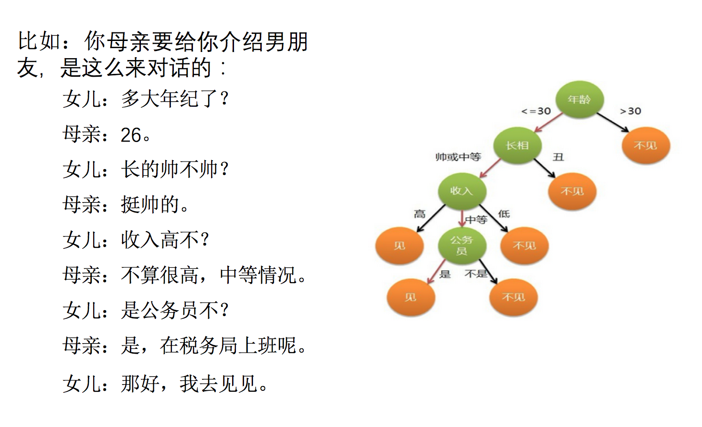

# 决策树

决策树思想的来源非常朴素，程序设计中的条件分支结构就是if-then结构，最早的决策树就是利用这类结构分割数据的一种分类学习方法

怎么理解这句话？通过一个对话例子



想一想这个女生为什么把年龄放在最上面判断！！！！！！！！！

### 决策树概述

决策树（Decision Tree）算法是一种基本的分类与回归方法，是最经常使用的数据挖掘算法之一。我们这章节只讨论用于分类的决策树。

决策树模型呈树形结构，在分类问题中，表示基于特征对实例进行分类的过程。它可以认为是 if-then 规则的集合，也可以认为是定义在特征空间与类空间上的条件概率分布。

决策树学习通常包括 3 个步骤：特征选择、决策树的生成和决策树的修剪。

### 决策树工作原理

如何构造一个决策树?
我们使用 createBranch() 方法，伪代码如下所示：

```
#此处为伪代码，请勿运行
def createBranch():
'''
此处运用了迭代的思想。 感兴趣可以搜索 迭代 recursion， 甚至是 dynamic programing。
'''
    检测数据集中的所有数据的分类标签是否相同:
        If so return 类标签
        Else:
            寻找划分数据集的最好特征（划分之后信息熵最小，也就是信息增益最大的特征）
            划分数据集
            创建分支节点
                for 每个划分的子集
                    调用函数 createBranch （创建分支的函数）并增加返回结果到分支节点中
            return 分支节点
```

### 决策树算法特点


优点：计算复杂度不高，输出结果易于理解，数据有缺失也能跑，可以处理不相关特征。

缺点：容易过拟合。

适用数据类型：数值型和标称型。

### 决策树应用场景

一个叫做 "二十个问题" 的游戏，游戏的规则很简单：参与游戏的一方在脑海中想某个事物，其他参与者向他提问，只允许提 20 个问题，问题的答案也只能用对或错回答。问问题的人通过推断分解，逐步缩小待猜测事物的范围，最后得到游戏的答案。

一个邮件分类系统，大致工作流程如下：

首先检测发送邮件域名地址。如果地址为 myEmployer.com, 则将其放在分类 "无聊时需要阅读的邮件"中。
如果邮件不是来自这个域名，则检测邮件内容里是否包含单词 "曲棍球" , 如果包含则将邮件归类到 "需要及时处理的朋友邮件", 
如果不包含则将邮件归类到 "无需阅读的垃圾邮件" 。

### 决策树的定义：

分类决策树模型是一种描述对实例进行分类的树形结构。决策树由结点（node）和有向边（directed edge）组成。结点有两种类型：内部结点（internal node）和叶结点（leaf node）。内部结点表示一个特征或属性(features)，叶结点表示一个类(labels)。

用决策树对需要测试的实例进行分类：从根节点开始，对实例的某一特征进行测试，根据测试结果，将实例分配到其子结点；这时，每一个子结点对应着该特征的一个取值。如此递归地对实例进行测试并分配，直至达到叶结点。最后将实例分配到叶结点的类中。

### 信息熵 & 信息增益

熵（entropy）： 熵指的是体系的混乱的程度，在不同的学科中也有引申出的更为具体的定义，是各领域十分重要的参量。

信息论（information theory）中的熵（香农熵）： 是一种信息的度量方式，表示信息的混乱程度，也就是说：信息越有序，信息熵越低。例如：火柴有序放在火柴盒里，熵值很低，相反，熵值很高。

信息增益（information gain）： 在划分数据集前后信息发生的变化称为信息增益。

### 决策树的三种算法实现

当然决策树的原理不止信息增益这一种，还有其他方法。但是原理都类似，我们就不去举例计算。

- ID3
  - 信息增益 最大的准则
- C4.5
  - 信息增益比 最大的准则
- CART
  - 分类树: 基尼系数 最小的准则 在sklearn中可以选择划分的默认原则
  - 优势：划分更加细致（从后面例子的树显示来理解）

## 决策树项目案例

### 案例1: 判定鱼类和非鱼类

#### 项目概述

根据以下 2 个特征，将动物分成两类：鱼类和非鱼类。

1. 不浮出水面是否可以生存   
2. 是否有脚蹼

#### 开发流程

- 收集数据：可以使用任何方法
- 准备数据：树构造算法（这里使用的是ID3算法，因此数值型数据必须离散化。）
- 分析数据：可以使用任何方法，构造树完成之后，我们可以将树画出来。
- 训练算法：构造树结构
- 测试算法：使用习得的决策树执行分类
- 使用算法：此步骤可以适用于任何监督学习任务，而使用决策树可以更好地理解数据的内在含义

#### 收集数据&准备数据

我们利用 createDataSet() 函数输入数据

```python
def createDataSet():
    dataSet = [[1, 1, 'yes'],
            [1, 1, 'yes'],
            [1, 0, 'no'],
            [0, 1, 'no'],
            [0, 1, 'no']]
    labels = ['no surfacing', 'flippers']
    return dataSet, labels
dataSet,labels=createDataSet()
print(dataSet)
print(labels)
```

#### 准备数据：树构造算法

此处，由于我们输入的数据本身就是离散化数据，所以这一步就省略了。
计算给定数据集的香农熵的函数

```python
from math import log
def calcShannonEnt(dataSet):
    # 求list的长度，表示计算参与训练的数据量
    numEntries = len(dataSet)
    # 计算分类标签label出现的次数
    labelCounts = {}
    # the the number of unique elements and their occurrence
    for featVec in dataSet:
        # 将当前实例的标签存储，即每一行数据的最后一个数据代表的是标签
        currentLabel = featVec[-1]
        # 为所有可能的分类创建字典，如果当前的键值不存在，则扩展字典并将当前键值加入字典。每个键值都记录了当前类别出现的次数。
        if currentLabel not in labelCounts.keys():
            labelCounts[currentLabel] = 0
        labelCounts[currentLabel] += 1

    # 对于 label 标签的占比，求出 label 标签的香农熵
    shannonEnt = 0.0
    for key in labelCounts:
        # 使用所有类标签的发生频率计算类别出现的概率。
        prob = float(labelCounts[key])/numEntries
        # 计算香农熵，以 2 为底求对数
        shannonEnt -= prob * log(prob, 2)
    return shannonEnt

#计算我们上边自定义的数据集    
calcShannonEnt(dataSet)
```

##### 按照给定特征划分数据集

```python
#将指定特征的特征值等于 value 的行剩下列作为子数据集。
def splitDataSet(dataSet, index, value):
    """splitDataSet(通过遍历dataSet数据集，求出index对应的colnum列的值为value的行)
        就是依据index列进行分类，如果index列的数据等于 value的时候，就要将 index 划分到我们创建的新的数据集中
    Args:
        dataSet 数据集                 待划分的数据集
        index 表示每一行的index列        划分数据集的特征
        value 表示index列对应的value值   需要返回的特征的值。
    Returns:
        index列为value的数据集【该数据集需要排除index列】
    """
    retDataSet = []
    for featVec in dataSet: 
        # index列为value的数据集【该数据集需要排除index列】
        # 判断index列的值是否为value
        if featVec[index] == value:
            # chop out index used for splitting
            # [:index]表示前index行，即若 index 为2，就是取 featVec 的前 index 行
            reducedFeatVec = featVec[:index]
            '''
            请百度查询一下： extend和append的区别
            music_media.append(object) 向列表中添加一个对象object
            music_media.extend(sequence) 把一个序列seq的内容添加到列表中 (跟 += 在list运用类似， music_media += sequence)
            1、使用append的时候，是将object看作一个对象，整体打包添加到music_media对象中。
            2、使用extend的时候，是将sequence看作一个序列，将这个序列和music_media序列合并，并放在其后面。
            music_media = []
            music_media.extend([1,2,3])
            print music_media
            #结果：
            #[1, 2, 3]
            
            music_media.append([4,5,6])
            print music_media
            #结果：
            #[1, 2, 3, [4, 5, 6]]
            
            music_media.extend([7,8,9])
            print music_media
            #结果：
            #[1, 2, 3, [4, 5, 6], 7, 8, 9]
            '''
            reducedFeatVec.extend(featVec[index+1:])
            # [index+1:]表示从跳过 index 的 index+1行，取接下来的数据
            # 收集结果值 index列为value的行【该行需要排除index列】
            retDataSet.append(reducedFeatVec)
    return retDataSet
print(splitDataSet(dataSet,0,1))
print(splitDataSet(dataSet,1,0))
```

##### 选择最好的数据集划分方式

```python
def chooseBestFeatureToSplit(dataSet):
    """chooseBestFeatureToSplit(选择最好的特征)

    Args:
        dataSet 数据集
    Returns:
        bestFeature 最优的特征列
    """
    # 求第一行有多少列的 Feature, 最后一列是label列嘛
    numFeatures = len(dataSet[0]) - 1
    # 数据集的原始信息熵
    baseEntropy = calcShannonEnt(dataSet)
    # 最优的信息增益值, 和最优的Featurn编号
    bestInfoGain, bestFeature = 0.0, -1
    # iterate over all the features
    for i in range(numFeatures):
        # create a list of all the examples of this feature
        # 获取对应的feature下的所有数据
        featList = [example[i] for example in dataSet]
        # get a set of unique values
        # 获取剔重后的集合，使用set对list数据进行去重
        uniqueVals = set(featList)
        # 创建一个临时的信息熵
        newEntropy = 0.0
        # 遍历某一列的value集合，计算该列的信息熵 
        # 遍历当前特征中的所有唯一属性值，对每个唯一属性值划分一次数据集，计算数据集的新熵值，并对所有唯一特征值得到的熵求和。
        for value in uniqueVals:
            subDataSet = splitDataSet(dataSet, i, value)
            # 计算概率
            prob = len(subDataSet)/float(len(dataSet))
            # 计算信息熵
            newEntropy += prob * calcShannonEnt(subDataSet)
        # gain[信息增益]: 划分数据集前后的信息变化， 获取信息熵最大的值
        # 信息增益是熵的减少或者是数据无序度的减少。最后，比较所有特征中的信息增益，返回最好特征划分的索引值。
        infoGain = baseEntropy - newEntropy
        print('infoGain=', infoGain, 'bestFeature=', i, baseEntropy, newEntropy)
        if (infoGain > bestInfoGain):
            bestInfoGain = infoGain
            bestFeature = i
    return bestFeature
# 测试
chooseBestFeatureToSplit(dataSet)
```

#### 训练算法：构造树的数据结构

```python
#创建树的函数代码如下：
def createTree(dataSet, labels):
    classList = [example[-1] for example in dataSet]
    # 如果数据集的最后一列的第一个值出现的次数=整个集合的数量，也就说只有一个类别，就只直接返回结果就行
    # 第一个停止条件：所有的类标签完全相同，则直接返回该类标签。
    # count() 函数是统计括号中的值在list中出现的次数
    if classList.count(classList[0]) == len(classList):
        return classList[0]
    # 如果数据集只有1列，那么最初出现label次数最多的一类，作为结果
    # 第二个停止条件：使用完了所有特征，仍然不能将数据集划分成仅包含唯一类别的分组。
    if len(dataSet[0]) == 1:
        return majorityCnt(classList)

    # 选择最优的列，得到最优列对应的label含义
    bestFeat = chooseBestFeatureToSplit(dataSet)
    # 获取label的名称
    bestFeatLabel = labels[bestFeat]
    # 初始化myTree
    myTree = {bestFeatLabel: {}}
    # 注：labels列表是可变对象，在PYTHON函数中作为参数时传址引用，能够被全局修改
    # 所以这行代码导致函数外的同名变量被删除了元素，造成例句无法执行，提示'no surfacing' is not in list
    # del(labels[bestFeat])
    # 取出最优列，然后它的branch做分类
    featValues = [example[bestFeat] for example in dataSet]
    uniqueVals = set(featValues)
    for value in uniqueVals:
        # 求出剩余的标签label
        subLabels = labels[:]
        # 遍历当前选择特征包含的所有属性值，在每个数据集划分上递归调用函数createTree()
        myTree[bestFeatLabel][value] = createTree(splitDataSet(dataSet, bestFeat, value), subLabels)
        # print('myTree', value, myTree)
    return myTree
# 根据数据集构造树
tree=createTree(dataSet,labels)
print(tree)
```

#### 测试算法：使用决策树执行分类

```python
def classify(inputTree, featLabels, testVec):
    """classify(给输入的节点，进行分类)

    Args:
        inputTree  决策树模型
        featLabels Feature标签对应的名称
        testVec    测试输入的数据
    Returns:
        classLabel 分类的结果值，需要映射label才能知道名称
    """
    # 获取tree的根节点对于的key值
    firstStr = list(inputTree.keys())
    # 通过key得到根节点对应的value
    secondDict = inputTree[firstStr[0]]
    # 判断根节点名称获取根节点在label中的先后顺序，这样就知道输入的testVec怎么开始对照树来做分类
    featIndex = featLabels.index(firstStr[0])
    # 测试数据，找到根节点对应的label位置，也就知道从输入的数据的第几位来开始分类
    key = testVec[featIndex]
    valueOfFeat = secondDict[key]
    print('+++', firstStr, 'xxx', secondDict, '---', key, '>>>', valueOfFeat)
    # 判断分枝是否结束: 判断valueOfFeat是否是dict类型
    if isinstance(valueOfFeat, dict):
        classLabel = classify(valueOfFeat, featLabels, testVec)
    else:
        classLabel = valueOfFeat
    return classLabel
classify
```

#### 使用算法：

此步骤可以适用于任何监督学习任务，而使用决策树可以更好地理解数据的内在含义。

```
print(labels)
classify(tree,labels,[1,0])
```

### 案例2: 使用决策树预测隐形眼镜类型

#### 项目概述

隐形眼镜类型包括硬材质、软材质以及不适合佩戴隐形眼镜。我们需要使用决策树预测患者需要佩戴的隐形眼镜类型。

#### 开发流程

1. 收集数据: 提供的文本文件。
2. 解析数据: 解析 tab 键分隔的数据行
3. 分析数据: 快速检查数据，确保正确地解析数据内容，使用 createPlot() 函数绘制最终的树形图。
4. 训练算法: 使用 createTree() 函数。
5. 测试算法: 编写测试函数验证决策树可以正确分类给定的数据实例。
6. 使用算法: 存储树的数据结构，以便下次使用时无需重新构造树。

#### 收集数据：提供的文本文件

文本文件数据格式如下：

```python
!head /share/datasets/decisionTree_Lense.txt
```

####  训练算法：构造树的数据结构

```python
#创建树的函数代码如下：
def createTree(dataSet, labels):
    classList = [example[-1] for example in dataSet]
    # 如果数据集的最后一列的第一个值出现的次数=整个集合的数量，也就说只有一个类别，就只直接返回结果就行
    # 第一个停止条件：所有的类标签完全相同，则直接返回该类标签。
    # count() 函数是统计括号中的值在list中出现的次数
    if classList.count(classList[0]) == len(classList):
        return classList[0]
    # 如果数据集只有1列，那么最初出现label次数最多的一类，作为结果
    # 第二个停止条件：使用完了所有特征，仍然不能将数据集划分成仅包含唯一类别的分组。
    if len(dataSet[0]) == 1:
        return majorityCnt(classList)

    # 选择最优的列，得到最优列对应的label含义
    bestFeat = chooseBestFeatureToSplit(dataSet)
    # 获取label的名称
    bestFeatLabel = labels[bestFeat]
    # 初始化myTree
    myTree = {bestFeatLabel: {}}
    # 注：labels列表是可变对象，在PYTHON函数中作为参数时传址引用，能够被全局修改
    # 所以这行代码导致函数外的同名变量被删除了元素，造成例句无法执行，提示'no surfacing' is not in list
    # del(labels[bestFeat])
    # 取出最优列，然后它的branch做分类
    featValues = [example[bestFeat] for example in dataSet]
    uniqueVals = set(featValues)
    for value in uniqueVals:
        # 求出剩余的标签label
        subLabels = labels[:]
        # 遍历当前选择特征包含的所有属性值，在每个数据集划分上递归调用函数createTree()
        myTree[bestFeatLabel][value] = createTree(splitDataSet(dataSet, bestFeat, value), subLabels)
        # print('myTree', value, myTree)
    return myTree
createTree
```

#### 选择最优特征去进行分裂

```python
def chooseBestFeatureToSplit(dataSet):
    """chooseBestFeatureToSplit(选择最好的特征)

    Args:
        dataSet 数据集
    Returns:
        bestFeature 最优的特征列
    """
    # 求第一行有多少列的 Feature, 最后一列是label列嘛
    numFeatures = len(dataSet[0]) - 1
    # 数据集的原始信息熵
    baseEntropy = calcShannonEnt(dataSet)
    # 最优的信息增益值, 和最优的Featurn编号
    bestInfoGain, bestFeature = 0.0, -1
    # iterate over all the features
    for i in range(numFeatures):
        # create a list of all the examples of this feature
        # 获取对应的feature下的所有数据
        featList = [example[i] for example in dataSet]
        # get a set of unique values
        # 获取剔重后的集合，使用set对list数据进行去重
        uniqueVals = set(featList)
        # 创建一个临时的信息熵
        newEntropy = 0.0
        # 遍历某一列的value集合，计算该列的信息熵 
        # 遍历当前特征中的所有唯一属性值，对每个唯一属性值划分一次数据集，计算数据集的新熵值，并对所有唯一特征值得到的熵求和。
        for value in uniqueVals:
            subDataSet = splitDataSet(dataSet, i, value)
            # 计算概率
            prob = len(subDataSet)/float(len(dataSet))
            # 计算信息熵
            newEntropy += prob * calcShannonEnt(subDataSet)
        # gain[信息增益]: 划分数据集前后的信息变化， 获取信息熵最大的值
        # 信息增益是熵的减少或者是数据无序度的减少。最后，比较所有特征中的信息增益，返回最好特征划分的索引值。
        infoGain = baseEntropy - newEntropy
        print('infoGain=', infoGain, 'bestFeature=', i, baseEntropy, newEntropy)
        if (infoGain > bestInfoGain):
            bestInfoGain = infoGain
            bestFeature = i
    return bestFeature
chooseBestFeatureToSplit
```

#### 选择最优特征的依据

```python
from math import log
def calcShannonEnt(dataSet):
    # 求list的长度，表示计算参与训练的数据量
    numEntries = len(dataSet)
    # 计算分类标签label出现的次数
    labelCounts = {}
    # the the number of unique elements and their occurrence
    for featVec in dataSet:
        # 将当前实例的标签存储，即每一行数据的最后一个数据代表的是标签
        currentLabel = featVec[-1]
        # 为所有可能的分类创建字典，如果当前的键值不存在，则扩展字典并将当前键值加入字典。每个键值都记录了当前类别出现的次数。
        if currentLabel not in labelCounts.keys():
            labelCounts[currentLabel] = 0
        labelCounts[currentLabel] += 1

    # 对于 label 标签的占比，求出 label 标签的香农熵
    shannonEnt = 0.0
    for key in labelCounts:
        # 使用所有类标签的发生频率计算类别出现的概率。
        prob = float(labelCounts[key])/numEntries
        # 计算香农熵，以 2 为底求对数
        shannonEnt -= prob * log(prob, 2)
    return shannonEnt

#将指定特征的特征值等于 value 的行剩下列作为子数据集。
def splitDataSet(dataSet, index, value):
    """splitDataSet(通过遍历dataSet数据集，求出index对应的colnum列的值为value的行)
        就是依据index列进行分类，如果index列的数据等于 value的时候，就要将 index 划分到我们创建的新的数据集中
    Args:
        dataSet 数据集                 待划分的数据集
        index 表示每一行的index列        划分数据集的特征
        value 表示index列对应的value值   需要返回的特征的值。
    Returns:
        index列为value的数据集【该数据集需要排除index列】
    """
    retDataSet = []
    for featVec in dataSet: 
        # index列为value的数据集【该数据集需要排除index列】
        # 判断index列的值是否为value
        if featVec[index] == value:
            # chop out index used for splitting
            # [:index]表示前index行，即若 index 为2，就是取 featVec 的前 index 行
            reducedFeatVec = featVec[:index]
            '''
            请百度查询一下： extend和append的区别
            music_media.append(object) 向列表中添加一个对象object
            music_media.extend(sequence) 把一个序列seq的内容添加到列表中 (跟 += 在list运用类似， music_media += sequence)
            1、使用append的时候，是将object看作一个对象，整体打包添加到music_media对象中。
            2、使用extend的时候，是将sequence看作一个序列，将这个序列和music_media序列合并，并放在其后面。
            music_media = []
            music_media.extend([1,2,3])
            print music_media
            #结果：
            #[1, 2, 3]

            music_media.append([4,5,6])
            print music_media
            #结果：
            #[1, 2, 3, [4, 5, 6]]

            music_media.extend([7,8,9])
            print music_media
            #结果：
            #[1, 2, 3, [4, 5, 6], 7, 8, 9]
            '''
            reducedFeatVec.extend(featVec[index+1:])
            # [index+1:]表示从跳过 index 的 index+1行，取接下来的数据
            # 收集结果值 index列为value的行【该行需要排除index列】
            retDataSet.append(reducedFeatVec)
    return retDataSet
calcShannonEnt
```

#### 解析数据，并返回标签，和数据集，树模型

```python
def ContactLensesTest():
    """
    Desc:
        预测隐形眼镜的测试代码
    Args:
        none
    Returns:
        none
    """

    # 加载隐形眼镜相关的 文本文件 数据
    fr = open('./decisionTree_Lense.txt')
    # 解析数据，获得 features 数据
    lenses = [inst.strip().split('\t') for inst in fr.readlines()]
    # 得到数据的对应的 Labels
    lensesLabels = ['age', 'prescript', 'astigmatic', 'tearRate']
    # 使用上面的创建决策树的代码，构造预测隐形眼镜的决策树
    lensesTree = createTree(lenses, lensesLabels)
    print(lensesTree)
    return lenses,lensesLabels,lensesTree
    # 画图可视化展现
    # dtPlot.createPlot(lensesTree)
lenses,lensesLabels,lensesTree=ContactLensesTest()
```

#### 分类算法

```python
def classify(inputTree, featLabels, testVec):
    """classify(给输入的节点，进行分类)

    Args:
        inputTree  决策树模型
        featLabels Feature标签对应的名称
        testVec    测试输入的数据
    Returns:
        classLabel 分类的结果值，需要映射label才能知道名称
    """
    # 获取tree的根节点对于的key值
    firstStr = list(inputTree.keys())
    # 通过key得到根节点对应的value
    secondDict = inputTree[firstStr[0]]
    # 判断根节点名称获取根节点在label中的先后顺序，这样就知道输入的testVec怎么开始对照树来做分类
    featIndex = featLabels.index(firstStr[0])
    # 测试数据，找到根节点对应的label位置，也就知道从输入的数据的第几位来开始分类
    key = testVec[featIndex]
    valueOfFeat = secondDict[key]
    print('+++', firstStr, 'xxx', secondDict, '---', key, '>>>', valueOfFeat)
    # 判断分枝是否结束: 判断valueOfFeat是否是dict类型
    if isinstance(valueOfFeat, dict):
        classLabel = classify(valueOfFeat, featLabels, testVec)
    else:
        classLabel = valueOfFeat
    return classLabel
classify
```

#### 模型的存储与载入: 

存储树的数据结构，以便下次使用时无需重新构造树。

```python
#使用 pickle 模块存储决策树
def storeTree(inputTree, filename):
    import pickle
    fw = open(filename, 'wb')
    pickle.dump(inputTree, fw)
    fw.close()

def grabTree(filename):
    import pickle
    fr = open(filename, 'rb')
    return pickle.load(fr)

model_filename='\model_pickel'
model=storeTree(lensesTree,'\model_pickel')
loaded_model=grabTree(model_filename)
loaded_model
```

#### 测试算法: 

使用加载的模型来验证决策树可以正确分类给定的数据实例。


### 案例3：泰坦尼克号乘客生存预测

- 泰坦尼克号数据

在泰坦尼克号和titanic2数据帧描述泰坦尼克号上的个别乘客的生存状态。这里使用的数据集是由各种研究人员开始的。其中包括许多研究人员创建的旅客名单，由Michael A. Findlay编辑。我们提取的数据集中的特征是票的类别，存活，乘坐班，年龄，登陆，home.dest，房间，票，船和性别。

**乘坐班是指乘客班（1，2，3），是社会经济阶层的代表。**

**其中age数据存在缺失。**

> 数据：http://biostat.mc.vanderbilt.edu/wiki/pub/Main/DataSets/titanic.txt

**分析**

- 选择我们认为重要的几个特征 ['pclass', 'age', 'sex']
- 填充缺失值
- 特征中出现类别符号，需要进行one-hot编码处理(DictVectorizer)
  - x.to_dict(orient="records") 需要将数组特征转换成字典数据
- 数据集划分
- 决策树分类预测

**代码**

```python
def decisioncls():
    """
    决策树进行乘客生存预测
    :return:
    """
    # 1、获取数据
    titan = pd.read_csv("http://biostat.mc.vanderbilt.edu/wiki/pub/Main/DataSets/titanic.txt")

    # 2、数据的处理
    x = titan[['pclass', 'age', 'sex']]

    y = titan['survived']

    # print(x , y)
    # 缺失值需要处理，将特征当中有类别的这些特征进行字典特征抽取
    x['age'].fillna(x['age'].mean(), inplace=True)

    # 对于x转换成字典数据x.to_dict(orient="records")
    # [{"pclass": "1st", "age": 29.00, "sex": "female"}, {}]

    dict = DictVectorizer(sparse=False)

    x = dict.fit_transform(x.to_dict(orient="records"))

    print(dict.get_feature_names())
    print(x)

    # 分割训练集合测试集
    x_train, x_test, y_train, y_test = train_test_split(x, y, test_size=0.3)

    # 进行决策树的建立和预测
    dc = DecisionTreeClassifier(max_depth=5)

    dc.fit(x_train, y_train)

    print("预测的准确率为：", dc.score(x_test, y_test))

    return None
```

由于决策树类似一个树的结构，我们可以保存到本地显示

#### 保存树的结构到dot文件

- 1、`sklearn.tree.export_graphviz() `该函数能够导出DOT格式
  - `tree.export_graphviz(estimator,out_file='tree.dot’,feature_names=[‘’,’’])`
- 2、工具:(能够将dot文件转换为pdf、png)
  - 安装graphviz
  - ubuntu:`sudo apt-get install graphviz`
  - Mac:`brew install graphviz`
- 3、运行命令
  - 然后我们运行这个命令
  - `dot -Tpng tree.dot -o tree.png`

```python
export_graphviz(dc, out_file="./tree.dot", feature_names=['age', 'pclass=1st', 'pclass=2nd', 'pclass=3rd', '女性', '男性'])
```

##  决策树总结

- 优点：
  - 简单的理解和解释，树木可视化。
- 缺点：
  - **决策树学习者可以创建不能很好地推广数据的过于复杂的树，这被称为过拟合。**
- 改进：
  - 减枝cart算法(决策树API当中已经实现，随机森林参数调优有相关介绍)
  - **随机森林**

**注：企业重要决策，由于决策树很好的分析能力，在决策过程应用较多， 可以选择特征**

## 作业

- 说明信息熵的公式以及作用
- 说明信息增益的公式作用
- 应用信息增益实现计算特征的不确定性减少程度
- 了解决策树的三种算法实现

- 泰坦尼克号乘客生存预测