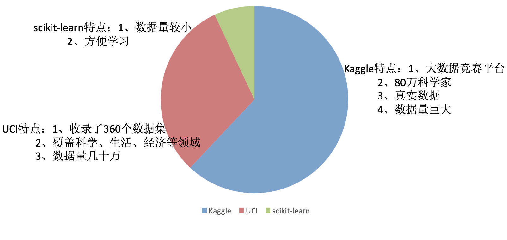
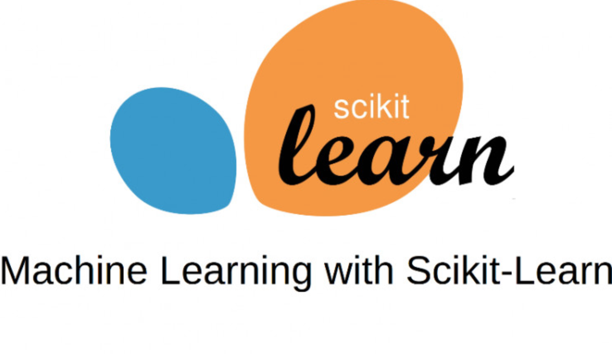
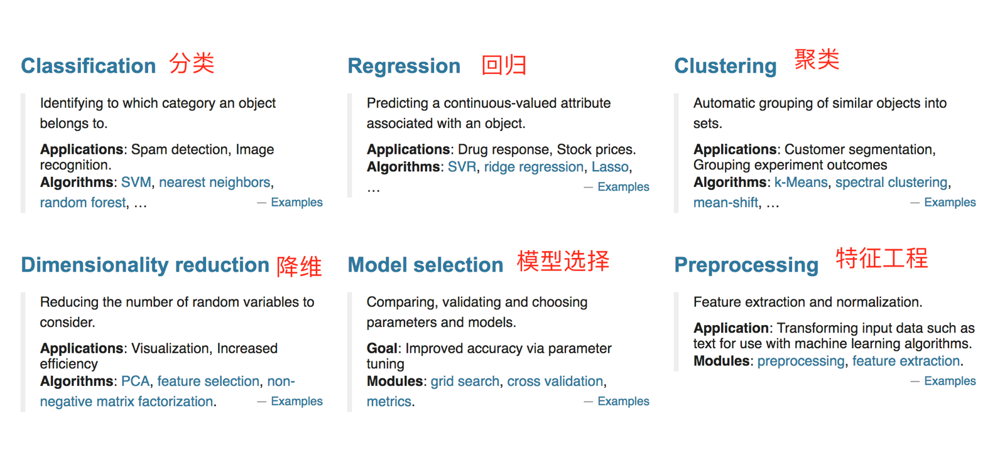

# 特征工程

## 学习目标

- 目标
  - 了解特征工程在机器学习当中的重要性
  - 知道特征工程的分类
  - 知道数据集的分为训练集和测试集
  - 会使用sklearn的数据集

## 为什么需要特征工程(Feature Engineering)

> 机器学习领域的大神Andrew Ng(吴恩达)老师说“Coming up with features is difficult, time-consuming, requires expert knowledge. “Applied machine learning” is basically feature engineering. ”
>
> 注：业界广泛流传：数据和特征决定了机器学习的上限，而模型和算法只是逼近这个上限而已。

## 什么是特征工程

特征工程是使用**专业背景知识和技巧处理数据**，**使得特征能在机器学习算法上发挥更好的作用的过程**。

- 意义：会直接影响机器学习的效果

## 特征工程的位置与数据处理的比较


- pandas:一个数据读取非常方便以及基本的处理格式的工具
- sklearn:对于特征的处理提供了强大的接口

**特征工程包含内容**

- 特征抽取
- 特征预处理
- 特征降维


## 机器学习数据集

### 可用数据集



Kaggle网址：https://www.kaggle.com/datasets

UCI数据集网址： http://archive.ics.uci.edu/ml/

scikit-learn网址：[http://scikit-learn.org/stable/datasets/index.html#datasets](http://scikit-learn.org/stable/datasets/index.html)

#### Scikit-learn工具介绍



- Python语言的机器学习工具
- Scikit-learn包括许多知名的机器学习算法的实现
- Scikit-learn文档完善，容易上手，丰富的API

#### 安装

```
!pip3 install Scikit-learn --user
```

安装好之后可以通过以下命令查看是否安装成功

```python
import sklearn
```

- 注：安装scikit-learn需要Numpy, Scipy等库

#### Scikit-learn包含的内容



- 分类、聚类、回归
- 特征工程
- 模型选择、调优

### sklearn数据集

#### scikit-learn数据集API介绍

- sklearn.datasets
  - 加载获取流行数据集
  - datasets.load_*()
    - 获取小规模数据集，数据包含在datasets里
  - datasets.fetch_*(data_home=None)
    - 获取大规模数据集，需要从网络上下载，函数的第一个参数是data_home，表示数据集下载的目录,默认是 ~/scikit_learn_data/

#### sklearn小数据集

- `sklearn.datasets.load_iris()`

  加载并返回鸢尾花数据集


- sklearn.datasets.load_boston()

  加载并返回波士顿房价数据集


#### sklearn大数据集

- `sklearn.datasets.fetch_20newsgroups(data_home=None,subset=‘train’)`
  - subset：'train'或者'test'，'all'，可选，选择要加载的数据集。
  - 训练集的“训练”，测试集的“测试”，两者的“全部”

#### sklearn数据集的使用

- 以鸢尾花数据集为例：

  

**sklearn数据集返回值介绍**

- `load`和`fetch`

  返回的数据类型datasets.base.Bunch(字典格式)

  - data：特征数据数组，是 [n_samples * n_features] 的二维 numpy.ndarray 数组
- target：标签数组，是 n_samples 的一维 numpy.ndarray 数组
  - DESCR：数据描述
  - feature_names：特征名,新闻数据，手写数字、回归数据集没有
  - target_names：标签名

```python
from sklearn.datasets import load_iris
# 获取鸢尾花数据集
iris = load_iris()
print("鸢尾花数据集的返回值：\n", iris)
# 返回值是一个继承自字典的Bench
print("鸢尾花的特征值:\n", iris["data"])
print("鸢尾花的目标值：\n", iris.target)
print("鸢尾花特征的名字：\n", iris.feature_names)
print("鸢尾花目标值的名字：\n", iris.target_names)
print("鸢尾花的描述：\n", iris.DESCR)
```

**思考：拿到的数据是否全部都用来训练一个模型？**

### 数据集的划分

机器学习一般的数据集会划分为两个部分：

- 训练数据：用于训练，**构建模型**
- 测试数据：在模型检验时使用，用于**评估模型是否有效**

划分比例：

- 训练集：70% 80% 75%
- 测试集：30% 20% 30%

**数据集划分api**

- `sklearn.model_selection.train_test_split(arrays, *options)`
- x 数据集的特征值
- y 数据集的标签值
  - test_size 测试集的大小，一般为float
- random_state 随机数种子,不同的种子会造成不同的随机采样结果。相同的种子采样结果相同。
  - return 测试集特征训练集特征值值，训练标签，测试标签(默认随机取)

```python
from sklearn.datasets import load_iris
from sklearn.model_selection import train_test_split


def datasets_demo():
    """
    对鸢尾花数据集的演示
    :return: None
    """
    # 1、获取鸢尾花数据集
    iris = load_iris()
    print("鸢尾花数据集的返回值：\n", iris)
    # 返回值是一个继承自字典的Bench
    print("鸢尾花的特征值:\n", iris["data"])
    print("鸢尾花的目标值：\n", iris.target)
    print("鸢尾花特征的名字：\n", iris.feature_names)
    print("鸢尾花目标值的名字：\n", iris.target_names)
    print("鸢尾花的描述：\n", iris.DESCR)

    # 2、对鸢尾花数据集进行分割
    # 训练集的特征值x_train 测试集的特征值x_test 训练集的目标值y_train 测试集的目标值y_test
    x_train, x_test, y_train, y_test = train_test_split(iris.data, iris.target, random_state=22)
    print("x_train:\n", x_train.shape)
    # 随机数种子
    x_train1, x_test1, y_train1, y_test1 = train_test_split(iris.data, iris.target, random_state=6)
    x_train2, x_test2, y_train2, y_test2 = train_test_split(iris.data, iris.target, random_state=6)
    print("如果随机数种子不一致：\n", x_train == x_train1)
    print("如果随机数种子一致：\n", x_train1 == x_train2)

    return None

datasets_demo()
```
