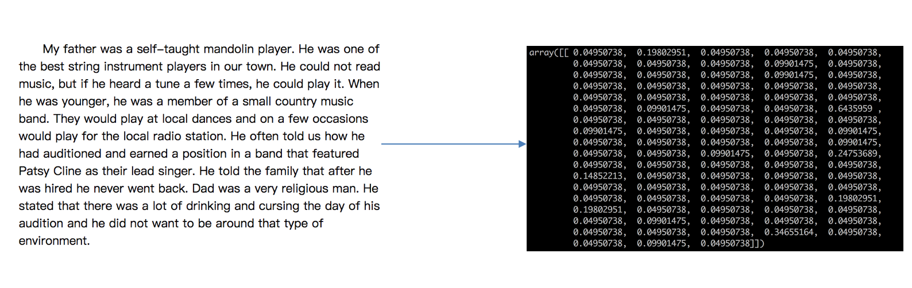

# 特征提取

## 什么是特征提取呢？




##  特征提取

### 将任意数据（如文本或图像）转换为可用于机器学习的数字特征

> 注：特征值化是为了计算机更好的去理解数据

- 字典特征提取(特征离散化)
- 文本特征提取
- 图像特征提取（深度学习将介绍）

**API**

`sklearn.feature_extraction`

## 字典特征提取

**作用：对字典数据进行特征值化**

- `sklearn.feature_extraction.DictVectorizer(sparse=True,…)`
  - `DictVectorizer.fit_transform(X)` `X`:字典或者包含字典的迭代器返回值：返回sparse矩阵
  - `DictVectorizer.inverse_transform(X)` `X:array`数组或者sparse矩阵 返回值:转换之前数据格式
  - `DictVectorizer.get_feature_names()` 返回类别名称

#### 练习：字典特征提取

我们对以下数据进行特征提取

```python
[{'city': '北京','temperature':100}
{'city': '上海','temperature':60}
{'city': '深圳','temperature':30}]
```


**流程分析**

- 实例化类`DictVectorizer`

- 调用`fit_transform`方法输入数据并转换（注意返回格式）

```python
from sklearn.feature_extraction import DictVectorizer

def dict_demo():
    """
    对字典类型的数据进行特征抽取
    :return: None
    """
    data = [{'city': '北京','temperature':100}, {'city': '上海','temperature':60}, {'city': '深圳','temperature':30}]
    # 1、实例化一个转换器类
    transfer = DictVectorizer(sparse=False)
    # 2、调用fit_transform
    data = transfer.fit_transform(data)
    print("返回的结果:\n", data)
    # 打印特征名字
    print("特征名字：\n", transfer.get_feature_names())

    return None
dict_demo  
```

注意观察没有加上sparse=False参数的结果

这个结果并不是我们想要看到的，所以加上参数，得到想要的结果：

之前在学习pandas中的离散化的时候，也实现了类似的效果。

我们把这个处理数据的技巧叫做”one-hot“编码：


转化为：


### 总结

**对于特征当中存在类别信息的我们都会做one-hot编码处理**

## 文本特征提取

**作用：对文本数据进行特征值化**

- `sklearn.feature_extraction.text.CountVectorizer(stop_words=[])`
  - 返回词频矩阵

- `CountVectorizer.fit_transform(X)` X:文本或者包含文本字符串的可迭代对象 返回值：返回sparse矩阵
- `CountVectorizer.inverse_transform(X)` X:array数组或者sparse矩阵 返回值:转换之前数据格
- `CountVectorizer.get_feature_names()` 返回值:单词列表

- `sklearn.feature_extraction.text.TfidfVectorizer`

#### 练习：文本特征提取

我们对以下数据进行特征提取

`["life is short,i like python","life is too long,i dislike python"]`


**流程分析**

- 实例化类`CountVectorizer`

- 调用`fit_transform`方法输入数据并转换 （注意返回格式，利用`toarray()`进行sparse矩阵转换array数组）

```python
from sklearn.feature_extraction.text import CountVectorizer

def text_count_demo(input_string):
    """
    对文本进行特征抽取，countvetorizer
    :return: None
    """
    data = ["life is short,i like like python", "life is too long,i dislike python"]
    # 1、实例化一个转换器类
    # transfer = CountVectorizer(sparse=False)
    transfer = CountVectorizer()
    # 2、调用fit_transform
    data = transfer.fit_transform(data)
    print("文本特征抽取的结果：\n", data.toarray())
    print("返回特征名字：\n", transfer.get_feature_names())

    return None
text_count_demo()
```

## 中文分词

### 如果我们将数据替换成中文？

`"人生苦短，我喜欢Python" "生活太长久，我不喜欢Python"`

那么最终得到的结果是


为什么会得到这样的结果呢，**仔细分析之后会发现英文默认是以空格分开的。其实就达到了一个分词的效果**，所以我们要对中文进行分词处理

### jieba分词处理

- `jieba.cut()`
  - 返回词语组成的生成器

需要安装下jieba库

```python
!pip install jieba --user
```

#### 练习：jieba分词处理

对以下三句话进行特征值化


    今天很残酷，明天更残酷，后天很美好，
    但绝对大部分是死在明天晚上，所以每个人不要放弃今天。
    
    我们看到的从很远星系来的光是在几百万年之前发出的，
    这样当我们看到宇宙时，我们是在看它的过去。
    
    如果只用一种方式了解某样事物，你就不会真正了解它。
    了解事物真正含义的秘密取决于如何将其与我们所了解的事物相联系。


- 分析
  - 准备句子，利用jieba.cut进行分词
  - 实例化CountVectorizer
  - 将分词结果变成字符串当作fit_transform的输入值


```python
from sklearn.feature_extraction.text import CountVectorizer
import jieba

def cut_word(text):
    """
    对中文进行分词
    "我爱北京天安门"————>"我 爱 北京 天安门"
    :param text:
    :return: text
    """
    # 用结巴对中文字符串进行分词
    text = " ".join(list(jieba.cut(text)))

    return text

def text_chinese_count_demo2():
    """
    对中文进行特征抽取
    :return: None
    """
    data = ["一种还是一种今天很残酷，明天更残酷，后天很美好，但绝对大部分是死在明天晚上，所以每个人不要放弃今天。",
            "我们看到的从很远星系来的光是在几百万年之前发出的，这样当我们看到宇宙时，我们是在看它的过去。",
            "如果只用一种方式了解某样事物，你就不会真正了解它。了解事物真正含义的秘密取决于如何将其与我们所了解的事物相联系。"]
    # 将原始数据转换成分好词的形式
    text_list = []
    for sent in data:
        text_list.append(cut_word(sent))
    print(text_list)

    # 1、实例化一个转换器类
    # transfer = CountVectorizer(sparse=False)
    transfer = CountVectorizer()
    # 2、调用fit_transform
    data = transfer.fit_transform(text_list)
    print("文本特征抽取的结果：\n", data.toarray())
    print("返回特征名字：\n", transfer.get_feature_names())

    return None
```

**但如果把这样的词语特征用于分类，会出现什么问题？**

请看问题：


**该如何处理某个词或短语在多篇文章中出现的次数高这种情况**

### Tf-idf文本特征提取

- TF-IDF的主要思想是：如果**某个词或短语在一篇文章中出现的概率高，并且在其他文章中很少出现**，则认为此词或者短语具有很好的类别区分能力，适合用来分类。
- **TF-IDF作用：用以评估一字词对于一个文件集或一个语料库中的其中一份文件的重要程度。**

#### 公式

- 词频（term frequency，tf）指的是某一个给定的词语在该文件中出现的频率
- 逆向文档频率（inverse document frequency，idf）是一个词语普遍重要性的度量。某一特定词语的idf，可以**由总文件数目除以包含该词语之文件的数目，再将得到的商取以10为底的对数得到**


最终得出结果可以理解为重要程度。


    注：假如一篇文件的总词语数是100个，而词语"非常"出现了5次，那么"非常"一词在该文件中的词频就是5/100=0.05。而计算文件频率（IDF）的方法是以文件集的文件总数，除以出现"非常"一词的文件数。所以，如果"非常"一词在1,000份文件出现过，而文件总数是10,000,000份的话，其逆向文件频率就是lg（10,000,000 / 1,0000）=3。最后"非常"对于这篇文档的tf-idf的分数为0.05 * 3=0.15


#### 练习：Tf-idf文本特征提取

```python
from sklearn.feature_extraction.text import TfidfVectorizer
import jieba

def cut_word(text):
    """
    对中文进行分词
    "我爱北京天安门"————>"我 爱 北京 天安门"
    :param text:
    :return: text
    """
    # 用结巴对中文字符串进行分词
    text = " ".join(list(jieba.cut(text)))

    return text

def text_chinese_tfidf_demo():
    """
    对中文进行特征抽取
    :return: None
    """
    data = ["一种还是一种今天很残酷，明天更残酷，后天很美好，但绝对大部分是死在明天晚上，所以每个人不要放弃今天。",
            "我们看到的从很远星系来的光是在几百万年之前发出的，这样当我们看到宇宙时，我们是在看它的过去。",
            "如果只用一种方式了解某样事物，你就不会真正了解它。了解事物真正含义的秘密取决于如何将其与我们所了解的事物相联系。"]
    # 将原始数据转换成分好词的形式
    text_list = []
    for sent in data:
        text_list.append(cut_word(sent))
    print(text_list)

    # 1、实例化一个转换器类
    # transfer = CountVectorizer(sparse=False)
    transfer = TfidfVectorizer(stop_words=['一种', '不会', '不要'])
    # 2、调用fit_transform
    data = transfer.fit_transform(text_list)
    print("文本特征抽取的结果：\n", data.toarray())
    print("返回特征名字：\n", transfer.get_feature_names())

    return None
```

Tf-idf的重要性：**分类机器学习算法进行文章分类中前期数据处理方式**

## 作业：

- 应用DictVectorizer实现对类别特征进行数值化、离散化
- 应用CountVectorizer实现对文本特征进行数值化
- 应用TfidfVectorizer实现对文本特征进行数值化
- 说出两种文本特征提取的方式区别