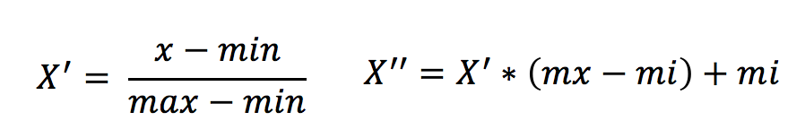
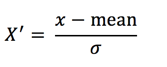

# 特征预处理

## 什么是特征预处理？


## 2.4.1 什么是特征预处理


    # scikit-learn的解释
    provides several common utility functions and transformer classes to change raw feature vectors into a representation that is more suitable for the downstream estimators.


翻译过来：通过**一些转换函数**将特征数据**转换成更加适合算法模型**的特征数据过程

可以通过上面那张图来理解

### 1 包含内容

- 数值型数据的无量纲化：
  - 归一化
  - 标准化

### 2 特征预处理API

```python
sklearn.preprocessing
```

**为什么我们要进行归一化/标准化？**

- 特征的**单位或者大小相差较大，或者某特征的方差相比其他的特征要大出几个数量级**，**容易影响（支配）目标结果**，使得一些算法无法学习到其它的特征

### 约会对象数据


我们需要用到一些方法进行**无量纲化**，**使不同规格的数据转换到同一规格**

## 归一化

### 定义

通过对原始数据进行变换把数据映射到(默认为[0,1])之间

### 公式



> 作用于每一列，max为一列的最大值，min为一列的最小值,那么X’’为最终结果，mx，mi分别为指定区间值默认mx为1,mi为0

那么怎么理解这个过程呢？我们通过一个例子


**API**

- `sklearn.preprocessing.MinMaxScaler (feature_range=(0,1)… )`
- `MinMaxScalar.fit_transform(X)`
  - X:numpy array格式的数据[n_samples,n_features]
- 返回值：转换后的形状相同的array

#### 练习：数值变换

我们对以下数据进行运算，在dating.txt中。保存的就是之前的约会对象数据

```
!head /share/datasets/dating.txt
```

1、实例化`MinMaxScalar`

2、通过`fit_transform()`转换

```python
import pandas as pd
from sklearn.preprocessing import MinMaxScaler

def minmax_demo():
    """
    归一化演示
    :return: None
    """
    data = pd.read_csv("dating.txt")
    print(data)
    # 1、实例化一个转换器类
    transfer = MinMaxScaler(feature_range=(2, 3))
    # 2、调用fit_transform
    data = transfer.fit_transform(data[['milage','Liters','Consumtime']])
    print("最小值最大值归一化处理的结果：\n", data)

    return None
minmax_demo()
```

**问题：如果数据中异常点较多，会有什么影响？**


### 归一化总结

注意最大值最小值是变化的，另外，最大值与最小值非常容易受异常点影响，**所以这种方法鲁棒性较差，只适合传统精确小数据场景。**

怎么办？

## 标准化

### 定义

通过对原始数据进行变换把数据变换到均值为0,标准差为1范围内

### 公式



> 作用于每一列，mean为平均值，σ为标准差

所以回到刚才异常点的地方，我们再来看看标准化


- 对于归一化来说：如果出现异常点，影响了最大值和最小值，那么结果显然会发生改变
- 对于标准化来说：如果出现异常点，由于具有一定数据量，少量的异常点对于平均值的影响并不大，从而方差改变较小。

**API**

- `sklearn.preprocessing.StandardScaler( )`
  - 处理之后每列来说所有数据都聚集在均值0附近标准差差为1
  - `StandardScaler.fit_transform(X)`
    - X:numpy array格式的数据[n_samples,n_features]
  - 返回值：转换后的形状相同的array

#### 练习：数据归一化

```python
#实例化StandardScaler
#通过fit_transform()转换

import pandas as pd
from sklearn.preprocessing import StandardScaler

def stand_demo():
    """
    标准化演示
    :return: None
    """
    data = pd.read_csv("/share/datasets/dating.txt")
    print(data)
    # 1、实例化一个转换器类
    transfer = StandardScaler()
    # 2、调用fit_transform
    data = transfer.fit_transform(data[['milage','Liters','Consumtime']])
    print("标准化的结果:\n", data)
    print("每一列特征的平均值：\n", transfer.mean_)
    print("每一列特征的方差：\n", transfer.var_)

    return None

stand_demo()
```

### 标准化总结

在已有样本足够多的情况下比较稳定，适合现代嘈杂大数据场景。

## 作业：

- 请问数值型数据、类别型数据特点有哪些？
- 请在下方代码框中应用`MinMaxScaler()`实现对特征数据进行归一化
```Python
#
```
- 请在下方代码框中应用`StandardScaler`实现对特征数据进行标准化
```Python
#
```