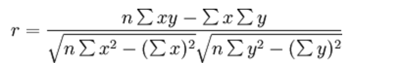
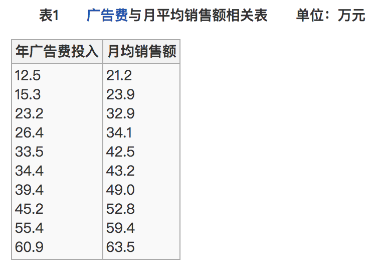
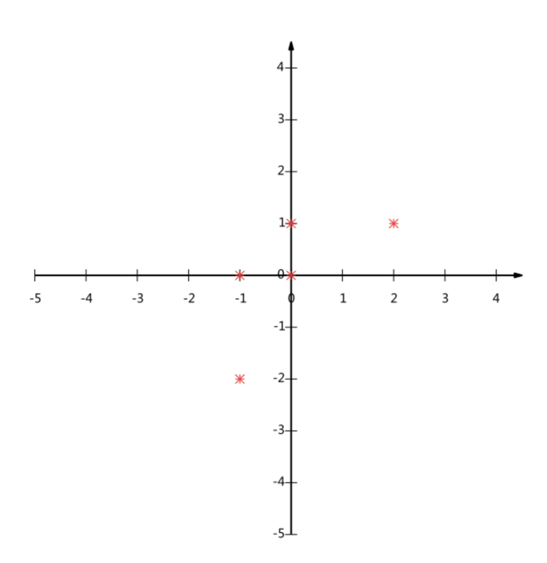
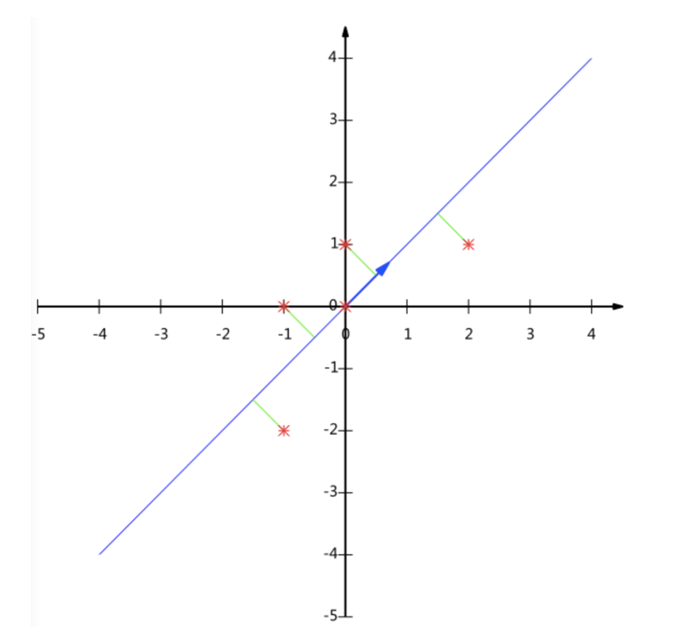
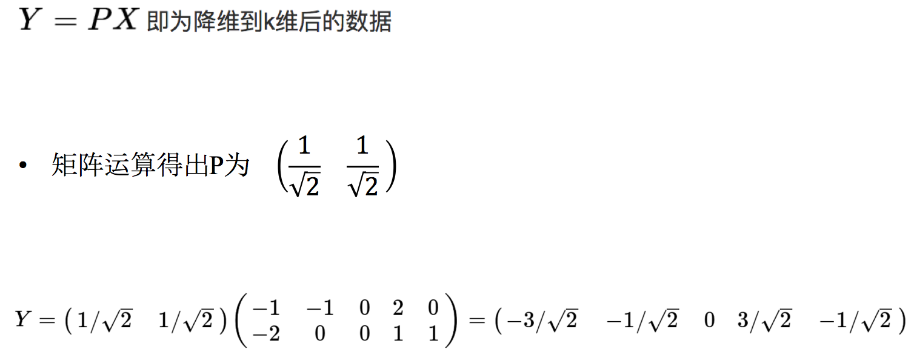
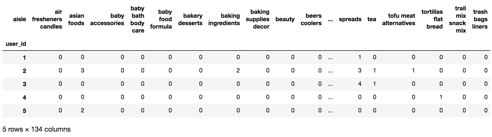
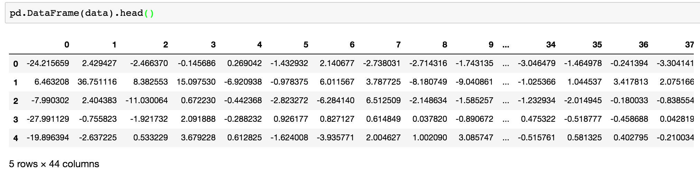

# 特征降维

## 降维

**降维**是指在某些限定条件下，**降低随机变量(特征)个数**，得到**一组“不相关”主变量**的过程

- 降低随机变量的个数


- 相关特征(correlated feature)
  - 相对湿度与降雨量之间的相关
  - 等等

正是因为在进行训练的时候，我们都是使用特征进行学习。如果特征本身存在问题或者特征之间相关性较强，对于算法学习预测会影响较大。

## 降维的两种方式

- **特征选择**
- **主成分分析（可以理解一种特征提取的方式）**

## 什么是特征选择

### 定义

数据中包含**冗余或无关变量（或称特征、属性、指标等）**，旨在从**原有特征中找出主要特征**。


### 方法

- Filter(过滤式)：主要探究特征本身特点、特征与特征和目标值之间关联
  - **方差选择法：低方差特征过滤**
  - **相关系数**
- Embedded (嵌入式)：算法自动选择特征（特征与目标值之间的关联）
  - **决策树:信息熵、信息增益**
  - **正则化：L1、L2**
  - **深度学习：卷积等**

> 对于Embedded方式，只能在讲解算法的时候在进行介绍，更好的去理解

### 模块

`
sklearn.feature_selection
`

### 过滤式：低方差特征过滤

删除低方差的一些特征，前面讲过方差的意义。再结合方差的大小来考虑这个方式的角度。

- 特征方差小：某个特征大多样本的值比较相近
- 特征方差大：某个特征很多样本的值都有差别

**API** 

- `sklearn.feature_selection.VarianceThreshold(threshold = 0.0)`
  - 删除所有低方差特征
  - `Variance.fit_transform(X)`
    - X: numpy array格式的数据[n_samples,n_features]
    - 返回值：训练集差异低于threshold的特征将被删除。默认值是保留所有非零方差特征，即删除所有样本中具有相同值的特征。

#### 练习：股票指标特征之间筛选

我们对**某些股票的指标特征之间进行一个筛选**，除去'index,'date','return'列不考虑**（这些类型不匹配，也不是所需要指标）**

一共这些特征

```Python
!cat /share/datasets/factor_returns.csv
```

- 分析

1、初始化`VarianceThreshold`,指定阀值方差

2、调用`fit_transform`

```python
def variance_demo():
    """
    删除低方差特征——特征选择
    :return: None
    """
    data = pd.read_csv("/share/datasets/factor_returns.csv")
    print(data)
    # 1、实例化一个转换器类
    transfer = VarianceThreshold(threshold=1)
    # 2、调用fit_transform
    data = transfer.fit_transform(data.iloc[:, 1:10])
    print("删除低方差特征的结果：\n", data)
    print("形状：\n", data.shape)

    return None

#调用
variance_demo()
```

#### 相关系数

- 皮尔逊相关系数(Pearson Correlation Coefficient)
  - 反映变量之间相关关系密切程度的统计指标

##### 公式计算案例(了解，不用记忆)

- 公式



- 比如说我们计算年广告费投入与月均销售额



那么之间的相关系数怎么计算


最终计算：


= 0.9942

**所以我们最终得出结论是广告投入费与月平均销售额之间有高度的正相关关系。** 　

**特点：相关系数的值介于–1与+1之间，即–1≤ r ≤+1**。其性质如下：

- **当r>0时，表示两变量正相关，r<0时，两变量为负相关**
- 当|r|=1时，表示两变量为完全相关，当r=0时，表示两变量间无相关关系
- **当0<|r|<1时，表示两变量存在一定程度的相关。且|r|越接近1，两变量间线性关系越密切；|r|越接近于0，表示两变量的线性相关越弱**
- **一般可按三级划分：|r|<0.4为低度相关；0.4≤|r|<0.7为显著性相关；0.7≤|r|<1为高度线性相关**

> 这个符号：|r|为r的绝对值， |-5| = 5

** API **

- from scipy.stats import pearsonr
  - x : (N,) array_like
  - y : (N,) array_like Returns: (Pearson’s correlation coefficient, p-value)

#### 练习：股票的财务指标相关性计算

我们刚才的股票的这些指标进行相关性计算， 假设我们以

`factor = ['pe_ratio','pb_ratio','market_cap','return_on_asset_net_profit','du_return_on_equity','ev','earnings_per_share','revenue','total_expense']`

这些特征当中的两两进行计算，得出相关性高的一些特征


- 分析
  - 两两特征之间进行相关性计算

```python
import pandas as pd
from scipy.stats import pearsonr

def pearsonr_demo(data):
    """
    相关系数计算
    :return: None
    """
    

    factor = ['pe_ratio', 'pb_ratio', 'market_cap', 'return_on_asset_net_profit', 'du_return_on_equity', 'ev',
              'earnings_per_share', 'revenue', 'total_expense']

    for i in range(len(factor)):
        for j in range(i, len(factor) - 1):
            print(
                "指标%s与指标%s之间的相关性大小为%f" % (factor[i], factor[j + 1], pearsonr(data[factor[i]], data[factor[j + 1]])[0]))

    return None


data = pd.read_csv("/share/datasets/factor_returns.csv")

#验证函数对象
pearsonr_demo()
```

从中我们得出

- 指标revenue与指标total_expense之间的相关性大小为0.995845
- 指标return_on_asset_net_profit与指标du_return_on_equity之间的相关性大小为0.818697

我们也可以通过画图来观察结果

```python
%matplotlib inline
import matplotlib.pyplot as plt
plt.figure(figsize=(20, 8), dpi=100)

data = pd.read_csv("/share/datasets/factor_returns.csv")
plt.scatter(data['revenue'], data['total_expense'])
plt.show()
```

**这两对指标之间的相关性较大，可以做之后的处理，比如合成这两个指标。**


## 什么是主成分分析(PCA)

- 定义：**高维数据转化为低维数据的过程**，在此过程中**可能会舍弃原有数据、创造新的变量**
- 作用：**是数据维数压缩，尽可能降低原数据的维数（复杂度），损失少量信息。**
- 应用：回归分析或者聚类分析当中

> 对于信息一词，在决策树中会进行介绍

那么更好的理解这个过程呢？我们来看一张图


#### 练习：计算案例理解(了解，无需记忆)

假设对于给定5个点，数据如下
```
(-1,-2)
(-1, 0)
( 0, 0)
( 2, 1)
( 0, 1)
```


要求：将这个二维的数据简化成一维？ 并且损失少量的信息



这个过程如何计算的呢？**找到一个合适的直线，通过一个矩阵运算得出主成分分析的结果（不需要理解）**



**API**

- `sklearn.decomposition.PCA(n_components=None)`
  - 将数据分解为较低维数空间
  - n_components:
    - **小数：表示保留百分之多少的信息**
    - **整数：减少到多少特征**
  - `PCA.fit_transform(X)` X:numpy array格式的数据[n_samples,n_features]
  - 返回值：转换后指定维度的array


```python
from sklearn.decomposition import PCA

def pca_demo():
    """
    对数据进行PCA降维
    :return: None
    """
    data = [[2,8,4,5], [6,3,0,8], [5,4,9,1]]

    # 1、实例化PCA, 小数——保留多少信息
    transfer = PCA(n_components=0.9)
    # 2、调用fit_transform
    data1 = transfer.fit_transform(data)

    print("保留90%的信息，降维结果为：\n", data1)

    # 1、实例化PCA, 整数——指定降维到的维数
    transfer2 = PCA(n_components=3)
    # 2、调用fit_transform
    data2 = transfer2.fit_transform(data)
    print("降维到3维的结果：\n", data2)

    return None
pca_demo()
```

#### 练习：探究用户对物品类别的喜好细分降维


数据如下：

- order_products__prior.csv：订单与商品信息
  - 字段：**order_id**, **product_id**, add_to_cart_order, reordered
- products.csv：商品信息
  - 字段：**product_id**, product_name, **aisle_id**, department_id
- orders.csv：用户的订单信息
  - 字段：**order_id**,**user_id**,eval_set,order_number,….
- aisles.csv：商品所属具体物品类别
  - 字段： **aisle_id**, **aisle**

**需求**





** 分析**

- 合并表，使得**user_id**与**aisle**在一张表当中
- 进行交叉表变换
- 进行降维

**完整代码**

```python
import pandas as pd
from sklearn.decomposition import PCA

# 1、获取数据集
# ·商品信息- products.csv：
# Fields：product_id, product_name, aisle_id, department_id
# ·订单与商品信息- order_products__prior.csv：
# Fields：order_id, product_id, add_to_cart_order, reordered 
# ·用户的订单信息- orders.csv：
# Fields：order_id, user_id,eval_set, order_number,order_dow, order_hour_of_day, days_since_prior_order 
# ·商品所属具体物品类别- aisles.csv：
# Fields：aisle_id, aisle     
products = pd.read_csv("./instacart/products.csv")
order_products = pd.read_csv("./instacart/order_products__prior.csv")
orders = pd.read_csv("./instacart/orders.csv")
aisles = pd.read_csv("./instacart/aisles.csv")

# 2、合并表，将user_id和aisle放在一张表上
# 1）合并orders和order_products on=order_id tab1:order_id, product_id, user_id
tab1 = pd.merge(orders, order_products, on=["order_id", "order_id"])
# 2）合并tab1和products on=product_id tab2:aisle_id
tab2 = pd.merge(tab1, products, on=["product_id", "product_id"])
# 3）合并tab2和aisles on=aisle_id tab3:user_id, aisle
tab3 = pd.merge(tab2, aisles, on=["aisle_id", "aisle_id"])

# 3、交叉表处理，把user_id和aisle进行分组
table = pd.crosstab(tab3["user_id"], tab3["aisle"])

# 4、主成分分析的方法进行降维
# 1）实例化一个转换器类PCA
transfer = PCA(n_components=0.95)
# 2）fit_transform
data = transfer.fit_transform(table)

data.shape
```

## 作业

- 特征选择的嵌入式、过滤式以及包裹氏三种方式？

- 应用`VarianceThreshold()`实现删除低方差特征
```Python
#
```
- 相关系数的特点和计算？

- 应用相关性系数实现特征选择？

- 应用PCA实现特征的降维？
```Python
#
```