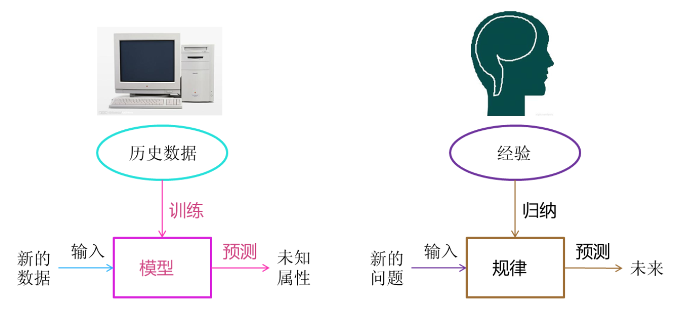
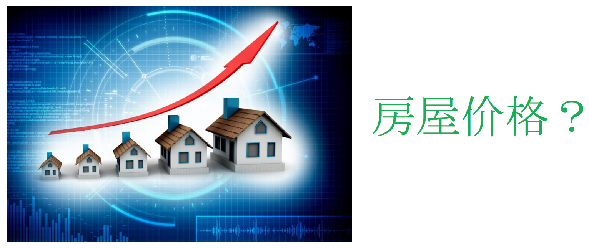
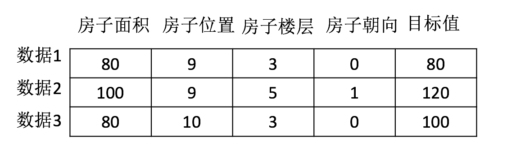
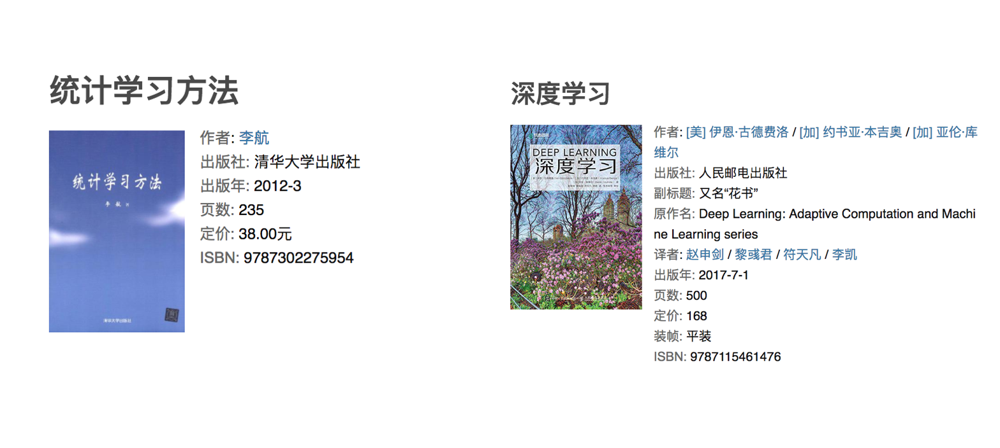

# 人工智能概述

## 什么是机器学习

### 定义

机器学习是从**数据**中**自动分析获得模型**，并利用**模型**对未知数据进行预测。

### 解释

- 我们人从大量的日常经验中归纳规律，当面临新的问题的时候，就可以利用以往总结的规律去分析现实状况，采取最佳策略。

- 从数据（大量的猫和狗的图片）中自动分析获得模型（辨别猫和狗的规律），从而使机器拥有识别猫和狗的能力。

- 从数据（房屋的各种信息）中自动分析获得模型（判断房屋价格的规律），从而使机器拥有预测房屋价格的能力。

**从历史数据当中获得规律？这些历史数据是怎么的格式？**

### 数据集构成

- 结构：特征值+目标值

**注意：**

- 对于每一行数据我们可以称之为**样本**。
- 有些数据集可以没有目标值：

## 机器学习与人工智能、深度学习

- 机器学习和人工智能，深度学习的关系

  - 机器学习是人工智能的一个实现途径
  - 深度学习是机器学习的一个方法发展而来

- 达特茅斯会议-人工智能的起点

  1956年8月，在美国汉诺斯小镇宁静的达特茅斯学院中，

  约翰·麦卡锡（John McCarthy）

  马文·闵斯基（Marvin Minsky，人工智能与认知学专家）

  克劳德·香农（Claude Shannon，信息论的创始人）

  艾伦·纽厄尔（Allen Newell，计算机科学家）

  赫伯特·西蒙（Herbert Simon，诺贝尔经济学奖得主）等科学家正聚在一起，讨论着一个完全不食人间烟火的主题：

  **用机器来模仿人类学习以及其他方面的智能。**

  会议足足开了两个月的时间，虽然大家没有达成普遍的共识，但是却为会议讨论的内容起了一个名字：

  [人工智能](https://baike.baidu.com/item/人工智能)

  因此，1956年也就成为了人工智能元年。

## 机器学习、深度学习能做些什么

**机器学习的应用场景非常多，可以说渗透到了各个行业领域当中。医疗、航空、教育、物流、电商等等领域的各种场景。**

- 用在挖掘、预测领域：

  - 应用场景：店铺销量预测、量化投资、广告推荐、企业客户分类、SQL语句安全检测分类…

- 用在图像领域：

  - 应用场景：街道交通标志检测、人脸识别等等

    

- 用在自然语言处理领域：

  - 应用场景：文本分类、情感分析、自动聊天、文本检测等等

    

**当前重要的是掌握一些机器学习算法等技巧，从某个业务领域切入解决问题。**

## 机器学习算法分类

### 分析前面的例子：

- 特征值：猫/狗的图片；目标值：猫/狗-类别
  - 分类问题

- 特征值：房屋的各个属性信息；目标值：房屋价格-连续型数据
  - 回归问题

- 特征值：人物的各个属性信息；目标值：无
  - 无监督学习

###  总结

## 机器学习算法分类

- 监督学习(supervised learning)（预测）

  - 定义：输入数据是由输入特征值和目标值所组成。函数的输出可以是一个连续的值(称为回归），或是输出是有限个离散值（称作分类）。
  - **分类 k-近邻算法、贝叶斯分类、决策树与随机森林、逻辑回归、神经网络**
  - **回归：线性回归、岭回归**

- 无监督学习(unsupervised learning)

  - 定义：输入数据是由输入特征值所组成。
  - 聚类 k-means

## 机器学习开发流程

- 流程图：

## 学习框架和资料介绍

需明确几点问题：

（1）**算法**是核心，**数据**与**计算**是基础

（2）找准定位

大部分复杂模型的算法设计都是算法工程师在做，而我们

- 分析很多的数据
- 分析具体的业务
- 应用常见的算法
- 特征工程、调参数、优化

- 我们应该怎么做？
- 学会分析问题，使用机器学习算法的目的，想要算法完成何种任务
- 掌握算法基本思想，学会对问题用相应的算法解决
- 学会利用库或者框架解决问题

**当前重要的是掌握一些机器学习算法等技巧，从某个业务领域切入解决问题。**

### 机器学习库与框架

###  书籍资料

###  提深内功（但不是必须）

## 作业

  - 说明机器学习算法监督学习与无监督学习的区别
  - 说明监督学习中的分类、回归特点

- 说一下它们具体问题类别：

	- 1、预测明天的气温是多少度？

	- 2、预测明天是阴、晴还是雨？

	- 3、人脸年龄预测？

	- 4、人脸识别？