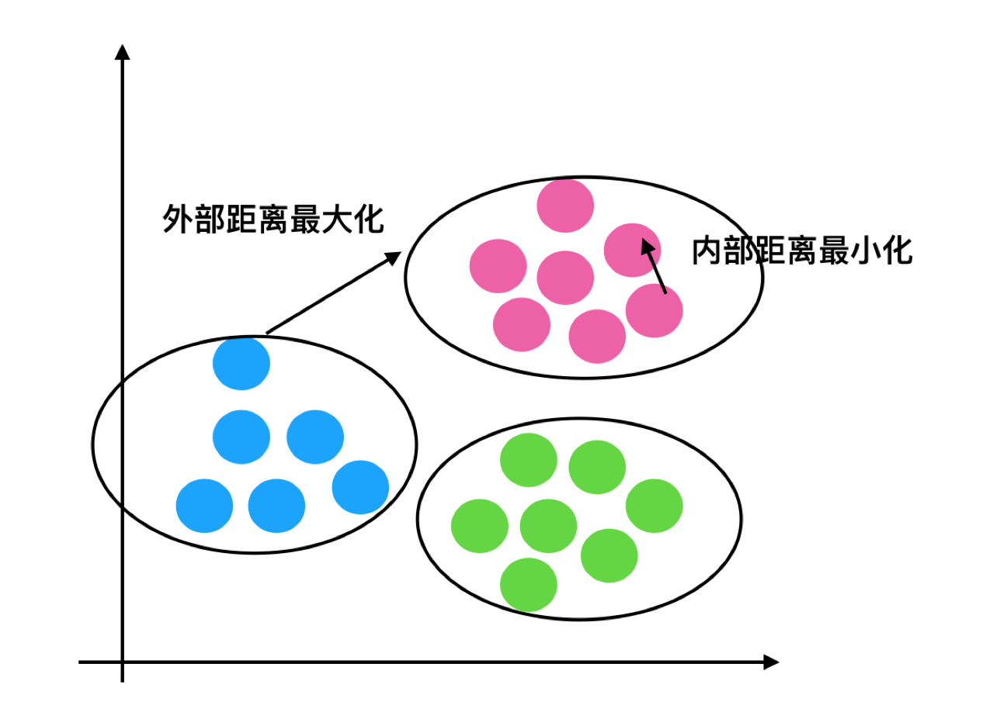

# 无监督学习-K-means算法

## 什么是无监督学习

**回忆非监督学习的特点？**


- 一家广告平台需要根据相似的人口学特征和购买习惯将美国人口分成不同的小组，以便广告客户可以通过有关联的广告接触到他们的目标客户。
- Airbnb 需要将自己的房屋清单分组成不同的社区，以便用户能更轻松地查阅这些清单。
- 一个数据科学团队需要降低一个大型数据集的维度的数量，以便简化建模和降低文件大小。

我们可以怎样最有用地对其进行归纳和分组？我们可以怎样以一种压缩格式有效地表征数据？**这都是无监督学习的目标，之所以称之为无监督，是因为这是从无标签的数据开始学习的。**

## 无监督学习包含算法

- 聚类
  - K-means(K均值聚类)
- 降维
  - PCA

##  K-means原理

我们先来看一下一个K-means的聚类效果图


###  K-means聚类步骤

- 1、随机设置K个特征空间内的点作为初始的聚类中心
- 2、对于其他每个点计算到K个中心的距离，未知的点选择最近的一个聚类中心点作为标记类别
- 3、接着对着标记的聚类中心之后，重新计算出每个聚类的新中心点（平均值）
- 4、如果计算得出的新中心点与原中心点一样，那么结束，否则重新进行第二步过程

我们以一张图来解释效果


** K-means API**

- `sklearn.cluster.KMeans(n_clusters=8,init=‘k-means++’)`
  - k-means聚类
  - n_clusters:开始的聚类中心数量
  - init:初始化方法，默认为'k-means ++’
  - labels_:默认标记的类型，可以和真实值比较（不是值比较）

#### 练习：k-means

```python
%matplotlib inline
import numpy as np
import matplotlib.pyplot as plt
#matplotlib inline
from sklearn import metrics
from sklearn.datasets.samples_generator import make_blobs
# X为样本特征，Y为样本簇类别， 共1000个样本，
# 每个样本4个特征，共4个簇，簇中心在[-1,-1], [0,0],[1,1],[2,2]， 簇方差分别为[0.4, 0.2, 0.2]
X, y = make_blobs(n_samples=1000, n_features=2,
centers=[[-1,-1], [0,0], [1,1], [2,2]],
cluster_std=[0.4, 0.2, 0.2, 0.2],
random_state =9)
plt.scatter(X[:, 0], X[:, 1], marker='o')
plt.show()
```
#### 练习：用Calinski-Harabasz Index评估二分类的聚类分数
```python
%matplotlib inline
from sklearn.cluster import KMeans
y_pred = KMeans(n_clusters=2, random_state=9).fit_predict(X)
plt.scatter(X[:, 0], X[:, 1], c=y_pred)
plt.show()
print(metrics.calinski_harabaz_score(X, y_pred))
#Calinski-Harabasz Index对应的方法是metrics.calinski_harabaz_score
```

#### 练习：用Calinski-Harabasz Index评估三分类的聚类分数
```python
%matplotlib inline
from sklearn.cluster import KMeans
y_pred = KMeans(n_clusters=3, random_state=9).fit_predict(X)
plt.scatter(X[:, 0], X[:, 1], c=y_pred)
plt.show()
print(metrics.calinski_harabaz_score(X, y_pred))
```
#### 练习：用Calinski-Harabasz Index评估四分类的聚类分数
```python
%matplotlib inline
from sklearn.cluster import KMeans
y_pred = KMeans(n_clusters=4, random_state=9).fit_predict(X)
plt.scatter(X[:, 0], X[:, 1], c=y_pred)
plt.show()
print(metrics.calinski_harabaz_score(X, y_pred))

```

#### 练习：运用Kmeans算法实现图像压缩

```python
%matplotlib inline
import numpy as np
import matplotlib.pyplot as plt
from sklearn.cluster import KMeans
from sklearn.metrics import pairwise_distances_argmin
from sklearn.datasets import load_sample_image
from sklearn.utils import shuffle
from time import time
n_colors = 64
# 加载sklearn中样图
china = load_sample_image("china.jpg")
china = np.array(china, dtype=np.float64) / 255

# 加载图像并转换成二维数字阵列
w, h, d = original_shape = tuple(china.shape)
assert d == 3
image_array = np.reshape(china, (w * h, d))
print("一个小样本数据拟合模型")
t0 = time()
image_array_sample = shuffle(image_array, random_state=0)[:1000]
kmeans = KMeans(n_clusters=n_colors,
random_state=0).fit(image_array_sample)
print("完成时间 %0.3fs." % (time() - t0))
# Get labels for all points
print("预测全图像上的颜色指数（k-均值）")
t0 = time()
labels = kmeans.predict(image_array)
print("完成时间 %0.3fs." % (time() - t0))

def recreate_image(codebook, labels, w, h):
    """从代码簿和标签中重新创建（压缩）图像"""
    d = codebook.shape[1]
    image = np.zeros((w, h, d))
    label_idx = 0
    for i in range(w):
        for j in range(h):
            image[i][j] = codebook[labels[label_idx]]
            label_idx += 1
    return image

# 与原始图像一起显示所有结果
plt.figure(1)
plt.clf()
ax = plt.axes([0, 0, 1, 1])
plt.axis('off')
plt.title('Original image (96,615 colors)')
plt.imshow(china)
plt.figure(2)
plt.clf()
ax = plt.axes([0, 0, 1, 1])
plt.axis('off')
plt.title('Quantized (64 colors, K-Means)')
plt.imshow(recreate_image(kmeans.cluster_centers_, labels, w,h))
plt.show()
```


分析**

- 1、降维之后的数据
- 2、k-means聚类
- 3、聚类结果显示


## Kmeans性能评估指标

### 轮廓系数


> 注：对于每个点i 为已聚类数据中的样本 ，b_i 为i 到其它族群的所有样本的距离最小值，a_i 为i 到本身簇的距离平均值。最终计算出所有的样本点的轮廓系数平均值

###  轮廓系数值分析



- 分析过程（我们以一个蓝1点为例）
  - 1、计算出蓝1离本身族群所有点的距离的平均值a_i
  - 2、蓝1到其它两个族群的距离计算出平均值红平均，绿平均，取最小的那个距离作为b_i
  - 根据公式：极端值考虑：如果b_i >>a_i: 那么公式结果趋近于1；如果a_i>>>b_i: 那么公式结果趋近于-1

### 结论

**如果b_i>>a_i:趋近于1效果越好， b_i<**

**API**

- `sklearn.metrics.silhouette_score(X, labels)`
- 计算所有样本的平均轮廓系数
- X：特征值
- labels：被聚类标记的目标值

### 用户聚类结果评估

```python
silhouette_score(cust, pre)
```

## K-means总结

- 特点分析：采用迭代式算法，直观易懂并且非常实用
- 缺点：容易收敛到局部最优解(多次聚类)

> 注意：聚类一般做在分类之前

## 作业

- 说明K-means算法原理
- 说明K-means的性能评估标准轮廓系数
- 说明K-means的优缺点
- 如何去评估聚类的效果呢？
- instacart用户聚类