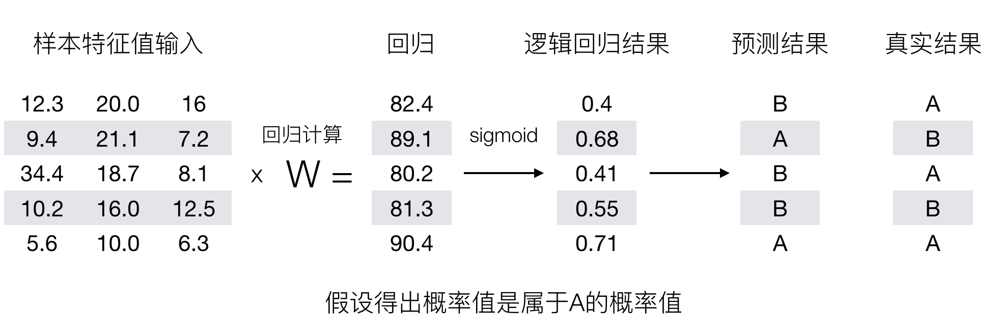

# 逻辑回归

逻辑回归（Logistic Regression）是机器学习中的一种分类模型，逻辑回归是一种分类算法，虽然名字中带有回归，但是它与回归之间有一定的联系。由于算法的简单和高效，在实际中应用非常广泛。

## 逻辑回归的应用场景

- 广告点击率
- 是否为垃圾邮件
- 是否患病
- 金融诈骗
- 虚假账号

看到上面的例子，我们可以发现其中的特点，那就是都属于两个类别之间的判断。逻辑回归就是解决二分类问题的利器

## 逻辑回归的原理

### 输入


逻辑回归的输入就是一个线性回归的结果。

### 激活函数

- `sigmoid`函数


- 分析
  - 回归的结果输入到sigmoid函数当中
  - 输出结果：[0, 1]区间中的一个概率值，默认为0.5为阈值

> 逻辑回归最终的分类是通过属于某个类别的概率值来判断是否属于某个类别，并且这个类别默认标记为1(正例),另外的一个类别会标记为0(反例)。（方便损失计算）

输出结果解释(重要)：假设有两个类别A，B，并且假设我们的概率值为属于A(1)这个类别的概率值。现在有一个样本的输入到逻辑回归输出结果0.6，那么这个概率值超过0.5，意味着我们训练或者预测的结果就是A(1)类别。那么反之，如果得出结果为0.3那么，训练或者预测结果就为B(0)类别。

所以接下来我们回忆之前的线性回归预测结果我们用均方误差衡量，那如果对于逻辑回归，我们预测的结果不对该怎么去衡量这个损失呢？我们来看这样一张图



那么如何去衡量逻辑回归的预测结果与真实结果的差异呢？

## 损失以及优化

###  损失

逻辑回归的损失，称之为**对数似然损失**，公式如下：

- 分开类别：


怎么理解单个的式子呢？这个要根据log的函数图像来理解


- 综合完整损失函数


> 看到这个式子，其实跟我们讲的信息熵类似。

接下来我们呢就带入上面那个例子来计算一遍，就能理解意义了。


> 我们已经知道，log(P), P值越大，结果越小，所以我们可以对着这个损失的式子去分析

### 优化

同样使用梯度下降优化算法，去减少损失函数的值。这样去更新逻辑回归前面对应算法的权重参数，**提升原本属于1类别的概率，降低原本是0类别的概率。**

**逻辑回归API**

- `sklearn.linear_model.LogisticRegression(solver='liblinear', penalty=‘l2’, C = 1.0)`
  - solver:优化求解方式（默认开源的liblinear库实现，内部使用了坐标轴下降法来迭代优化损失函数）
    - sag：根据数据集自动选择，随机平均梯度下降
  - penalty：正则化的种类
  - C：正则化力度

**默认将类别数量少的当做正例**

#### 练习：癌症分类预测-良／恶性乳腺癌肿瘤预测
LogisticRegression方法相当于 SGDClassifier(loss="log", penalty=" "),SGDClassifier实现了一个普通的随机梯度下降学习，也支持平均随机梯度下降法（ASGD），可以通过设置average=True。而使用LogisticRegression(实现了SAG)

- 数据介绍

原始数据的下载地址：[https://archive.ics.uci.edu/ml/machine-learning-databases/](https://archive.ics.uci.edu/ml/machine-learning-databases/breast-cancer-wisconsin/)

> 数据描述
>
> （1）699条样本，共11列数据，第一列用语检索的id，后9列分别是与肿瘤
>
> 相关的医学特征，最后一列表示肿瘤类型的数值。
>
> （2）包含16个缺失值，用”?”标出。

**分析**

- 缺失值处理
- 标准化处理
- 逻辑回归预测

**代码**

```python
import pandas as pd
import numpy as np
from sklearn.model_selection import train_test_split
from sklearn.preprocessing import StandardScaler
from sklearn.linear_model import LogisticRegression

#逻辑回归进行癌症预测
# 读取数据，处理缺失值以及标准化
column_name = ['Sample code number', 'Clump Thickness', 'Uniformity of Cell Size', 'Uniformity of Cell Shape','Marginal Adhesion', 'Single Epithelial Cell Size', 'Bare Nuclei', 'Bland Chromatin','Normal Nucleoli', 'Mitoses', 'Class']

data = pd.read_csv("https://archive.ics.uci.edu/ml/machine-learning-databases/breast-cancer-wisconsin/breast-cancer-wisconsin.data", names=column_name)

# 删除缺失值
data = data.replace(to_replace='?', value=np.nan)

data = data.dropna()

# 取出特征值
x = data[column_name[1:10]]

y = data[column_name[10]]

# 分割数据集
x_train, x_test, y_train, y_test = train_test_split(x, y, test_size=0.3)

# 进行标准化
std = StandardScaler()

x_train = std.fit_transform(x_train)

x_test = std.transform(x_test)

# 使用逻辑回归
lr = LogisticRegression()

lr.fit(x_train, y_train)

print("得出来的权重：", lr.coef_)

# 预测类别
print("预测的类别：", lr.predict(x_test))

# 得出准确率
print("预测的准确率:", lr.score(x_test, y_test))
```

在很多分类场景当中我们不一定只关注预测的准确率！！！！！

比如以这个癌症举例子！！！我们并不关注预测的准确率，而是关注在所有的样本当中，癌症患者有没有被全部预测（检测）出来。

## 作业

- 说明逻辑回归的损失函数
- 说明逻辑回归的优化方法
- 说明sigmoid函数
- 知道逻辑回归的应用场景
- 知道精确率、召回率指标的区别
- 知道F1-score指标说明召回率的实际意义
- 说明如何解决样本不均衡情况下的评估
- 了解ROC曲线的意义说明AUC指标大小
- 应用classification_report实现精确率、召回率计算
- 应用roc_auc_score实现指标计算
- 癌症患者预测