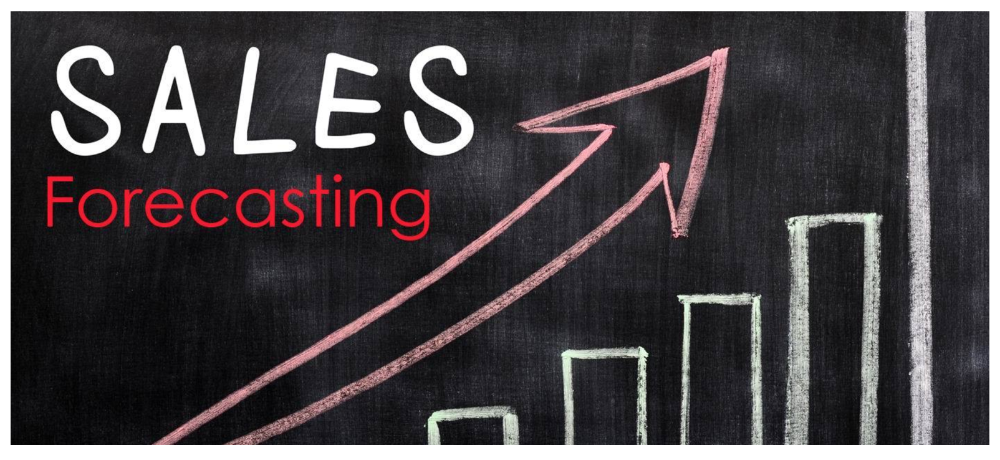
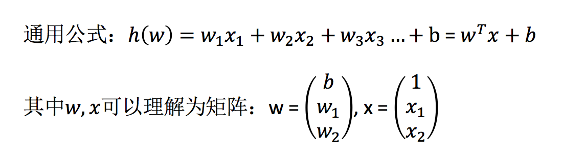
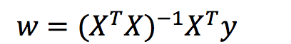
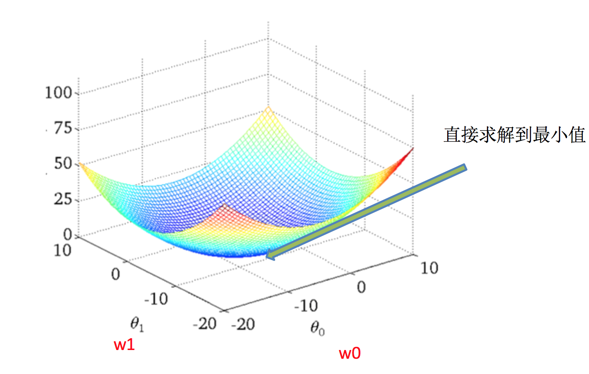
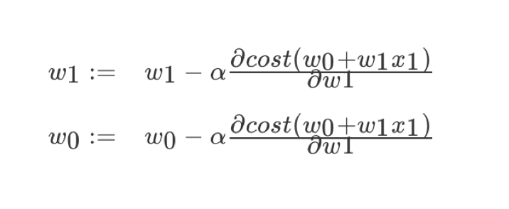
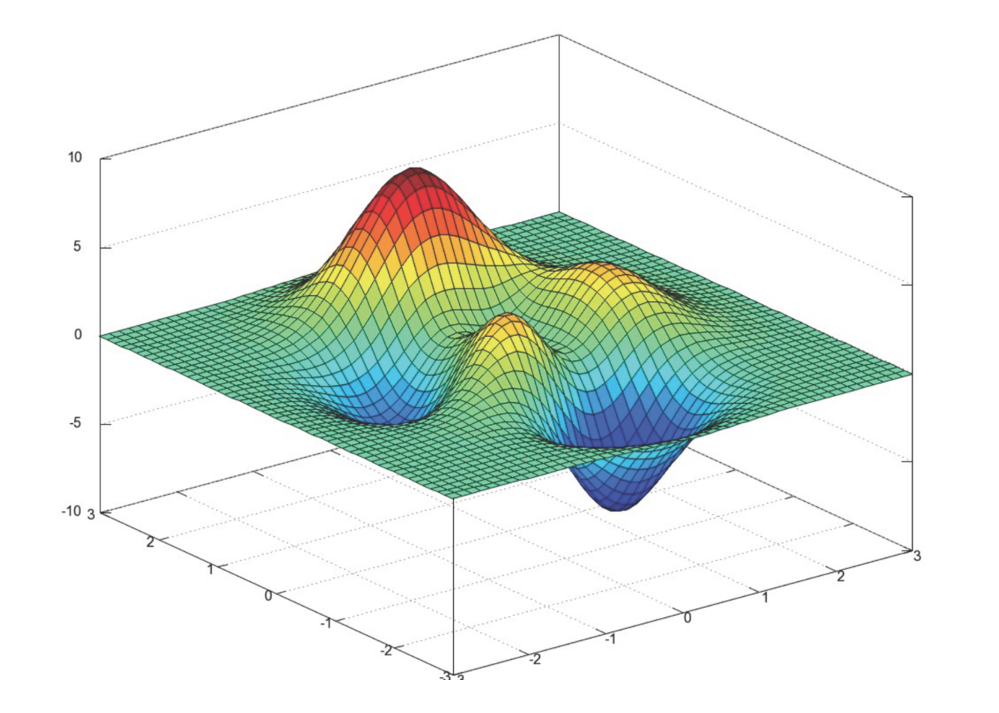
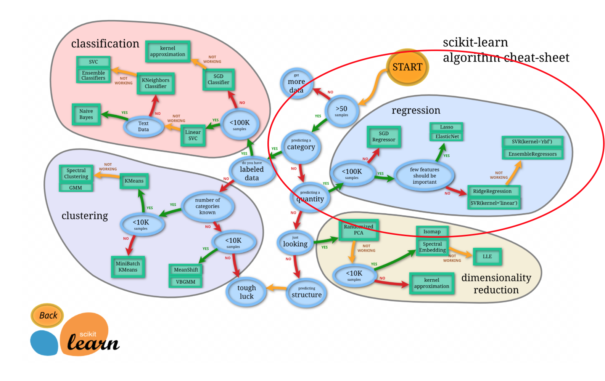

# 线性回归

#### 回忆一下回归问题的判定是什么？

## 线性回归的原理

## 线性回归应用场景

- 房价预测
- 销售额度预测
- 金融：贷款额度预测、利用线性回归以及系数分析因子



## 什么是线性回归

#### 定义与公式

线性回归(Linear regression)是利用**回归方程(函数)**对一个或**多个自变量(特征值)和因变量(目标值)之间**关系进行建模的一种分析方式。

- 特点：只有一个自变量的情况称为单变量回归，大于一个自变量情况的叫做多元回归



那么怎么理解呢？我们来看几个例子

- **期末成绩：0.7×考试成绩+0.3×平时成绩**
- **房子价格 = 0.02×中心区域的距离 + 0.04×城市一氧化氮浓度 + (-0.12×自住房平均房价) + 0.254×城镇犯罪率**

上面两个例子，**我们看到特征值与目标值之间建立的一个关系，这个可以理解为回归方程**。

#### 线性回归的特征与目标的关系分析

线性回归当中的关系有两种，一种是线性关系，另一种是非线性关系。**在这里我们只能画一个平面更好去理解，所以都用单个特征举例子。**

- 线性关系


> 注释：如果在单特征与目标值的关系呈直线关系，或者两个特征与目标值呈现平面的关系
>
> 更高维度的我们不用自己去想，记住这种关系即可

- 非线性关系


> 注释：为什么会这样的关系呢？原因是什么？我们后面 讲解过拟合欠拟合重点介绍
>
> 如果是非线性关系，那么回归方程可以理解为：w1x1+w2x2^2+w3x3^2

## 线性回归的损失和优化原理（理解记忆）

**假设刚才的房子例子，真实的数据之间存在这样的关系**

$$
真实关系：真实房子价格 = 0.02×中心区域的距离 + 0.04×城市一氧化氮浓度 + (-0.12×自住房平均房价) + 0.254×城镇犯罪率
$$

那么现在呢，我们随意指定一个关系（猜测）

$$
随机指定关系：预测房子价格 = 0.25×中心区域的距离 + 0.14×城市一氧化氮浓度 + 0.42×自住房平均房价 + 0.34×城镇犯罪率
$$

请问这样的话，会发生什么？真实结果与我们预测的结果之间是不是存在一定的误差呢？类似这样样子


那么存在这个误差，我们将这个误差给衡量出来

### 损失函数

总损失定义为：


- y_i为第i个训练样本的真实值
- h(x_i)为第i个训练样本特征值组合预测函数
- 又称最小二乘法

**如何去减少这个损失，使我们预测的更加准确些？既然存在了这个损失，我们一直说机器学习有自动学习的功能，在线性回归这里更是能够体现。这里可以通过一些优化方法去优化（其实是数学当中的求导功能）回归的总损失！！！**

## 优化算法

**如何去求模型当中的W，使得损失最小？（目的是找到最小损失对应的W值）**

线性回归经常使用的两种优化算法

- 正规方程



> 理解：X为特征值矩阵，y为目标值矩阵。直接求到最好的结果
>
> 缺点：当特征过多过复杂时，求解速度太慢并且得不到结果



- **梯度下降(Gradient Descent)**



> 理解：α为学习速率，需要手动指定（超参数），α旁边的整体表示方向
>
> 沿着这个函数下降的方向找，最后就能找到山谷的最低点，然后更新W值
>
> 使用：面对训练数据规模十分庞大的任务 ，能够找到较好的结果

我们通过两个图更好理解梯度下降的过程




**所以有了梯度下降这样一个优化算法，回归就有了"自动学习"的能力**

### 优化动态图演示


## 线性回归API

- sklearn.linear_model.LinearRegression(fit_intercept=True)
  - 通过正规方程优化
  - fit_intercept：是否计算偏置
  - LinearRegression.coef_：回归系数
  - LinearRegression.intercept_：偏置
- sklearn.linear_model.SGDRegressor(loss="squared_loss", fit_intercept=True, learning_rate ='invscaling', eta0=0.01)
  - SGDRegressor类实现了随机梯度下降学习，它支持不同的**loss函数和正则化惩罚项**来拟合线性回归模型。
  - loss:损失类型
    - **loss=”squared_loss”: 普通最小二乘法**
  - fit_intercept：是否计算偏置
  - learning_rate : string, optional
    - 学习率填充
    - **'constant': eta = eta0**
    - **'optimal': eta = 1.0 / (alpha \* (t + t0)) [default]**
    - 'invscaling': eta = eta0 / pow(t, power_t)
      - **power_t=0.25:存在父类当中**
    - **对于一个常数值的学习率来说，可以使用learning_rate=’constant’ ，并使用eta0来指定学习率。**
  - SGDRegressor.coef_：回归系数
  - SGDRegressor.intercept_：偏置

> sklearn提供给我们两种实现的API， 可以根据选择使用

#### 练习： 波士顿房价预测

- 数据介绍

> 给定的这些特征，是专家们得出的影响房价的结果属性。我们此阶段不需要自己去探究特征是否有用，只需要使用这些特征。到后面量化很多特征需要我们自己去寻找

** 分析**

回归当中的数据大小不一致，是否会导致结果影响较大。所以需要做标准化处理。同时我们对目标值也需要做标准化处理。

- 数据分割与标准化处理
- 回归预测
- 线性回归的算法效果评估

** 回归性能评估**

均方误差(Mean Squared Error)$$MSE$$评价机制：


$$
MSE=\frac{1}{m}\sum^m_{n=1}(y^i-\bar y)^2
$$

注：$y_i$为预测值，$\hat y$为真实值

- `sklearn.metrics.mean_squared_error(y_true, y_pred)`
  - 均方误差回归损失
  - y_true:真实值
  - y_pred:预测值
  - return:浮点数结果

```python
from sklearn import datasets
import pandas as pd
from sklearn.linear_model import LinearRegression
from sklearn.model_selection import train_test_split


#载入数据集
boston = datasets.load_boston()


#先用key方法查看数据集
print(boston.keys())


#查看feature_names
print(boston['feature_names'])


#这里的data有13个维度，target就是我们要预测的房价，接下来再查看feature_names
print(boston['feature_names'])

#其中'RM'列就是我们需要的房间数，接下为了方便处理，我们将其转为DataFrame类型，并进行数据划分得到训练集和测试集

data = pd.DataFrame(boston['data'],columns=boston['feature_names'])
x = pd.DataFrame(data['RM'],columns=['RM'])
y = pd.DataFrame(boston['target'],columns=['target'])
x_train,x_test,y_train,y_test = train_test_split(x,y,test_size=0.33, random_state=42)

#接下来训练线性回归模型，并进行预测

lr = LinearRegression()
lr.fit(x_train,y_train)
y_pre = lr.predict(x_test)
```

```python
#模型评价的好坏
#我们将从以下的均方误差(MSE)，均方根误差(RMSE)，平均绝对误差(MAE)，R Squared
from sklearn.metrics import r2_score
from sklearn.metrics import mean_squared_error 
from sklearn.metrics import mean_absolute_error 


print(r2_score(y_test,y_pre))
print(mean_absolute_error(y_test,y_pre))
print(mean_squared_error(y_test,y_pre))
```

```python
#可视化
%matplotlib inline
plt.plot(y_test,label='real')
plt.plot(y_lr,label='lr')
plt.legend()
plt.show()
```

**线性回归与岭回归，lasso回归的比较**

```python
from sklearn.linear_model import LinearRegression,Lasso,Ridge
from sklearn.datasets import load_boston
import matplotlib.pyplot as plt

boston=load_boston()
data = boston.data
target = boston.target

x_train = data[:450]
y_train = target[:450]
x_test = data[450:]
y_test = target[450:]

lr = LinearRegression()
rr = Ridge()
lasso = Lasso()

lr.fit(x_train,y_train)
rr.fit(x_train,y_train)
lasso.fit(x_train,y_train)

y_lr = lr.predict(x_test)
y_rr = rr.predict(x_test)
y_lasso = lasso.predict(x_test)

plt.plot(y_test,label='real')
plt.plot(y_lr,label='lr')
plt.plot(y_rr,label='rr')
plt.plot(y_lasso,label='lasso')
plt.legend()
plt.show()
```

### 正规方程和梯度下降对比



- 文字对比

|       梯度下降       |            正规方程             |
| :------------------: | :-----------------------------: |
|    需要选择学习率    |             不需要              |
|     需要迭代求解     |          一次运算得出           |
| 特征数量较大可以使用 | 需要计算方程，时间复杂度高O(n3) |

- 选择：
  - 小规模数据：
    - **LinearRegression(不能解决拟合问题)**
    - 岭回归
  - 大规模数据：`SGDRegressor`

## 拓展-关于优化方法GD、SGD、SAG

### GD

**梯度下降(Gradient Descent)，原始的梯度下降法需要计算所有样本的值才能够得出梯度，计算量大，所以后面才有会一系列的改进。**

### SGD

**随机梯度下降(Stochastic gradient descent)是一个优化方法。它在一次迭代时只考虑一个训练样本。**

- SGD的优点是：
  - 高效
  - 容易实现
- SGD的缺点是：
  - SGD需要许多超参数：比如正则项参数、迭代数。
  - SGD对于特征标准化是敏感的。

### SAG

随机平均梯度法(Stochasitc Average Gradient)，由于收敛的速度太慢，有人提出SAG等基于梯度下降的算法

> Scikit-learn：SGDRegressor、岭回归、逻辑回归等当中都会有SAG优化

## 总结

- 线性回归的损失函数-均方误差
- 线性回归的优化方法
  - 正规方程
  - 梯度下降
- 线性回归的性能衡量方法-均方误差
- sklearn的`SGDRegressor` API 参数

## 学习目标

- 记忆线性回归的原理过程
- 应用LinearRegression或SGDRegressor实现回归预测
- 记忆回归算法的评估标准及其公式

- 波士顿房价预测