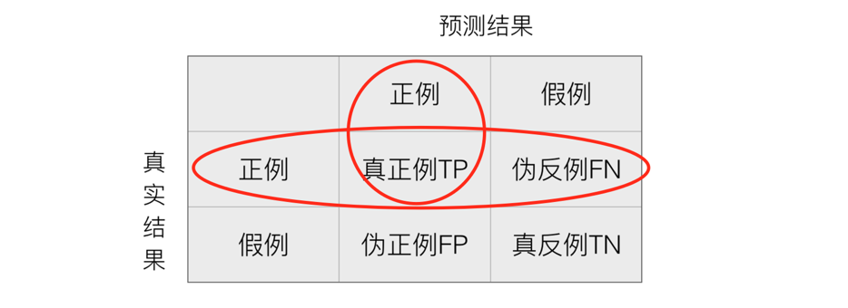

# 分类的评估方法

## 精确率与召回率

### 混淆矩阵

在分类任务下，预测结果(Predicted Condition)与正确标记(True Condition)之间存在四种不同的组合，构成混淆矩阵(适用于多分类)


### 精确率(Precision)与召回率(Recall)

- 精确率：预测结果为正例样本中真实为正例的比例（了解）


- 召回率：真实为正例的样本中预测结果为正例的比例（查的全，对正样本的区分能力）



那么怎么更好理解这个两个概念


还有其他的评估标准，F1-score，反映了模型的稳健型


###  分类评估报告API

- `sklearn.metrics.classification_report(y_true, y_pred, labels=[], target_names=None )`
- - y_true：真实目标值
  - y_pred：估计器预测目标值
  - labels:指定类别对应的数字
  - target_names：目标类别名称
  - return：每个类别精确率与召回率

`print("精确率和召回率为：", classification_report(y_test, lr.predict(x_test), labels=[2, 4], target_names=['良性', '恶性']))`

**假设这样一个情况，如果99个样本癌症，1个样本非癌症，不管怎样我全都预测正例(默认癌症为正例),准确率就为99%但是这样效果并不好，这就是样本不均衡下的评估问题**

## ROC曲线与AUC指标

### 知道TPR与FPR

- TPR = TP / (TP + FN)
  - 所有真实类别为1的样本中，预测类别为1的比例
- FPR = FP / (FP + FN)
  - 所有真实类别为0的样本中，预测类别为1的比例

### ROC曲线

- ROC曲线的横轴就是FPRate，纵轴就是TPRate，当二者相等时，表示的意义则是：对于不论真实类别是1还是0的样本，分类器预测为1的概率是相等的，此时AUC为0.5


### AUC指标

- AUC的概率意义是随机取一对正负样本，正样本得分大于负样本的概率
- AUC的最小值为0.5，最大值为1，取值越高越好
- **AUC=1，完美分类器，采用这个预测模型时，不管设定什么阈值都能得出完美预测。绝大多数预测的场合，不存在完美分类器。**

**最终AUC的范围在[0.5, 1]之间，并且越接近1越好**

### AUC计算API

- `from sklearn.metrics import roc_auc_score`
  - `sklearn.metrics.roc_auc_score(y_true, y_score)`
    - 计算ROC曲线面积，即AUC值
    - y_true:每个样本的真实类别，必须为0(反例),1(正例)标记
    - y_score:每个样本预测的概率值

```python
# 0.5~1之间，越接近于1约好
y_test = np.where(y_test > 2.5, 1, 0)

print("AUC指标：", roc_auc_score(y_test, lr.predict(x_test)))
```

## 总结

- AUC只能用来评价二分类
- AUC非常适合评价样本不平衡中的分类器性能

## 作业：

- 如何衡量样本不均衡下的评估？ 